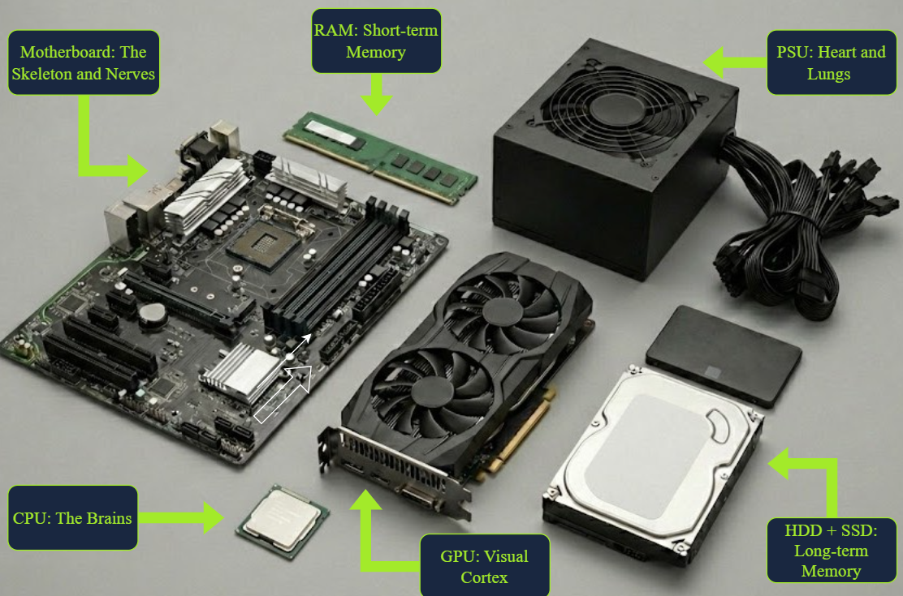
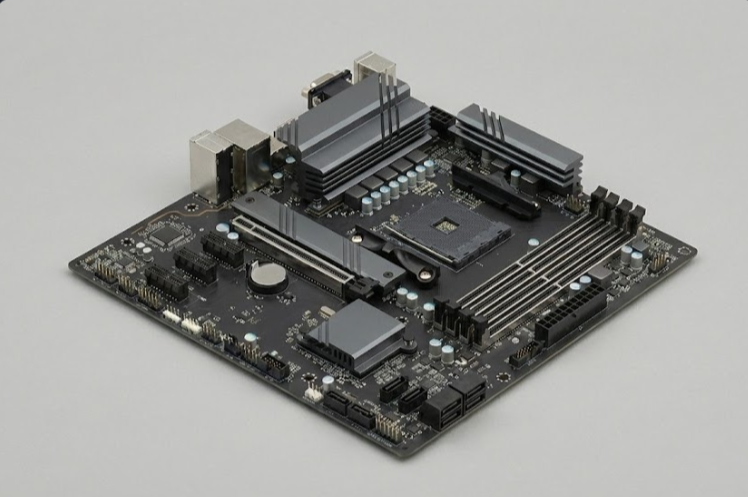
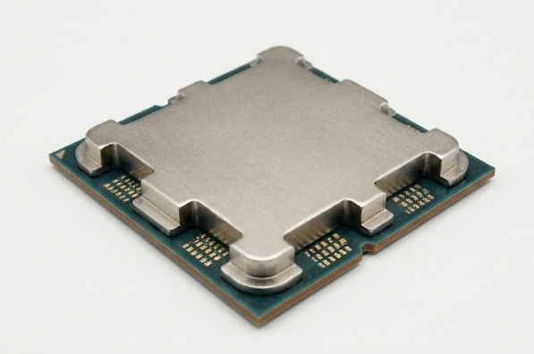
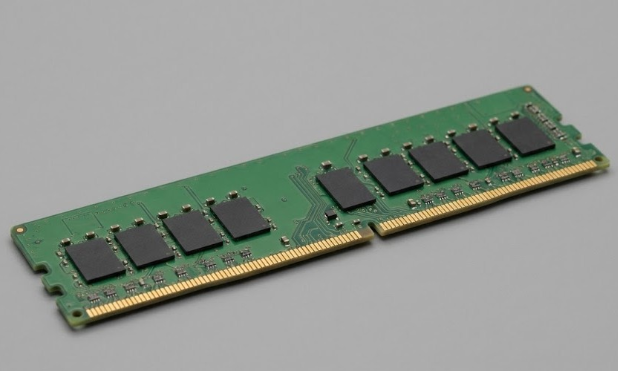
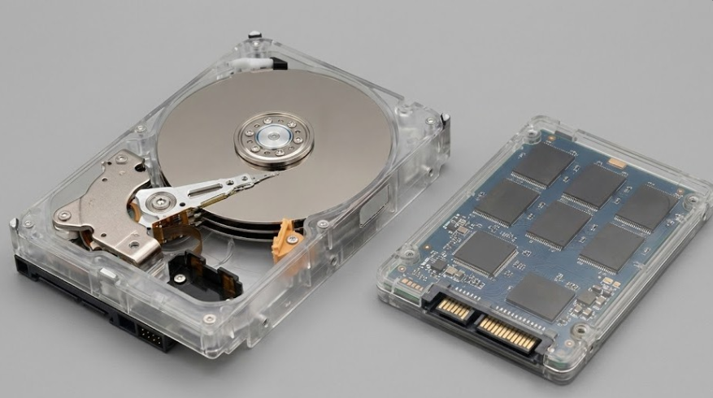
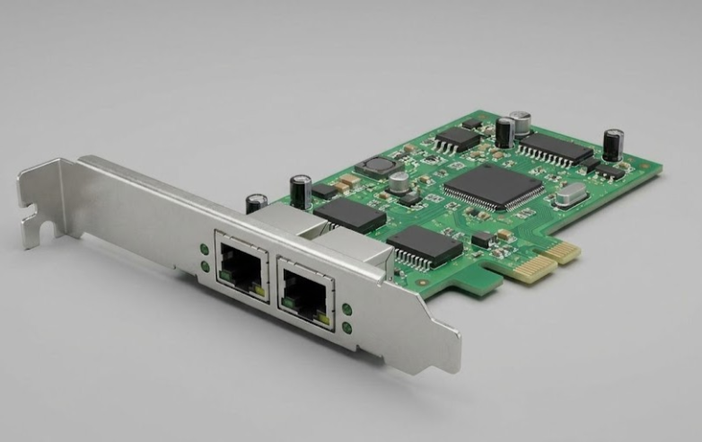
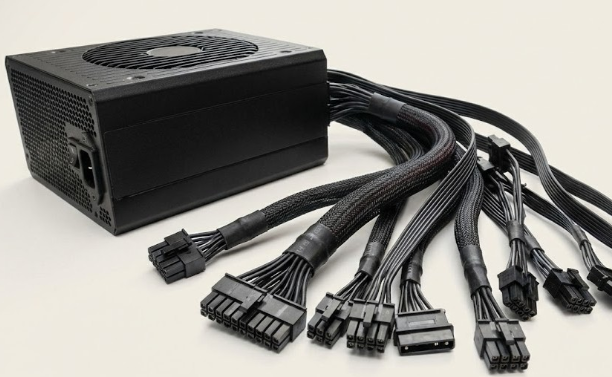
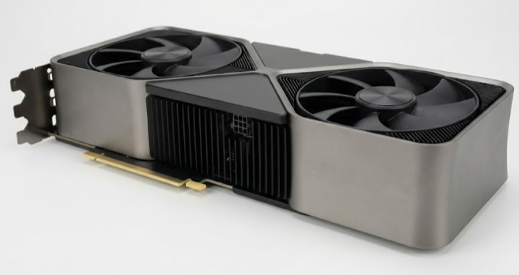
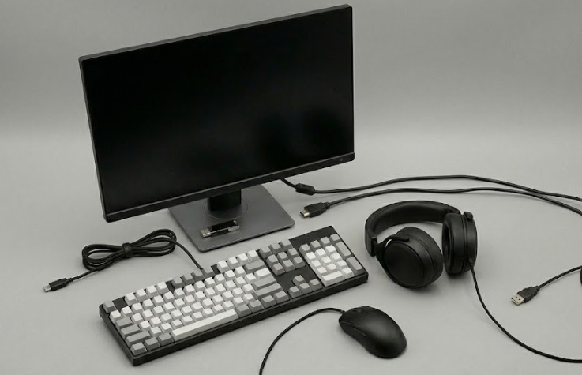
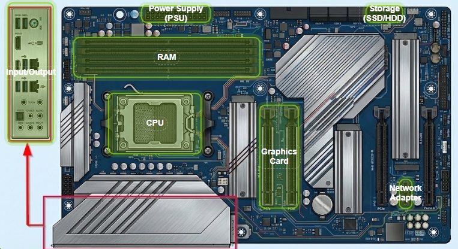

# Room: Inside a Computer System
**Path:** Computer Fundamentals
**Date:** July 2026
**Difficulty:** Easy

## Objective
Learn the basic hardware components of a computer, understand the purpose of each component, and see how a computer boots from pressing the power button to loading the operating system.

---

## Key Concepts

- **Computer System:** A collection of hardware components working together to process data and provide services.
- **Motherboard:** The main circuit board that connects and allows communication between all hardware components.
- **Boot Process:** The sequence of steps a computer follows to start and load the operating system.
- **UEFI (Unified Extensible Firmware Interface):** Modern firmware responsible for initializing hardware and starting the boot process (replaces the older BIOS in most systems).
- **POST (Power-On Self Test):** A diagnostic check performed during startup to verify that essential hardware is working correctly.

---

## Core Computer Components

### Motherboard

The motherboard is the foundation of the computer. Every major component connects to it, allowing them to communicate.

**Analogy:** Skeleton + Nervous System

**Connects:**
- CPU
- RAM
- Storage devices
- Graphics card
- Network adapter
- Power supply
- Input/Output devices

---

### CPU (Central Processing Unit)

The CPU is the "brain" of the computer. It executes instructions and performs calculations required by programs and the operating system.

**Analogy:** Brain

**Key Points**
- Executes program instructions.
- Modern CPUs have multiple cores for parallel processing.
- Installed into the motherboard's CPU socket.

---

### RAM (Random Access Memory)

RAM temporarily stores data that the CPU needs immediate access to.

**Analogy:** Short-term memory

**Key Points**
- Very fast memory.
- Volatile (contents are lost when power is removed).
- Modern systems commonly use DDR5 or DDR6 RAM.

---

### Storage (SSD & HDD)

Storage devices permanently save the operating system, applications, and user files.

**Analogy:** Long-term memory

#### HDD (Hard Disk Drive)
- Uses spinning disks (moving parts).
- Larger capacity.
- Lower cost.
- Slower performance.

#### SSD (Solid State Drive)
- No moving parts.
- Much faster than HDDs.
- Better performance for booting and loading applications.

---

### Network Adapter

Allows the computer to communicate with other devices over a network.

**Analogy:** Vocal cords

**Types**
- Wired (Ethernet)
- Wireless (Wi-Fi)

Can be built into the motherboard or installed as an expansion card.

---

### Power Supply Unit (PSU)

Supplies electrical power to every hardware component.

**Analogy:** Heart

Without sufficient power, the computer cannot operate correctly.

---

### Graphics Card (GPU)

Processes graphical information and sends video output to the monitor.

**Analogy:** Visual cortex

Typically installed in a PCI Express x16 slot.

---

### Input & Output (I/O) Devices

Input devices send information to the computer.

Examples:
- Keyboard
- Mouse
- Microphone
- Scanner

Output devices present information from the computer.

Examples:
- Monitor
- Printer
- Speakers

Common connectors:
- USB
- HDMI
- DisplayPort

---

## Motherboard Connections

| Component | Connection |
|-----------|------------|
| CPU | CPU Socket |
| RAM | DIMM Slots |
| GPU | PCI Express x16 |
| Network Card | PCI Express x1 / x4 |
| SSD / HDD | SATA Ports (or PCIe for NVMe SSDs) |
| Power Supply | 24-pin ATX Connector |
| External Devices | Rear I/O Ports |

---

## Boot Sequence

When a computer starts, it follows a specific sequence before the operating system loads.

### Step 1 — Power Button
Pressing the power button sends a signal to the PSU, which supplies power to all hardware components.

### Step 2 — Firmware Starts
UEFI (or older BIOS) initializes the hardware and prepares the system for startup.

### Step 3 — Power-On Self Test (POST)
UEFI checks whether essential hardware is present and functioning correctly.

If a problem is detected:
- Error messages
- Warning lights
- Beep codes

may indicate the faulty component.

### Step 4 — Select Boot Device
UEFI checks the configured boot order and selects the device containing the operating system (usually an SSD or HDD).

### Step 5 — Bootloader Starts
The bootloader loads the operating system into RAM.

After this, UEFI transfers control to the operating system, and the computer becomes ready to use.

---

## Terms Learned

- **Firmware:** Low-level software stored on the motherboard that starts the computer.
- **UEFI:** Modern replacement for BIOS that initializes hardware and starts the boot process.
- **BIOS:** Older firmware standard used before UEFI.
- **POST (Power-On Self Test):** Hardware diagnostic performed during startup.
- **Bootloader:** Program responsible for loading the operating system into RAM.
- **Volatile Memory:** Memory that loses its contents when power is removed (RAM).

---

## What I Learned

A computer is made of several core hardware components, each with a specific responsibility. The motherboard connects everything together, the CPU processes instructions, RAM stores temporary working data, storage devices permanently save files, the PSU provides power, and the GPU handles graphics. I also learned the complete boot sequence—from pressing the power button, through UEFI initialization and POST, to selecting a boot device and loading the operating system. Understanding these fundamentals is essential before studying how attackers target computer systems.