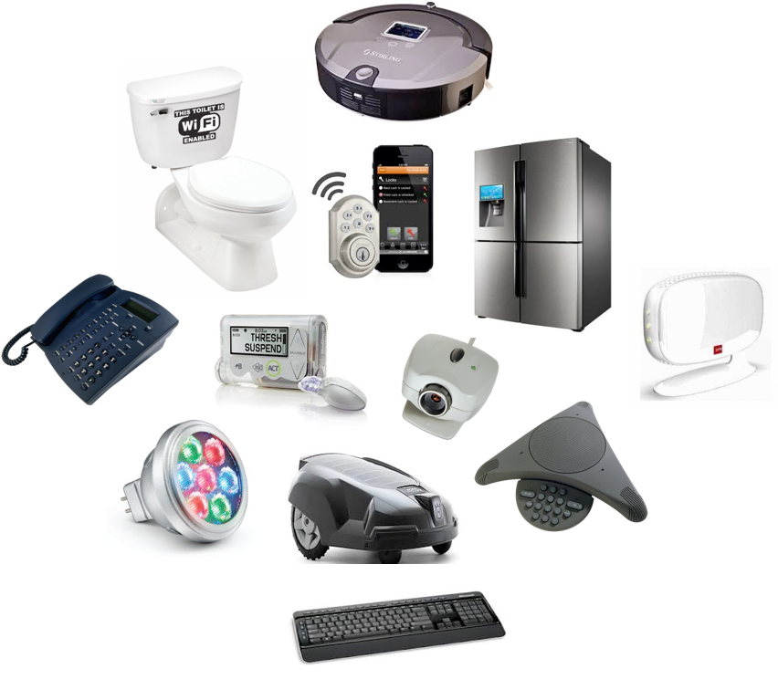

# Room: Computer Types
**Path:** Computer Fundamentals
**Date:** July 2026
**Difficulty:** Easy

## Objective
Learn about the different types of computers, understand their purposes, and recognize why computers are designed differently depending on their intended use.

---

## Key Concepts

- **Computer Types:** Computers come in many forms, each optimized for a specific purpose.
- **User-Facing Systems:** Computers that users interact with directly, such as laptops and smartphones.
- **Hidden Systems:** Computers embedded inside devices that often operate without users noticing.
- **Trade-offs:** Every computer design balances factors such as portability, performance, cost, reliability, and power consumption.

---

## Traditional Computer Types

### Laptop

- Portable and battery-powered.
- Designed for everyday computing.
- Limited performance compared to desktops due to cooling and power constraints.

---

### Desktop

- Designed for use in a fixed location.
- Better cooling allows higher sustained performance.
- Easier to upgrade than laptops.

---

### Workstation

- Built for professional and high-performance workloads.
- Focuses on precision, reliability, and stability.
- Commonly used for engineering, scientific computing, and 3D design.

---

### Server

- Provides services to other computers over a network.
- Usually runs without a monitor or keyboard.
- Designed to operate continuously (24/7).
- Can serve many users simultaneously.

---

## Modern & Hidden Computers

### Smartphone
A pocket-sized computer capable of running applications, connecting to networks, and performing everyday computing tasks.

---

### Tablet
A touchscreen computer that combines portability with a larger display.

---

### IoT (Internet of Things) Devices

Devices connected to the internet that can send and receive data.

**Examples**
- Smart doorbell
- Smart thermostat
- Smart refrigerator

**Security Note**
Because IoT devices are connected to networks, they increase an organization's or home's **attack surface**.

---

### Embedded Computers

Small computers built into larger devices to perform one specific task.

**Examples**
- Coffee machine
- Door sensor
- Washing machine
- Microwave

Unlike many IoT devices, embedded systems often operate without internet connectivity.

---

## IoT vs Embedded Systems

| IoT Device | Embedded Computer |
|------------|-------------------|
| Connected to a network | Often not connected to a network |
| Sends and receives data | Performs one dedicated function |
| Can be managed remotely | Usually operates silently in the background |

---

## Why Different Computer Types Exist

Different computers are designed for different needs.

### Mobility vs Performance
- Laptops prioritize portability.
- Desktops and workstations prioritize performance.

### Reliability vs Cost
- Servers often include redundant components to improve reliability.
- Higher reliability usually increases cost.

### Purpose-Driven Design
Each computer is optimized for its intended job rather than trying to do everything.

**Key Principle**

> There is no "best" computer—only the right computer for a particular task.

---

## Terms Learned

- **Server:** A computer that provides services or resources to other computers over a network.
- **Workstation:** A high-performance computer designed for professional workloads.
- **IoT (Internet of Things):** Everyday devices connected to the internet that can communicate with other systems.
- **Embedded Computer:** A computer integrated into another device to perform a dedicated function.
- **Attack Surface:** The total number of possible entry points an attacker can target in a system.

---

## What I Learned

Computers exist in many different forms, from laptops and desktops to servers, smartphones, IoT devices, and embedded systems. Each type is designed for a specific purpose and involves trade-offs between portability, performance, reliability, and cost. I also learned that many computers operate behind the scenes inside everyday devices, and internet-connected devices (IoT) increase the attack surface, making them important from a cybersecurity perspective.