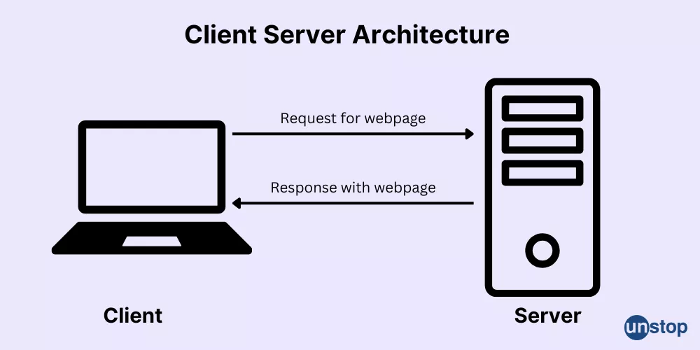
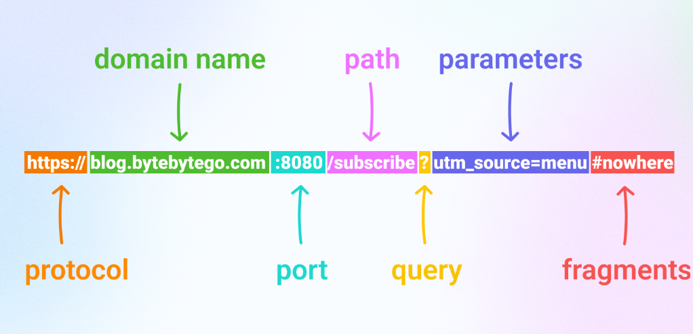

# Room: Client-Server Basics
**Path:** Computer Fundamentals
**Date:** August 2026
**Difficulty:** Easy
---

## Objective
Understand how computers communicate over networks using the **Client-Server model**, and learn the purpose of clients, servers, protocols, ports, DNS, and HTTP/HTTPS.
---

## Key Concepts

* **Client:** A device or application that requests a service from a server.
* **Server:** A system that provides services or resources to clients.
* **Client-Server Model:** A communication model where a client sends a request and a server processes and responds to it.
* **Protocol:** A set of rules that defines how systems communicate.
* **Port:** A number used to identify a specific service running on a server.
* **DNS (Domain Name System):** Translates human-readable domain names into IP addresses.
* **IP Address:** An address used to identify a device on a network.
* **HTTP/HTTPS:** Protocols used for communication between web browsers and web servers.
---

## Client-Server Model
Modern computers rarely operate completely independently. They communicate with other systems over networks to request and provide services.
The **Client-Server model** is one of the fundamental concepts behind the internet.


### Client
The client is the system that **initiates a request** for a service or resource.
Examples:
* Web browser
* Mobile application
* Email application
* SSH client
**Analogy:** Customer

### Server
The server receives requests from clients, processes them, and provides the requested service or resource.
Examples:
* Web server
* File server
* Database server
* DNS server
**Analogy:** Service provider
---

## Request & Response
Client-server communication generally follows this process:

1. The **client sends a request**.
2. The **server receives and processes** the request.
3. The **server sends a response**.
4. The client receives and displays or processes the response.
For example, when visiting a website:
```text
Browser → Request → Web Server
Browser ← Response ← Web Server
```
The response may contain the requested webpage, data, or an error message.

### Possible Outcomes
* **Success:** The requested resource is provided.
* **Error:** The request is invalid or the requested resource is unavailable.
---

## Protocols
A **protocol** defines the rules that systems follow when communicating.
Protocols specify things such as:
* How requests are structured
* Commands that can be used
* The syntax of messages
* Expected responses
* How errors are handled
**Analogy:** A language that computers use to communicate.
Different services use different protocols.
Examples:
* HTTP → Web communication
* HTTPS → Secure web communication
* DNS → Domain name resolution
* SSH → Secure remote access
---

## Ports
A **port** identifies a specific service running on a server.
A server can provide multiple services at the same time, with different services listening on different ports.
### Analogy
Think of a server as a building:
* **Building** → Server
* **Doors** → Ports
* **Services behind the doors** → Network services
For example:
```text
Server
 ├── Port 80  → HTTP
 ├── Port 443 → HTTPS
 └── Port 22  → SSH
```
Knowing which port a service uses is important when analyzing network communication and security.
---

## DNS — Domain Name System

**DNS (Domain Name System)** translates human-readable domain names into IP addresses.
For example:
```text
google.com → IP address
```
Humans can easily remember domain names, while computers use IP addresses to communicate with network devices.
**Analogy:** GPS or a phonebook that translates a name into an address.
### Why DNS Is Important
Without DNS, users would generally need to remember IP addresses instead of convenient domain names.
---

## Answers
**Q:** What identifies a specific service on a server?
**A:** `port`
**Q:** What is the address of a server called?
**A:** `Internet Protocol Address`
---
# Web Communication
## HTTP & HTTPS

**HTTP (Hypertext Transfer Protocol)** is a protocol used for communication between web clients and web servers.
**HTTPS (Hypertext Transfer Protocol Secure)** provides secure HTTP communication.
When a user visits a website, the browser acts as the client and communicates with the web server.
```text
Browser → HTTP/HTTPS Request → Web Server
Browser ← HTTP/HTTPS Response ← Web Server
```
---

## HTTP Is Stateless
HTTP is **stateless**, meaning each request is treated independently.
The server does not automatically remember previous requests from the same client.
However, websites need to remember information such as whether a user is logged in.
To maintain state, websites can use:
* **Cookies**
* **Sessions**
* **Tokens**
For example, a login session allows a website to recognize a user across multiple requests.
---

## HTTP Methods
HTTP provides several methods that define what the client wants to do with a resource.
The nine core HTTP methods are:
| Method  | Purpose                                   |
| ------- | ----------------------------------------- |
| GET     | Retrieve data                             |
| POST    | Submit or create data                     |
| PUT     | Replace a resource                        |
| DELETE  | Delete a resource                         |
| PATCH   | Partially modify a resource               |
| HEAD    | Request headers without the response body |
| OPTIONS | Discover supported communication options  |
| CONNECT | Establish a tunnel                        |
| TRACE   | Perform a diagnostic loop-back            |
---

## GET Method
The **GET** method is commonly used to retrieve information from a server.
Example:
```http
GET https://tryhackme.com/index.php
```
The browser sends a request to the web server, and the server responds with information such as:
* Status code
* Response headers
* Requested content
---
## Understanding a URL

Consider the following URL:
```text
https://www.iamlearning.thm/contact
```
Different parts of the URL identify different pieces of information.
| Component | Value                 |
| --------- | --------------------- |
| Scheme    | `https`               |
| Host      | `www.iamlearning.thm` |
| Resource  | `/contact`            |

### Scheme
The **scheme** specifies the protocol being used.
In this example:
```text
https
```
### Host
The **host** identifies the domain/server being contacted.
In this example:
```text
www.iamlearning.thm
```
### Resource
The resource identifies the specific content being requested.
```text
/contact
```
---
## HTTP Request & Response
When a browser communicates with a web server, the communication consists of requests and responses.
### Request
The client sends information to the server describing what it wants.
Example:
```http
GET /contact HTTP/1.1
Host: www.iamlearning.thm
```
### Response
The server returns a response containing information about the result.
A response generally contains:
* **Status code**
* **Headers**
* **Body**
The **header** contains metadata about the response.
The **body** contains the actual content, such as HTML or other data.
---
## HTTP Status Codes
The server uses status codes to indicate the result of a request.
Common examples include:
| Status Code   | Meaning               |
| ------------- | --------------------- |
| `200 OK`      | Request succeeded     |
| `301` / `302` | Redirect              |
| `400`         | Bad request           |
| `401`         | Unauthorized          |
| `403`         | Forbidden             |
| `404`         | Resource not found    |
| `500`         | Internal server error |
---

## Answers
**Q:** What is the host in:
```text
https://www.iamlearning.thm/contact
```
**A:** `www.iamlearning.thm`
**Q:** What is the scheme in the same URL?
**A:** `https`
---

## Key Takeaways
* The **client initiates** communication.
* The **server provides** services or resources.
* Communication follows predefined **protocols**.
* **Ports** identify specific services running on a server.
* **DNS** translates domain names into IP addresses.
* **HTTP/HTTPS** are used for web communication.
* HTTP is **stateless**.
* **Cookies, sessions, and tokens** can be used to maintain state.
* HTTP methods such as **GET** and **POST** define different types of requests.
* HTTP responses contain **status codes, headers, and a body**.
---

## Terms Learned
* **Client:** A system that requests a service.
* **Server:** A system that provides a service.
* **Protocol:** Rules that define network communication.
* **Port:** Identifies a specific service on a server.
* **IP Address:** A network address used to identify a device.
* **DNS:** Converts domain names into IP addresses.
* **HTTP:** Protocol used for web communication.
* **HTTPS:** Secure version of HTTP.
* **Stateless:** Each HTTP request is handled independently.
* **Cookie:** Data stored by a website to help maintain information about a client.
* **Session:** A mechanism used to maintain a user's state across requests.
* **Status Code:** A code indicating the result of an HTTP request.
---

## What I Learned
This room helped me understand the basic architecture behind network communication. I learned that the **client-server model** allows systems to request and provide services over a network. The client initiates a request, while the server processes it and returns a response.

I also learned how **protocols, ports, DNS, and IP addresses** work together to make communication possible. In web communication, HTTP and HTTPS define how browsers and web servers exchange information, while HTTP methods such as GET define the purpose of requests.

These concepts are important foundations for cybersecurity because understanding how normal network communication works makes it easier to understand how attackers can discover, analyze, and potentially exploit network services.
