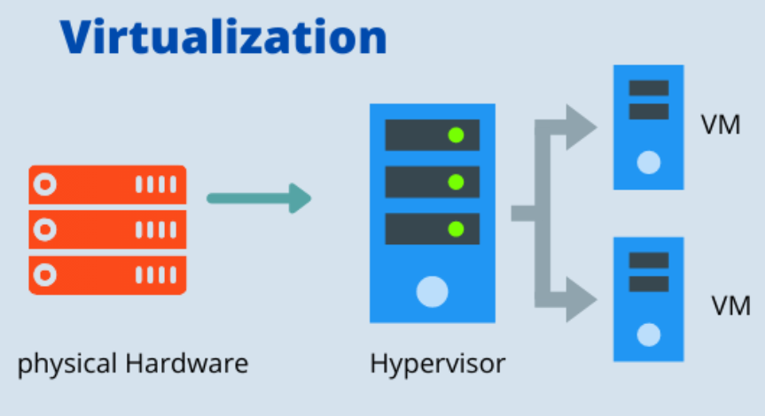
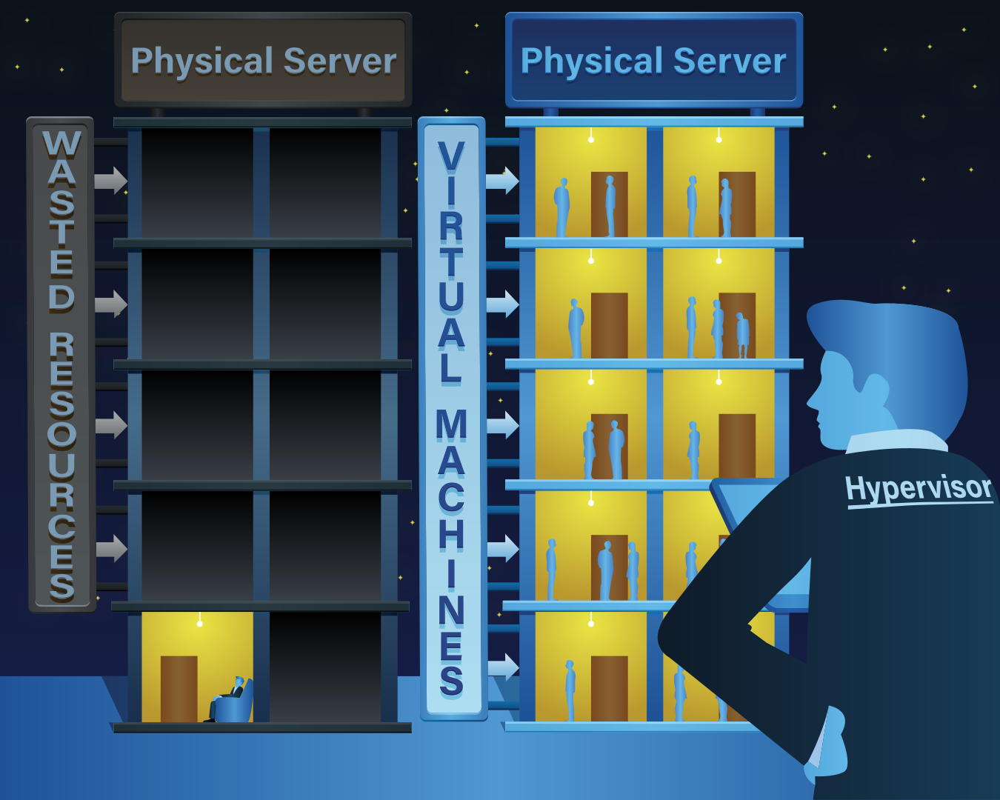
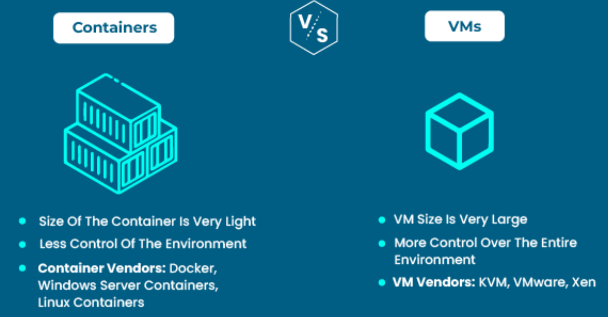
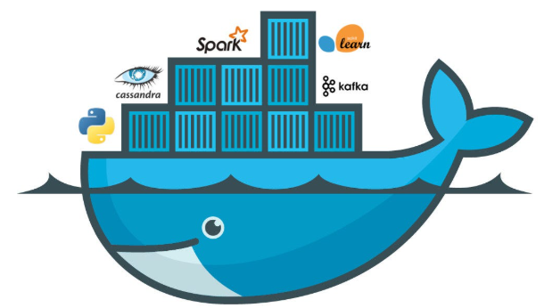

# Room: Virtualisation Basics
**Path:** Computer Fundamentals
**Date:** August 2026
**Difficulty:** Easy
---

## Objective
Understand the fundamentals of **virtualization**, including why it is used, how hypervisors manage virtual machines, how virtual machines differ from containers, and how virtual environments are managed.
---

## Key Concepts

* **Virtualization:** A technology that allows one physical computer to run multiple independent virtual systems.
* **Hypervisor:** Software or firmware that creates and manages virtual machines.
* **Virtual Machine (VM):** A virtualized computer with its own operating system and virtual hardware.
* **Container:** A lightweight environment designed to run an application while sharing the host operating system's kernel.
* **Container Image:** A template containing everything needed to create a container.
* **Docker:** A popular platform for building, running, and managing containers.
---

## Why Virtualization Is Needed
In traditional infrastructure, a common approach was:
> **One physical server = One application**
This approach could result in significant resource waste.

### Problems
* High hardware costs
* Low resource utilization
* Slow deployment
* Difficult scaling
* Large amounts of unused CPU and memory
Many physical servers were underused even though the organization still had to pay for their hardware, electricity, maintenance, and space.
---

# Virtualization
## The Basic Idea
Virtualization allows multiple systems and applications to share the resources of a single physical server.


Instead of requiring a separate physical server for every application, several virtual machines can run on the same physical hardware.
### Building Analogy
A useful way to understand virtualization is to imagine an apartment building:
| Real System       | Analogy          |
| ----------------- | ---------------- |
| Physical Server   | Building         |
| Virtual Machines  | Apartments       |
| Applications / OS | Tenants          |
| Hypervisor        | Building Manager |
The building provides the physical resources, while the manager controls how the apartments use those resources.
---

## Benefits of Virtualization
Virtualization provides several important benefits:
* **Better resource utilization**
* **Lower hardware costs**
* **Improved scalability**
* **Faster deployment**
* **Centralized management**
* **Flexible infrastructure**
* **Safe testing environments**
---

## Answers
**Q:** What do applications share?
**A:** `physical server`
**Q:** What manages virtual machines?
**A:** `hypervisor`
---

# Virtualization Components

## Hypervisor
A **hypervisor** is responsible for creating and managing virtual machines.
It controls how physical resources are allocated to virtual machines.

### Main Responsibilities
* Creates virtual machines
* Starts and stops VMs
* Allocates CPU resources
* Allocates RAM
* Allocates storage
* Manages virtual networking
* Helps isolate virtual machines from each other
**Analogy:** Building manager
---

## Types of Hypervisors
There are two main types of hypervisors.
| Type   | Description                                 | Common Use                |
| ------ | ------------------------------------------- | ------------------------- |
| Type 1 | Runs directly on physical hardware          | Servers and data centers  |
| Type 2 | Runs on top of an existing operating system | Personal labs and testing |

### Type 1 — Bare-Metal Hypervisor
A Type 1 hypervisor runs directly on the physical hardware.
```text
Hardware
   ↓
Type 1 Hypervisor
   ↓
Virtual Machines
```
It is commonly used in enterprise environments and data centers.
### Type 2 — Hosted Hypervisor
A Type 2 hypervisor runs as an application on an existing operating system.
```text
Hardware
   ↓
Host Operating System
   ↓
Type 2 Hypervisor
   ↓
Virtual Machines
```
This is convenient for learning, development, and personal cybersecurity labs.
---
# Virtual Machines
A **Virtual Machine (VM)** is a complete virtualized computer.
A VM can have its own:
* Virtual CPU
* Virtual RAM
* Virtual storage
* Operating system
* Network interface

From inside the VM, the operating system behaves similarly to an operating system running on a physical computer.

### Isolation
One of the major advantages of VMs is **isolation**.
Multiple VMs can run on the same physical server while remaining separated from each other.
For example:
```text
Physical Server
      │
      ├── VM 1 → Linux
      │
      ├── VM 2 → Windows
      │
      └── VM 3 → Linux
```
---

# Containers

A **container** is a lightweight environment designed to run an application.
Unlike a VM, a container does not normally contain a complete separate operating system. Instead, containers share the **host operating system kernel**.
### Characteristics
* Lightweight
* Fast startup
* Uses fewer resources
* Designed around applications
* Easy to deploy
* Portable between compatible environments
---

## Virtual Machine vs Container
| Feature          | Virtual Machine   | Container                |
| ---------------- | ----------------- | ------------------------ |
| Operating System | Full OS           | Shares host OS kernel    |
| Size             | Larger            | Lightweight              |
| Startup          | Slower            | Fast                     |
| Resource Usage   | Higher            | Lower                    |
| Isolation        | Strong            | Generally lighter        |
| Main Purpose     | Virtual computers | Application environments |
A simple way to remember the difference:
> **VM = Virtual computer**
> **Container = Isolated application environment**
---

# Docker

**Docker** is a popular platform used to build, run, and manage containers.
Containers make it easier to package an application together with its dependencies so that it can run consistently across different environments.
For example:
```text
Application
    +
Dependencies
    +
Configuration
        ↓
   Container Image
        ↓
     Container
```
### Container Image
A **container image** is a template used to create containers.
It can contain:
* Application code
* Libraries
* Dependencies
* Configuration
* Required files
---

## Answers
**Q:** What is the best hypervisor type for a personal lab?
**A:** `type 2`
**Q:** What is best for running multiple applications in one VM?
**A:** `containers`
---

# Managing Virtual Machines
Virtualization is not only about creating VMs. Administrators must also monitor and manage the virtual environment.
## 1. Monitor VM Status
Administrators should regularly check whether virtual machines are running correctly.
For example, if a VM such as:
```text
Mail-SERVER
```
fails, the administrator may need to investigate the problem and restart it.
---

## 2. Create Virtual Machines
When creating a VM, resources must be assigned to it.
Example:
| Resource | Configuration  |
| -------- | -------------- |
| Name     | `Marketing-VM` |
| CPU      | 4 cores        |
| Memory   | 8 GB           |
| Disk     | 100 GB         |
The assigned resources determine how much of the physical host's capacity the VM can use.
---

## 3. Monitor Physical Hosts
Virtual machines ultimately depend on physical hosts.
Administrators need to monitor:
* CPU usage
* Memory usage
* Storage capacity
* VM count
* Host availability
* Network connectivity

### Observations
| Host           | Observation        |
| -------------- | ------------------ |
| `HV-PROD-01`   | Available capacity |
| `HV-PROD-02`   | Near full usage    |
| `HV-BACKUP-01` | Disconnected       |
A host that is running too many VMs may become overloaded, while disconnected hosts may cause their virtual machines to become unavailable.
---

# Virtual Environment Answers
**Q:** Which VM had been running the longest?
**A:** `Monitoring-SYS`

**Q:** Which VM had the highest memory usage?
**A:** `DB-Cluster-01`
**Q:** How many VMs were running after fixing the environment?
**A:** `8`
**Q:** Which host had the most VMs?
**A:** `HV-PROD-02`

---

# Key Terminology
* **Virtualization:** Technology that allows one physical system to run multiple virtual systems.
* **Hypervisor:** Software or firmware that creates and manages virtual machines.
* **Virtual Machine (VM):** A complete virtualized computer.
* **Type 1 Hypervisor:** A hypervisor that runs directly on physical hardware.
* **Type 2 Hypervisor:** A hypervisor that runs on top of an existing operating system.
* **Container:** A lightweight environment for running applications.
* **Container Image:** A template used to create containers.
* **Docker:** A platform for creating and managing containers.
* **Host:** The physical or primary system providing resources to virtual machines.
* **Guest:** A virtual machine running on a host.
---

# Key Takeaways
* Virtualization allows **multiple systems to share one physical server**.
* A **hypervisor** manages virtual machines and allocates hardware resources.
* **Type 1 hypervisors** run directly on hardware.
* **Type 2 hypervisors** run on an existing operating system.
* A **VM** behaves like a complete virtual computer.
* **Containers** are lightweight environments designed to run applications.
* Containers share the host operating system's kernel.
* **Docker** is a popular container platform.
* Virtual environments require continuous monitoring of both VMs and physical hosts.
* Virtualization improves **resource utilization, scalability, flexibility, and deployment speed**.
---

## What I Learned
This room taught me how **virtualization** allows multiple independent systems to share the resources of a single physical server. Instead of dedicating one physical machine to every application, a hypervisor can divide the available CPU, RAM, storage, and networking resources between multiple virtual machines.
I also learned the difference between **Type 1 and Type 2 hypervisors**, and why Type 2 hypervisors are convenient for personal labs and testing. I learned that a **virtual machine provides a complete virtual computer**, while **containers provide lightweight environments for running applications** and share the host operating system's kernel.

Finally, I learned that virtualization environments need to be actively monitored. Administrators must keep track of VM status, resource usage, and physical host capacity to ensure that systems remain available and perform correctly.

Virtualization is an important foundation for understanding **cloud computing, containers, DevOps, and modern cybersecurity environments**.
