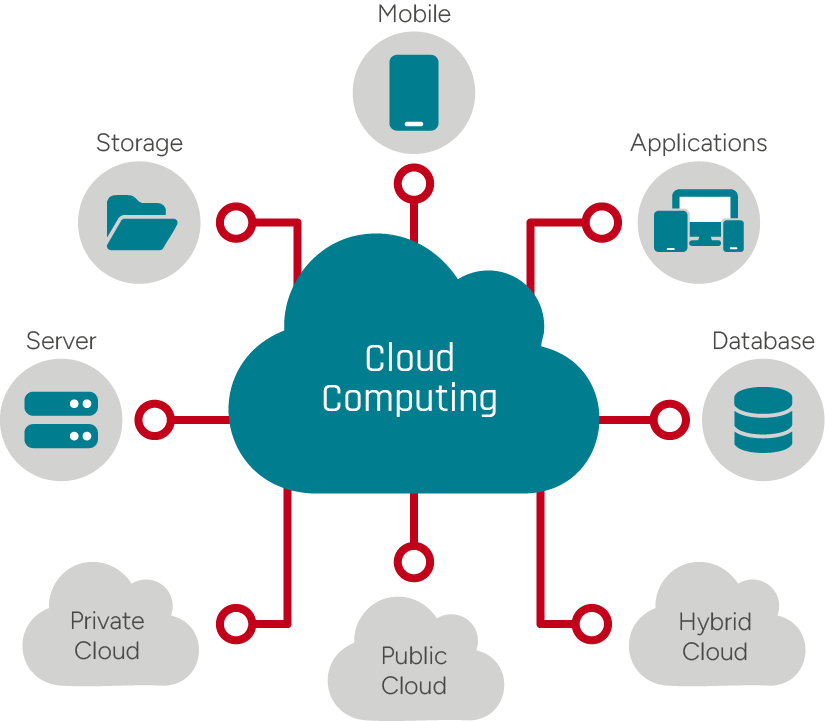
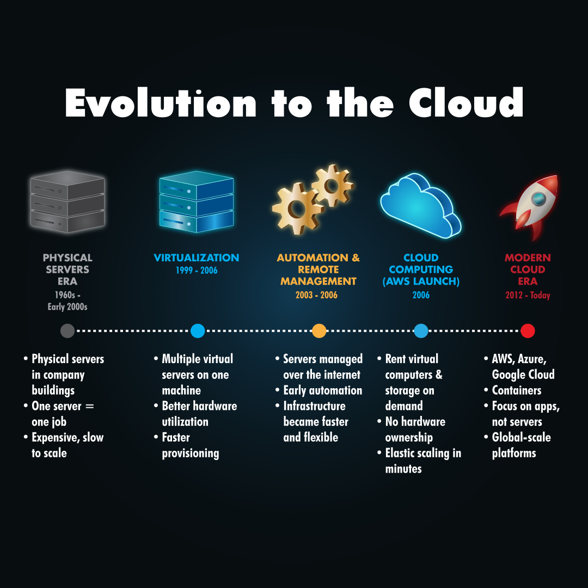
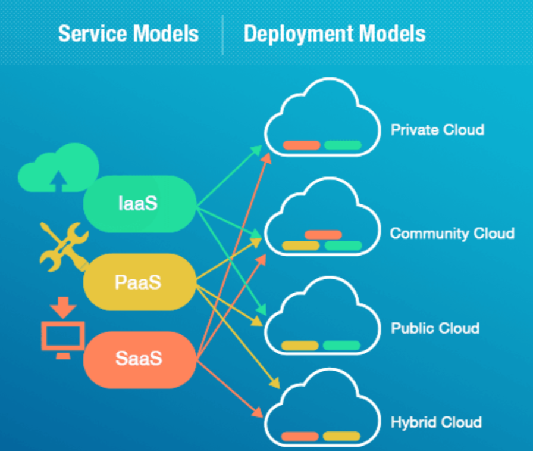
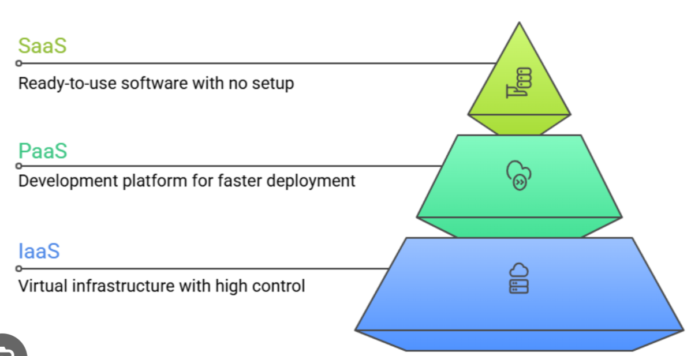

# Room: Cloud Computing Fundamentals
**Path:** Computer Fundamentals
**Date:** August 2026
**Difficulty:** Easy

---

## Objective
Understand the fundamentals of **cloud computing**, including how cloud infrastructure provides scalable resources over the internet, the different cloud deployment models, cloud service models, and how cloud instances can be deployed and managed.

---

## Key Concepts


* **Cloud Computing:** The delivery of computing resources and services over the internet.
* **Scalability:** The ability to increase or decrease resources based on demand.
* **High Availability:** Keeping applications and services available with minimal downtime.
* **Public Cloud:** Cloud infrastructure shared among multiple customers.
* **Private Cloud:** Cloud infrastructure dedicated to a specific organization.
* **Hybrid Cloud:** A combination of public and private cloud environments.
* **IaaS:** Infrastructure as a Service.
* **PaaS:** Platform as a Service.
* **SaaS:** Software as a Service.
* **EC2:** Amazon's virtual server service for running applications in the cloud.
---

# Why Cloud Computing?
Before cloud computing became widely used, applications were often hosted on individual physical computers or servers.
This approach has several limitations.
### Problems with Traditional Hosting
* Limited computing capacity
* Difficult to scale when traffic increases
* Users far away may experience higher latency
* Applications become unavailable if the physical machine is offline
* Hardware requires maintenance and upfront investment

For example, if an application suddenly becomes popular, a single physical server may not have enough resources to handle all the additional users.
### The Cloud Solution
Cloud computing allows organizations to use computing resources over the internet without needing to own and maintain all of the underlying physical infrastructure.
Cloud environments provide:
* Global accessibility
* High availability
* Scalability
* Flexible resource allocation
* Reliable infrastructure
* On-demand resources
---

# Evolution of Computing
Cloud computing developed from earlier technologies and infrastructure models.


A simplified evolution is:
```text
Physical Servers
       ↓
Virtualization
       ↓
Containers
       ↓
Cloud Computing
```
Each stage improved the way computing resources could be utilized and managed.
### Physical Servers
Applications traditionally ran directly on dedicated physical hardware.
### Virtualization
Multiple virtual machines could share the same physical server.
### Containers
Applications could be packaged into lightweight, isolated environments.
### Cloud Computing
These technologies could be combined with large-scale infrastructure and delivered as on-demand services over the internet.

---

# Benefits of Cloud Computing
Cloud computing provides several important advantages.
## Scalability
**Scalability** is the ability to increase or decrease resources based on demand.
For example, an online store may need additional resources during a large sale when thousands of users visit the website simultaneously.
```text
Normal Traffic
      ↓
Small Amount of Resources

Traffic Spike
      ↓
More Resources
```
---

## On-Demand Resources
Cloud resources can be created when they are needed.
Instead of purchasing a physical server and waiting for it to be installed, a cloud instance can be created much more quickly.

---

## Pay-as-you-go
Cloud providers commonly charge customers based on the resources they use.
This can reduce the need for large upfront hardware investments.

---

## High Availability
Cloud infrastructure can be designed to keep applications available even when individual components fail.

This helps reduce downtime.

---

## Global Access
Cloud resources can be deployed in different geographic locations, allowing applications to serve users around the world.

---

## Security
Cloud providers offer various security features and infrastructure protections.

However, customers are still responsible for securing the resources and applications they deploy, depending on the service model.

---

# Cloud Deployment Types


Cloud environments can be deployed in several ways.
| Type          | Description                              | Example Use                           |
| ------------- | ---------------------------------------- | ------------------------------------- |
| Public Cloud  | Shared cloud infrastructure              | Startups and web applications         |
| Private Cloud | Dedicated cloud environment              | Banks and government organizations    |
| Hybrid Cloud  | Combination of public and private clouds | Organizations with mixed requirements |

### Public Cloud
A **public cloud** provides computing resources through a cloud provider's shared infrastructure.

It is commonly used because organizations can quickly provision resources without owning the underlying physical hardware.

### Private Cloud
A **private cloud** is dedicated to a particular organization.

It provides greater control over the infrastructure and can be useful for organizations with specific security, compliance, or operational requirements.

### Hybrid Cloud
A **hybrid cloud** combines public and private cloud environments.

For example, an organization might keep sensitive systems in a private environment while using the public cloud for scalable applications.

---

# Cloud Service Models
Cloud providers offer different levels of managed services.


## IaaS — Infrastructure as a Service
**IaaS** provides virtualized infrastructure such as:
* Virtual machines
* Storage
* Networking
* CPU
* Memory

The customer is responsible for managing the operating system and applications.
**Analogy:** Renting an empty apartment.
You have the infrastructure, but you are responsible for setting it up.

---

## PaaS — Platform as a Service
**PaaS** provides a managed platform for developing and deploying applications.
The cloud provider manages much of the underlying infrastructure, allowing developers to focus primarily on their applications.
**Analogy:** A furnished apartment.
Much of the infrastructure is already prepared for you.

---

## SaaS — Software as a Service
**SaaS** provides ready-to-use software through the internet.
The provider manages the underlying infrastructure, platform, and application.
**Analogy:** A hotel.
You simply use the service without managing the building or infrastructure.

---

## Service Model Comparison
| Model | What You Get          | Main Responsibility      |
| ----- | --------------------- | ------------------------ |
| IaaS  | Infrastructure        | OS + applications        |
| PaaS  | Managed platform      | Application development  |
| SaaS  | Ready-to-use software | Mainly using the service |

A simple way to remember them:
> **IaaS → Manage more**

> **PaaS → Focus on development**

> **SaaS → Just use the software**
---

# Major Cloud Providers
Some major cloud providers include:
* Amazon Web Services (AWS)
* Microsoft Azure
* Google Cloud Platform (GCP)
* Alibaba Cloud
* IBM Cloud
* Oracle Cloud

These providers offer different services for computing, storage, networking, databases, security, monitoring, and application deployment.

---

# Real-World Cloud Usage
Cloud computing is widely used by modern applications and services.
Examples include:
* **Netflix** → Global video streaming
* **Spotify** → Music delivery
* **Instagram** → Media storage and delivery
* **E-commerce platforms** → Handling large changes in traffic

The main advantage is the ability to scale infrastructure based on demand.

---

## Answers
**Q:** What handles sudden increases in traffic?

**A:** `Scalability`

**Q:** What is the most common cloud deployment type?

**A:** `public cloud`

**Q:** Which service model is best when you want to focus mainly on development?

**A:** `PaaS`

---

# Deploying a Cloud Instance
Cloud providers allow users to create virtual computing resources on demand.

## EC2

**Amazon EC2 (Elastic Compute Cloud)** provides virtual servers that can be used to run applications in the cloud.
An EC2 instance can have:
* CPU
* RAM
* Storage
* Operating system
* Network connectivity

It behaves similarly to a virtual computer, but it runs on AWS infrastructure.

---

# Instance Types
Cloud providers offer different instance sizes depending on the required resources.
### Small Instance
* Lower cost
* Lower computing power
* Suitable for lightweight workloads
### Large Instance
* Higher cost
* More CPU and memory
* Suitable for demanding workloads

The correct instance type depends on the application's requirements.

---

# Region Selection
Cloud providers operate infrastructure in different geographic **regions**.
When deploying a cloud instance, selecting an appropriate region can affect:
* Network latency
* Performance
* Availability
* Data location
* Cost

Generally, choosing a region closer to your users can help reduce network latency.

---

# Created Instances
During the practical task, several cloud instances were created and managed.
### Application Interface
```text
Name: application-interface
Type: t3.micro
Status: Running
```
### Study Machines
```text
study-machine-1 → m5.large
study-machine-2 → m5.large
```
These instances demonstrate how cloud resources can be provisioned according to workload requirements.

---

# Cloud Cost Optimization
One important feature of cloud computing is the ability to dynamically control resource usage.
Unused instances can continue generating costs if they remain active.
Therefore, unnecessary resources should be stopped or removed when they are no longer needed.
> **Key Insight:** Cloud computing provides flexibility, but resources must be managed carefully to avoid unnecessary costs.
---

# Key Terminology
* **Cloud Computing:** Providing computing resources and services over the internet.
* **Public Cloud:** Shared cloud infrastructure provided to multiple customers.
* **Private Cloud:** Cloud infrastructure dedicated to an organization.
* **Hybrid Cloud:** Combination of public and private cloud environments.
* **IaaS:** Infrastructure as a Service.
* **PaaS:** Platform as a Service.
* **SaaS:** Software as a Service.
* **Scalability:** Ability to increase or decrease resources according to demand.
* **EC2:** AWS service providing virtual servers.
* **Instance:** A virtual computing resource running in the cloud.
* **Region:** A geographic location containing cloud infrastructure.
* **Pay-as-you-go:** Pricing model based on resource usage.
---

# Key Takeaways
* Cloud computing provides **computing resources over the internet**.
* Cloud infrastructure can scale according to application demand.
* **Public clouds** are shared infrastructure environments.
* **Private clouds** are dedicated to specific organizations.
* **Hybrid clouds** combine public and private environments.
* **IaaS** provides infrastructure.
* **PaaS** provides a managed development platform.
* **SaaS** provides ready-to-use software.
* Cloud providers offer infrastructure in different geographic **regions**.
* Cloud instances can be created, stopped, and resized as needed.
* Resource management is important for **cost optimization**.
* Cloud computing builds upon technologies such as **virtualization and containers**.
---

## What I Learned
This room taught me the fundamentals of **cloud computing** and how it has changed the way modern applications are hosted and deployed. Instead of relying entirely on physical servers, organizations can use computing resources provided through the internet.

I learned about the three major cloud service models: **IaaS, PaaS, and SaaS**, and how the level of responsibility changes between the customer and the cloud provider. I also learned about **public, private, and hybrid clouds** and when each deployment model can be useful.

The practical section helped me understand how cloud instances can be created and managed. I learned that choosing the correct instance size and region is important for both performance and cost. I also learned that unused resources should be stopped to avoid unnecessary charges.

Cloud computing is an important foundation for modern IT and cybersecurity because many organizations now run their applications, databases, storage, and infrastructure in cloud environments.
