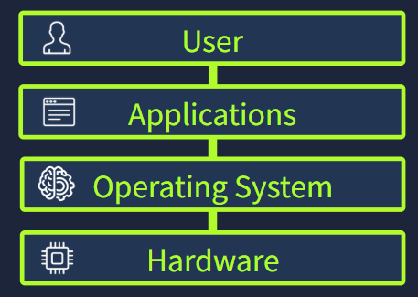
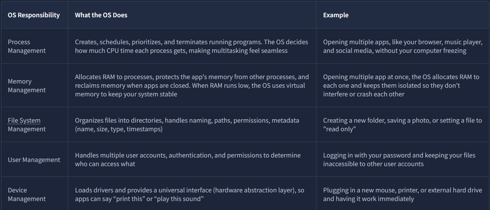
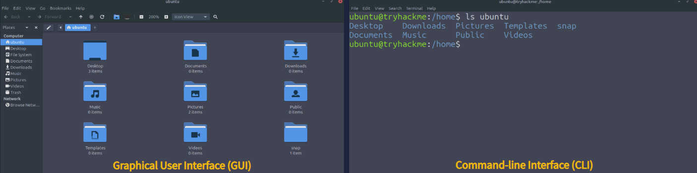
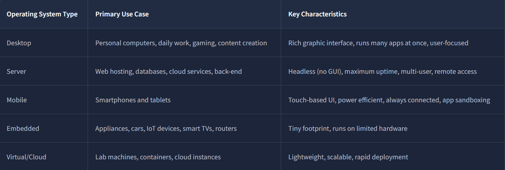
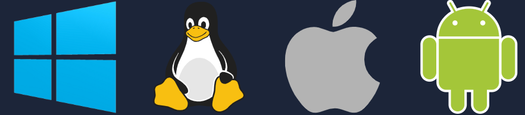

# Room: Operating Systems Introduction

**Path:** Operating Systems Basics

**Date:** August 2026

**Difficulty:** Easy

---

## Objective

Understand what an **Operating System (OS)** is, how it manages computer hardware and software, the difference between kernel space and user space, and the main responsibilities and types of operating systems.

The room also introduces interacting with an operating system through both **GUI** and **CLI** and investigating system information.

---

## Key Concepts



* **Operating System (OS):** Core software that manages hardware, applications, users, and system resources.
* **Kernel:** The privileged core of the operating system that directly manages hardware and system resources.
* **Kernel Space:** The highly privileged area where the kernel operates.
* **User Space:** The restricted environment where normal applications run.
* **GUI:** Graphical User Interface used to interact with a system through windows, icons, and menus.
* **CLI:** Command-Line Interface used to interact with a system through text commands.
* **System Call:** A mechanism that allows applications in user space to request services from the kernel.

---

# The Operating System

An **Operating System** is the core software that coordinates everything happening on a computer.

It sits between:


The OS acts as the central manager that allows applications to use hardware resources safely and efficiently.

Without an operating system, applications would need to manage the CPU, RAM, storage, and hardware devices themselves. This would create conflicts and make modern multitasking difficult.

### Airport Analogy

A useful analogy is an airport:

* **Hardware** → Runways, airplanes, radar, fuel systems
* **Applications** → Airlines and passengers
* **Operating System** → Air traffic control

The OS coordinates the different activities and ensures that resources are used correctly.

---

# System Privilege Layers

Modern operating systems separate software into different privilege levels.

This separation improves **security, stability, and reliability**.

## Kernel Space

**Kernel space** is the highly privileged part of the operating system.

The kernel has direct access to:

* CPU
* RAM
* Storage
* Network hardware
* Input/output devices

Because of its high level of privilege, problems inside the kernel can have serious effects on the entire system.

**Analogy:** Airport control tower

---

## User Space

**User space** is where normal applications run.

Applications are intentionally restricted from directly controlling hardware.

For example, if an application wants to:

* Open a file
* Save data
* Play audio
* Access a network connection

it requests the operating system to perform the operation.

This is done using a **system call**.

```text id="9n6wq2"
Application
    ↓
System Call
    ↓
Kernel
    ↓
Hardware
```

This separation prevents a normal application from having unrestricted access to the entire computer.

---

# Operating System Responsibilities

An operating system performs several important duties to keep a computer running correctly.



---

## Process Management

The OS manages programs while they are running.

It can:

* Create processes
* Schedule CPU time
* Prioritize processes
* Terminate processes

This allows multiple applications to run at the same time.

For example:

```text id="2a9m4k"
CPU
 ├── Browser
 ├── Music Player
 ├── File Manager
 └── Other Processes
```

The OS decides how CPU resources are shared between them.

---

## Memory Management

The operating system manages the computer's **RAM**.

It:

* Allocates memory to processes
* Prevents processes from interfering with each other's memory
* Reclaims memory when applications close
* Uses virtual memory when necessary

This allows multiple applications to operate without directly interfering with one another.

---

## File System Management

The OS organizes information stored on storage devices.

It manages:

* Files
* Directories
* File names
* File paths
* Permissions
* Metadata
* Timestamps

For example:

```text id="7jv1s5"
/home/ubuntu/
├── Documents/
├── Downloads/
├── Pictures/
└── Desktop/
```

The OS provides applications and users with a structured way to access stored data.

---

## User Management

Operating systems can support multiple users.

The OS handles:

* User accounts
* Authentication
* Permissions
* Access control

For example, a user's password can be used to authenticate them, while permissions determine which files and resources that user can access.

---

## Device Management

The operating system manages hardware devices using **drivers** and hardware abstraction.

This allows applications to interact with hardware without needing to understand every hardware-specific detail.

For example, when you connect a printer, the OS can use the appropriate driver to communicate with it.

---

# Operating System Security

The operating system itself provides important security protections.

## Authentication

Authentication verifies who a user is.

Examples include:

* Passwords
* PINs
* Biometrics

---

## Permissions

Permissions determine what users and applications are allowed to do.

For example, an application may be allowed to read a file but not modify it.

---

## Isolation

Operating systems isolate processes and separate **user space** from **kernel space**.

This helps prevent a faulty or compromised application from directly accessing protected system resources.

---

## System Protection

The OS protects important system files, configurations, and resources from unauthorized modification.

These protections form part of the foundation on which additional security tools such as firewalls and antivirus software operate.

---

# OS Interfaces

There are two primary ways users interact with an operating system:

* **GUI — Graphical User Interface**
* **CLI — Command-Line Interface**

---

## Graphical User Interface (GUI)

The **GUI** provides a visual way to interact with the operating system.

It uses elements such as:

* Windows
* Icons
* Menus
* Buttons
* File explorers

For example, opening a folder usually involves clicking through the graphical file manager.

**Analogy:** Using a navigation application by selecting a destination on a map.

---

## Command-Line Interface (CLI)

The **CLI** allows users to interact with the operating system by typing commands.

Instead of clicking through menus, the user gives the computer specific instructions.

For example, on Linux:

```bash
ls
```

can be used to list the contents of a directory.

The CLI provides:

* Precision
* Speed
* Automation
* Powerful system administration capabilities

**Analogy:** Entering exact GPS coordinates instead of selecting a destination visually.

---

## GUI vs CLI



| Feature     | GUI                               | CLI                               |
| ----------- | --------------------------------- | --------------------------------- |
| Interaction | Visual                            | Text-based                        |
| Ease of use | Beginner-friendly                 | Requires command knowledge        |
| Speed       | Often slower for repetitive tasks | Very fast                         |
| Automation  | More limited                      | Excellent                         |
| Precision   | Visual                            | Highly precise                    |
| Common Use  | Everyday computing                | Administration and advanced tasks |

Both interfaces can be used to perform many of the same operations.

---

# Operating System Landscape

Not all operating systems are designed for the same purpose.

Different devices require different features and priorities.



---

# Real-World Operating Systems

## Desktop

### Windows

Microsoft's desktop operating system and one of the most widely used operating systems for personal computers.

Examples:

* Windows 10
* Windows 11

### macOS

Apple's desktop operating system, designed for Mac computers.

Examples include:

* macOS Sonoma
* macOS Sequoia
* macOS Tahoe

### Linux

Linux is not one single operating system. It is a family of open-source operating systems known as **distributions**.

Examples:

* Ubuntu
* Debian
* Fedora

---

# Server Operating Systems

Server operating systems are designed to provide services to other computers and applications.

### Windows Server

Used in:

* Corporate networks
* Data centers
* Enterprise environments

Examples:

* Windows Server 2016
* Windows Server 2019
* Windows Server 2022
* Windows Server 2025

### Linux

Linux is widely used for servers because of its stability, flexibility, and open-source nature.

Examples:

* Ubuntu Server
* Debian
* Red Hat
* CentOS

### Unix

Unix-based systems are commonly found in certain enterprise environments.

Examples:

* IBM AIX
* Oracle Solaris

---

# Mobile Operating Systems

## Android

Android is a mobile operating system used on:

* Smartphones
* Tablets
* Smart devices

Modern Android versions include Android 14–16 and manufacturer-specific versions.

## iOS

iOS is Apple's mobile operating system used primarily on iPhones.

Recent versions include:

* iOS 17
* iOS 18
* iOS 26

---

# Embedded & IoT Operating Systems

Embedded systems are designed for specialized devices with specific functions.

Examples include:

* Routers
* Smart TVs
* Cars
* IoT devices
* Appliances

### Embedded Linux

Examples:

* OpenWrt
* Ubuntu Core
* Yocto Project

### Real-Time Operating Systems

A **Real-Time Operating System (RTOS)** is designed for situations where tasks need predictable response times.

Examples:

* FreeRTOS
* VxWorks
* QNX

These can be used in systems where timing is especially important, such as certain automotive or industrial systems.

---

# Virtual & Cloud Operating Systems

Operating systems are also used inside:

* Virtual machines
* Cloud instances
* Containers

Common examples include:

* Ubuntu LTS
* Amazon Linux
* Rocky Linux
* Alpine Linux
* Bottlerocket
* Flatcar Linux

These environments often prioritize lightweight operation, scalability, and rapid deployment.

---

# Why Are There So Many Operating Systems?



Different environments have different requirements.

### Desktop

Needs:

* User-friendly interfaces
* Multitasking
* Application support

### Server

Needs:

* Reliability
* Security
* High uptime
* Remote administration

### Mobile

Needs:

* Power efficiency
* Touch interfaces
* Hardware integration
* Application sandboxing

### Embedded Systems

Need:

* Small resource requirements
* Specialized functionality
* Efficient operation

Because different environments have different priorities, there is no single operating system that is ideal for every situation.

---

# Hands-On Investigation

In the practical section, I investigated a computer provided through the TryHackMe lab environment.

The system was running **Ubuntu Linux**.

The investigation involved using the operating system to gather information about:

* The operating system
* System version
* Hardware
* Files and directories

The **About This Computer** interface provided system information through the GUI.

The **Home** directory could then be explored to understand how the operating system organizes user files.

---

# Key Terminology

* **Operating System (OS):** Core software responsible for managing hardware, applications, and system resources.
* **Kernel:** The privileged core of the operating system.
* **Kernel Space:** Highly privileged memory and execution area where the kernel operates.
* **User Space:** Restricted environment where normal applications execute.
* **System Call:** A mechanism used by applications to request services from the kernel.
* **Process:** A running instance of a program.
* **GUI:** Graphical interface using windows, icons, menus, and other visual elements.
* **CLI:** Text-based interface used to control a system through commands.
* **Driver:** Software that allows the OS to communicate with a hardware device.
* **Linux Distribution:** An operating system built around the Linux kernel, such as Ubuntu or Debian.
* **RTOS:** Operating system designed to provide predictable responses within required timing constraints.

---

# Key Takeaways

* An **operating system** acts as the central manager between applications and hardware.
* The **kernel** is the privileged core responsible for managing system resources.
* **Kernel space** has highly privileged access to hardware.
* **User space** provides a restricted environment for normal applications.
* Applications use **system calls** to request services from the kernel.
* The OS manages **processes, memory, files, users, and devices**.
* Operating systems provide important security mechanisms such as **authentication, permissions, and isolation**.
* Users can interact with operating systems through **GUI and CLI**.
* Different OS types are designed for different environments, including **desktop, server, mobile, embedded, and cloud systems**.
* Linux is a family of distributions rather than a single operating system.

---

## What I Learned

This room helped me understand what an **operating system actually does behind the scenes**. Before this room, it was easy to think of an OS mainly as the graphical interface that I interact with, but I learned that its much more important role is managing the hardware and system resources underneath the applications.

I learned how the OS manages **processes, memory, files, users, and hardware devices**, while also providing security through authentication, permissions, and isolation.

One of the most important concepts was the separation between **kernel space and user space**. Normal applications run with limited privileges and use system calls when they need the kernel to perform privileged operations. This separation helps protect the system from faulty or malicious applications.

I also learned the difference between **GUI and CLI** and why the CLI is especially useful for system administration and cybersecurity. Finally, I explored the different types of operating systems and their use cases, from desktop systems such as Windows and Linux to mobile, embedded, server, and cloud environments.

Understanding operating systems is an essential foundation for cybersecurity because many security attacks ultimately involve processes, memory, files, permissions, users, or privileged system components.
