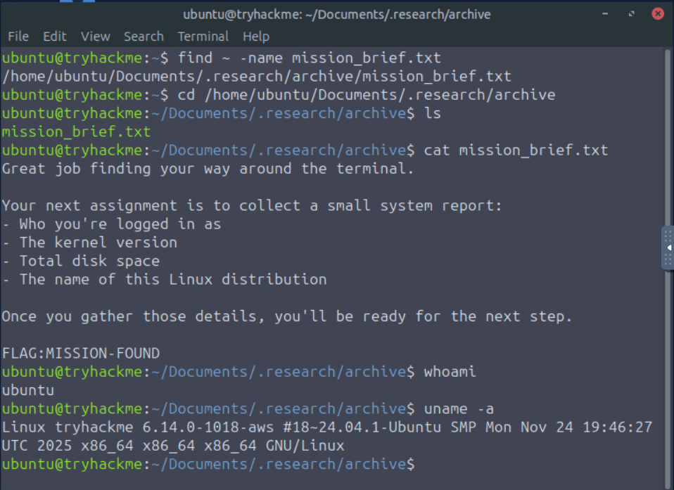
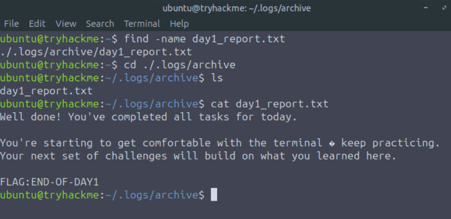

# 🐧 Linux CLI Basics

## 📘 Overview

The **Linux CLI Basics** room introduces the Linux terminal and teaches the fundamental commands required to interact with a Linux system.

In cyber security, Linux is widely used for:

* Servers
* Security tools
* Hacking environments
* System administration

The **Command-Line Interface (CLI)** allows users to interact with Linux by typing commands directly into the terminal instead of using a graphical interface.

> 💡 **Core Idea:**
> The Linux CLI provides a fast and powerful way to navigate the system, inspect files, and gather system information.

---

## 🎯 Learning Objectives

After completing this room, you will be able to:

* Understand what the Linux terminal is
* Interact with Linux using the CLI
* Navigate directories and files
* Retrieve system information
* Inspect important configuration files
* Search for files
* Read file contents using command-line utilities

---

## 📌 Prerequisites

Before beginning this room, it is recommended that you complete:

* Operating Systems: Introduction
* Windows Basics

---

## 🧩 Task 1: Introduction

Linux is everywhere in **cyber security**, powering servers, security tools, and hacking environments.

Before investigating or defending Linux systems, you need to understand how to interact with the operating system through the **Command-Line Interface (CLI)**.

### 🧠 Storyline

You start your first day as an **IT Support Engineer** with the Cyber Operations Support Team.

Your supervisor is called away during an urgent incident and leaves you with a Linux computer and a small mission.

Throughout the room, you will:

* Navigate the Linux filesystem
* Locate files
* Inspect system information
* Complete basic investigative tasks

These skills form the foundation for more advanced Linux and cyber security tasks.

### ❓ Question

**Q)** What does "CLI" stand for?

**A)** `command-line interface`

---

# 🔎 Task 2: Navigation Mission: "Find the Missing Notes"

Before starting the task, launch the target machine and open the split-screen view.

## 💻 The Terminal

The **terminal** is a text-based interface used to control and interact with a Linux system.

Instead of clicking through menus and windows, users type commands directly into the system.

### Why is the terminal important?

Cyber security professionals rely heavily on the terminal because:

* It is faster than graphical interfaces
* It provides more control over the system
* Many security tools are designed to run from the terminal

---

## 📍 Step 1: Determine Your Current Location

Use:

```bash
pwd
```

`pwd` stands for **Print Working Directory** and displays the directory you are currently working in.

### Example

```bash
ubuntu@tryhackme:~$ pwd
/home/ubuntu
```

> 🧠 **Think of `pwd` as:**
> **"Where am I?"**

---

## 📂 Step 2: View Files and Folders

Use:

```bash
ls
```

This lists the files and directories in the current directory.

### Example

```bash
ubuntu@tryhackme:~$ ls
Desktop    Downloads  Pictures  Templates  logs
Documents  Music      Public    Videos     projects
```

For a detailed listing:

```bash
ls -l
```

This displays additional information such as:

* Permissions
* Ownership
* File sizes
* Timestamps

To include hidden files and directories:

```bash
ls -al
```

### 👻 Hidden Files

Linux files beginning with a period (`.`) are hidden by default.

Example:

```text
.research
```

The `-a` option allows hidden files to be displayed.

---

## 📁 Step 3: Navigate Between Directories

To move into a directory:

```bash
cd Documents
```

Example:

```bash
ubuntu@tryhackme:~$ cd Documents/
ubuntu@tryhackme:~/Documents$
```

To move back one directory:

```bash
cd ..
```

Example:

```bash
ubuntu@tryhackme:~/Documents$ cd ..
ubuntu@tryhackme:~$
```

> 🧠 **`cd` = Change Directory**

---

## 🔎 Step 4: Locate Files Using `find`

Linux provides the `find` command to search for files and directories.

To search for `mission_brief.txt` inside the home directory:

```bash
find ~ -name mission_brief.txt
```

Example result:

```text
/home/ubuntu/Documents/.research/archive/mission_brief.txt
```

The command searches recursively through the specified directory and returns the path of matching files.

---

## 📖 Step 5: Read File Contents

After locating the file, navigate to its directory and use:

```bash
cat mission_brief.txt
```

The `cat` command displays the contents of a file directly in the terminal.

The file contains the following assignment:

* Identify the current user
* Find the kernel version
* Check total disk space
* Identify the Linux distribution

The hidden flag is:

```text
MISSION-FOUND
```

### ✅ Answers

**Q)** What is the full path of the `mission_brief.txt` file?

**A)**

```text
/home/ubuntu/Documents/.research/archive/mission_brief.txt
```

**Q)** What is the flag hidden inside the `mission_brief.txt` file?

**A)**

```text
MISSION-FOUND
```



---

# 🧠 Task 3: Investigating the System

The next task involves gathering important information about the Linux system.

System administrators and cyber security professionals commonly collect this information to:

* Understand the environment
* Troubleshoot problems
* Verify system configuration
* Investigate systems

---

## 👤 Step 1: Identify the Current User

Use:

```bash
whoami
```

This displays the username of the currently logged-in account.

### Example

```bash
ubuntu@tryhackme:~$ whoami
ubuntu
```

> 🧠 **Think of `whoami` as:**
> **"Who am I logged in as?"**

---

## 🖥️ Step 2: Display System Information

Use:

```bash
uname -a
```

This command provides information about the operating system and kernel.

### Example

```bash
ubuntu@tryhackme:~$ uname -a
Linux tryhackme 6.14.0-1018-aws #17-Ubuntu SMP Mon Sep 2 13:48:07 UTC 2024 x86_64 x86_64 x86_64 GNU/Linux
```

The output includes:

* Operating system name
* Hostname
* Kernel version
* System architecture
* GNU/Linux identifier

If only the operating system name is required:

```bash
uname
```

---

## 💾 Step 3: Check Disk Usage

Use:

```bash
df -h
```

The `-h` option displays disk usage in a **human-readable** format.

Example:

```text
Filesystem      Size  Used  Avail  Use%  Mounted on
/dev/root        70G   12G    58G   17%  /
```

The output shows:

* Total disk space → `70G`
* Used space → `12G`
* Available space → `58G`
* Usage percentage → `17%`

> 🧠 The `-h` option makes storage values easier to read using units such as MB and GB.

---

## ⚙️ Step 4: Read Operating System Information

Linux stores many important configuration and information files inside:

```text
/etc
```

Navigate to the directory:

```bash
cd /etc
```

List its contents:

```bash
ls
```

To view Linux distribution information:

```bash
cat os-release
```

Example:

```text
PRETTY_NAME="Ubuntu 24.04.1 LTS"
NAME="Ubuntu"
VERSION_ID="24.04"
VERSION="24.04.1 LTS (Noble Numbat)"
```

The `os-release` file contains information about the installed Linux distribution.

---

## 🏁 Mini Challenge

The final challenge is to locate a file called:

```text
day1_report.txt
```

You must:

1. Use `find` to locate the file
2. Navigate to its directory using `cd`
3. Read the file using `cat`
4. Retrieve the hidden message

### ✅ Answers

**Q)** What is the username returned by the `whoami` command?

**A)** `ubuntu`

**Q)** What is the kernel version shown by `uname -a`?

**A)** `6.14.0-1018-aws`

**Q)** How much free disk space does `df -h` report?

**A)** `58G`

**Q)** What is the message written inside `day1_report.txt`?

**A)** `END-OF-DAY1`



---

# 🧠 Task 4: Conclusion

Congratulations on completing **Linux CLI Basics**.

In this room, you learned how to:

* Navigate the Linux filesystem
* Locate files using the `find` utility
* Read file contents using `cat`
* Identify the current user
* Retrieve system and kernel information
* Check disk usage
* Inspect Linux configuration files
* Work with the Linux terminal

These commands form the foundation for more advanced Linux and cyber security topics, including:

* Process management
* File permissions
* Networking
* Scripting
* Security tooling

---

## 🔑 Key Terminology

* **CLI (Command-Line Interface)**
  A text-based interface used to interact with the operating system.

* **Terminal**
  The application used to access the Linux command line.

* **`pwd`**
  Displays the current working directory.

* **`ls`**
  Lists files and directories.

* **`cd`**
  Changes the current directory.

* **`find`**
  Searches for files and directories.

* **`cat`**
  Displays the contents of a file.

* **`whoami`**
  Shows the currently logged-in user.

* **`uname`**
  Displays operating system and kernel information.

* **`df -h`**
  Displays disk usage and available storage in a human-readable format.

* **`/etc`**
  Directory containing important Linux system configuration files.

* **`os-release`**
  Contains information about the installed Linux distribution.

---

## 🧠 Essential Commands

These are the main commands to remember from this room:

```bash
pwd
```

➡️ Shows your current location.

```bash
ls
```

➡️ Lists files and directories.

```bash
ls -al
```

➡️ Lists files, including hidden files, with detailed information.

```bash
cd Documents
```

➡️ Moves into a directory.

```bash
cd ..
```

➡️ Moves one directory back.

```bash
find ~ -name filename
```

➡️ Searches for a file.

```bash
cat filename
```

➡️ Reads a file.

```bash
whoami
```

➡️ Shows the current user.

```bash
uname -a
```

➡️ Shows detailed system and kernel information.

```bash
df -h
```

➡️ Shows available disk space.

```bash
cat /etc/os-release
```

➡️ Shows Linux distribution information.

---

## 🚀 What’s Next?

Now that you understand the Linux command line, you can continue developing your Linux and Windows administration skills through:

➡️ **Windows CLI Basics**

➡️ **Linux Fundamentals**

➡️ **Intro to Linux**
