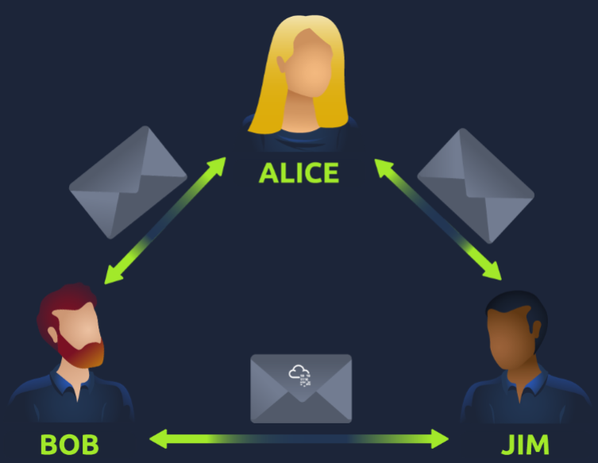
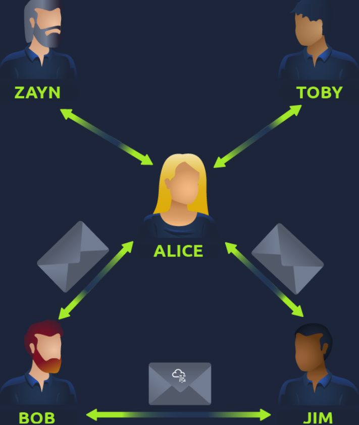
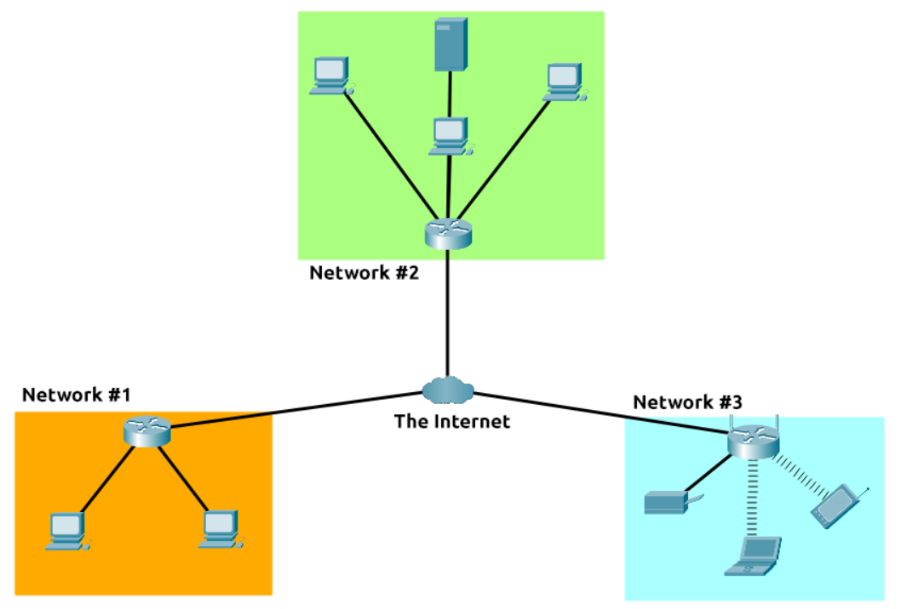
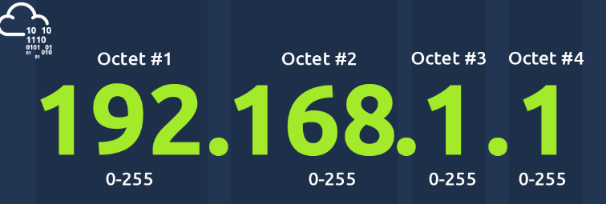
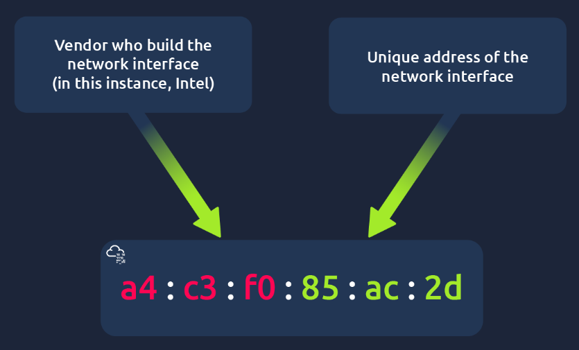
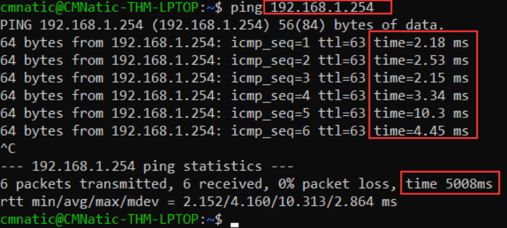

# Room: Introduction to Networking

**Path:** Operating Systems Basics

**Date:** August 2026

**Difficulty:** Easy

---

## Objective

Understand what a network is, how the Internet is formed from many smaller networks, and how devices identify themselves and each other on a network using **IP addresses** and **MAC addresses**. The room also covers the difference between public and private networks/addresses, IPv4 vs IPv6, and MAC address spoofing.

---

## Key Concepts

* **Network:** A group of things connected together — in computing, connected devices.
* **The Internet:** One giant network made up of many smaller private networks joined together by public networks.
* **Private Network:** A network connecting a small, local group of devices.
* **Public Network:** A network connecting private networks together — the Internet itself.
* **IP Address:** A changeable identifier used to locate and communicate with a device on a network.
* **MAC Address:** A permanent, factory-assigned hardware identifier for a device's network interface.
* **Spoofing:** Faking a device's MAC address to impersonate another device on the network.

---

# Task 1: What Is Networking?

## Networks Are Simply Things Connected

A network is just a group of things connected — like a friendship circle connected by shared interests, hobbies, or skills.

Networks show up all throughout everyday life:

* A city's public transportation system
* Infrastructure such as the national power grid for electricity
* Meeting and greeting your neighbours
* Postal systems for sending letters and parcels

## Networking in Computing

In computing, networking follows the same idea, just applied to technological devices. A network can be formed by anywhere from 2 devices to billions — laptops, phones, security cameras, traffic lights, even farming equipment.

Networks are deeply embedded in modern life: gathering weather data, delivering electricity to homes, determining right-of-way at a road. Because of this, networking is an essential concept to grasp in cybersecurity.

**Example:** Alice, Bob, and Jim form their own small network by being connected to one another.


Networks come in all shapes and sizes — a theme explored further throughout the module.

---

# Task 2: What Is the Internet?

## The Internet as a Network of Networks

The Internet is one giant network made up of many small networks joined together.

**Example:** Alice makes new friends, Zayn and Toby, who don't speak the same language as Bob and Jim. Since Alice speaks both languages, she becomes the messenger — connecting the two groups and forming a new, larger network through herself.


## A Brief History

* The first iteration of the Internet began with the **ARPANET** project in the late 1960s, funded by the U.S. Defence Department — the first documented network in action.
* The Internet as it's known today wasn't invented until **1989**, when **Tim Berners-Lee** created the **World Wide Web (WWW)**. From that point on, the Internet began to be used as a repository for storing and sharing information, much like today.


## Private vs Public Networks

Relating Alice's friend network back to computing devices: the Internet is a much larger version of that same diagram, made up of many small networks joined together. These small networks are called **private networks**, while the networks connecting them together are **public networks** — i.e. the Internet.

A network can be one of two types:

* A **private network**
* A **public network**

Devices use a set of labels to identify themselves on a network — covered in the next task.

---

# Task 3: Identifying Devices on a Network

## Why Identification Matters

To communicate and maintain order, devices must be both identifying and identifiable on a network — there's no point communicating if you don't know who you're talking to.

## Two Ways Devices Are Identified

Just like humans can be identified by name (changeable) and fingerprints (permanent), devices have two means of identification:

* **An IP Address** — can change over time
* **A MAC (Media Access Control) Address** — permanent, like a serial number

## IP Addresses


An **IP (Internet Protocol) address** identifies a host on a network for a period of time; that same IP address can later be reassigned to a different device. An IP address is a set of numbers divided into four octets, calculated through IP addressing & subnetting. IP addresses can change from device to device, but cannot be active on more than one device simultaneously within the same network.

IP addresses follow standards called **protocols**, which force devices to communicate using a shared "language."

### Public vs Private IP Addresses

Devices can sit on both private and public networks, and the type of network determines the type of address:

* A **public address** identifies a device on the Internet.
* A **private address** identifies a device among other devices on its local network.

**Example:**

| Device Name | IP Address | IP Address Type |
|---|---|---|
| DESKTOP-KJE57FD | 192.168.1.77 | Private |
| DESKTOP-KJE57FD | 86.157.52.21 | Public |
| CMNatic-PC | 192.168.1.74 | Private |
| CMNatic-PC | 86.157.52.21 | Public |

These two devices use their private IP addresses to communicate with each other locally, but any data sent to the Internet from either device is identified by the same shared public IP address. Public IP addresses are provided by an **Internet Service Provider (ISP)**, typically for a monthly fee.

### IPv4 vs IPv6

As more devices connect to the Internet, available public addresses are running out — Cisco estimated roughly 50 billion connected devices by the end of 2021.

* **IPv4** uses 2³² possible addresses (~4.29 billion) — hence the shortage.
* **IPv6** was introduced to solve this, supporting up to 2¹²⁸ addresses (340+ trillion) and using more efficient methodologies.


## MAC Addresses

Every networked device has a physical network interface (a microchip on the motherboard), assigned a unique **MAC address** at the factory. A MAC address is a twelve-character hexadecimal number, split into pairs and separated by colons — e.g. `a4:c3:f0:85:ac:2d`. The first six characters identify the manufacturer; the last six form a unique device number.

### MAC Address Spoofing



MAC addresses can be faked, or **spoofed** — where a device pretends to be another device by using its MAC address. This can break poorly implemented security designs that assume devices on a network are trustworthy.

**Example:** A firewall allows traffic to/from the administrator's MAC address. If an attacker spoofs that MAC address, the firewall believes it's communicating with the administrator when it isn't.

Places like cafes, coffee shops, and hotels often use MAC address control on their "Guest"/"Public" Wi-Fi — for example, offering a faster paid connection tied to a specific device's MAC address.

## Practical

The interactive lab simulates a hotel Wi-Fi network requiring payment. The router blocks Bob's packets (unpaid) from reaching the TryHackMe website while allowing Alice's packets through (paid). Changing Bob's MAC address to match Alice's demonstrates how spoofing can bypass this kind of MAC-based access control.

---

## Ping (ICMP)

**Ping** is a fundamental network tool used to check whether a device is reachable and to measure the time it takes for data to travel between two devices.

Ping uses **ICMP (Internet Control Message Protocol)** packets.

### How Ping Works

Ping sends an **ICMP Echo Request** to the target device.

If the target is reachable, it responds with an **ICMP Echo Reply**.

The time between sending the request and receiving the reply is measured, allowing us to see the connection's response time.

### Basic Syntax

```text
ping IP_ADDRESS
```

For example:

```text
ping 8.8.8.8
```

Here, `8.8.8.8` is the IP address being tested.

### What Ping Can Tell Us

Ping can help determine:

* Whether a device is reachable.
* Whether packets are being successfully returned.
* How long packets take to travel between the devices.
* Whether there may be connection or reliability problems.


### Example

```text
ping 192.168.1.254
```

A successful ping may show that ICMP packets were sent and received, along with the response time.

For example:

```text
Reply from 192.168.1.254: bytes=32 time=4ms TTL=64
```

The `time=4ms` value represents approximately how long the round trip took.

### ICMP

**ICMP (Internet Control Message Protocol)** is a network protocol used for sending control and diagnostic messages.

Ping specifically uses:

* **Echo Request** → Sent to the target.
* **Echo Reply** → Returned by the target.

### Practical

The TryHackMe practical asks us to ping the IP address:

```text
ping 8.8.8.8
```

Pinging the correct address reveals a flag that can be used to answer the room's question.

**Note:** The flag itself is not included here because it was not provided in the room content above.


# Task 4: Conclusion

This room introduced the foundational idea of networking — how connected devices form networks, how private networks combine to form the Internet, and how devices identify themselves and each other using IP and MAC addresses.

---

# Key Terminology

* **Network:** A group of connected things — in computing, connected devices.
* **The Internet:** A public network made up of many smaller private networks joined together.
* **Private Network:** A local network connecting a small group of devices.
* **Public Network:** A network connecting private networks together (the Internet).
* **IP Address:** A changeable numeric identifier (four octets) used to locate a device on a network.
* **IPv4:** The original IP addressing scheme, supporting ~4.29 billion addresses.
* **IPv6:** A newer IP addressing scheme supporting 340+ trillion addresses.
* **MAC Address:** A permanent, factory-assigned hexadecimal hardware identifier for a device's network interface.
* **Spoofing:** Faking a MAC (or other) address to impersonate another device.
* **ISP (Internet Service Provider):** The provider of a device's public IP address, typically for a fee.

---

# Key Takeaways

* A **network** is simply a set of connected things — in computing, connected devices, ranging from 2 devices to billions.
* The **Internet** is a public network formed by joining together countless smaller **private networks**.
* The Internet grew from the **ARPANET** project in the late 1960s into today's form with Tim Berners-Lee's invention of the **World Wide Web** in 1989.
* Devices are identified two ways: by a changeable **IP address** and a permanent, factory-assigned **MAC address** — much like a name versus a fingerprint.
* **Private IP addresses** identify a device on its local network, while a **public IP address** (from an ISP) identifies it on the Internet.
* **IPv6** was introduced to solve the address shortage created by **IPv4**'s limited address space.
* MAC addresses can be **spoofed**, which can bypass security controls that assume devices are trustworthy — as demonstrated in the hotel Wi-Fi practical.

---

## What I Learned

This room built a clear mental model of networking from the ground up, starting with the simple idea that a network is just "things connected" — whether that's a friendship circle, a city's transit system, or a set of laptops and phones. That framing made it much easier to understand the Internet itself: not as one single entity, but as a massive collection of smaller private networks linked together through public networks.

I found the history genuinely interesting — that the Internet's roots trace back to ARPANET in the late 1960s, but it didn't become the information-sharing tool we know today until Tim Berners-Lee created the World Wide Web in 1989.

The most practically useful part was learning how devices identify themselves. Comparing an IP address to a name (changeable) and a MAC address to a fingerprint (permanent) made the distinction stick immediately. I also learned why private and public IP addresses exist side by side — devices on the same local network talk to each other using private addresses, but all share one public address when reaching the Internet, which explains why IPv4's ~4.29 billion addresses ran out and why IPv6 was necessary.

Learning about **MAC address spoofing** tied everything back to cybersecurity: security systems that trust a device purely based on its MAC address can be fooled by an attacker who fakes that address, as shown in the hotel Wi-Fi lab where changing Bob's MAC address to Alice's let his traffic through. This was a good reminder that low-level network identifiers aren't inherently trustworthy and shouldn't be relied on as a sole security control.