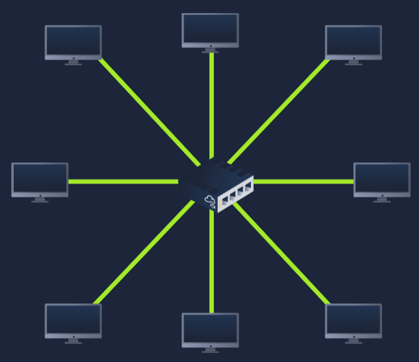
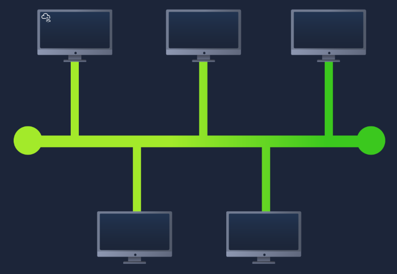
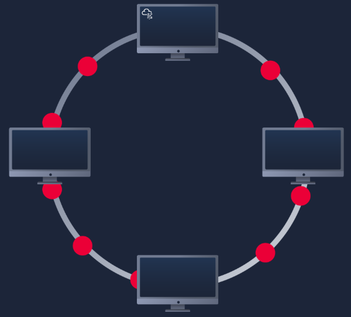
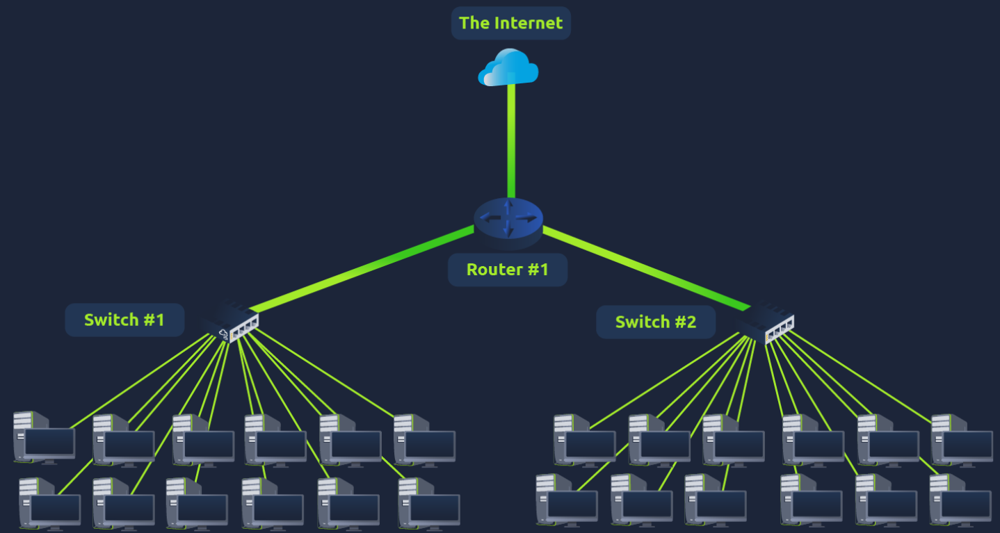
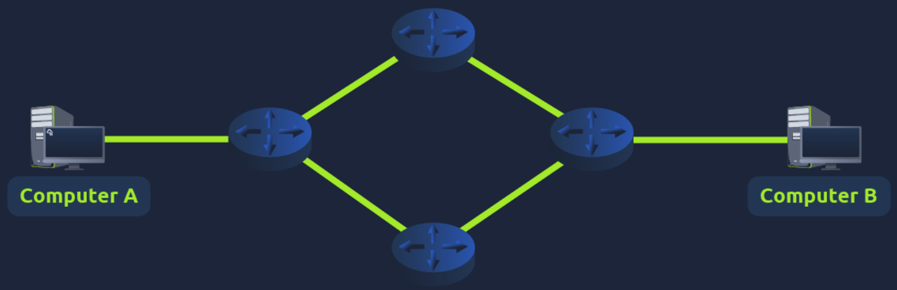
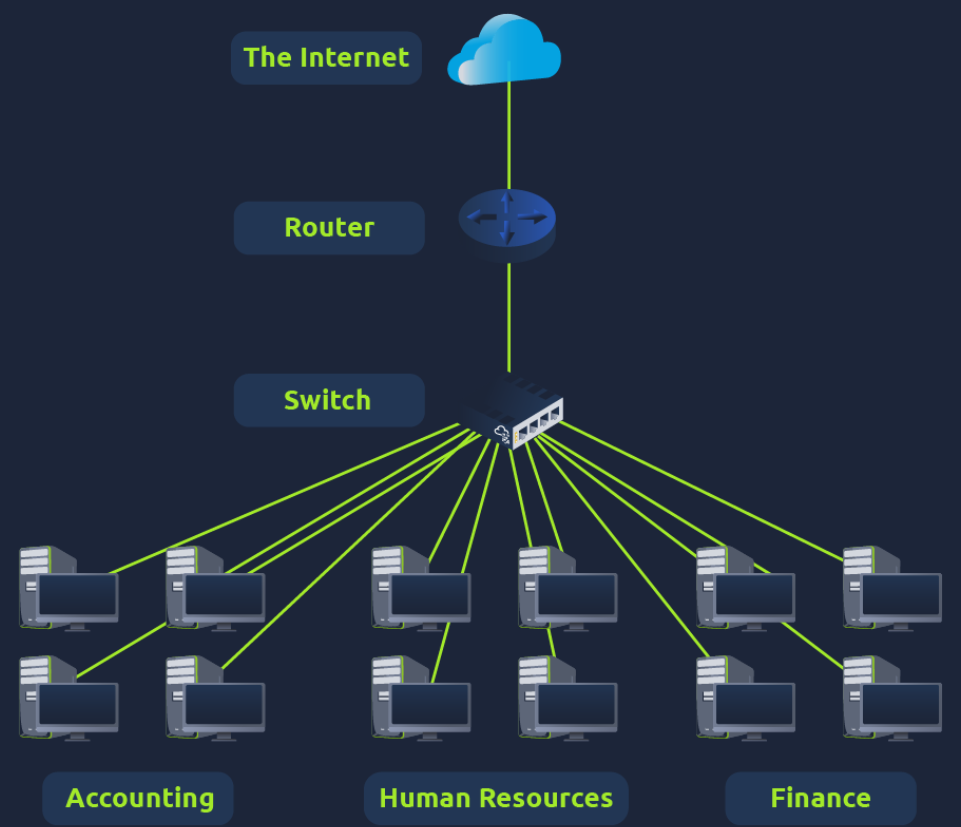
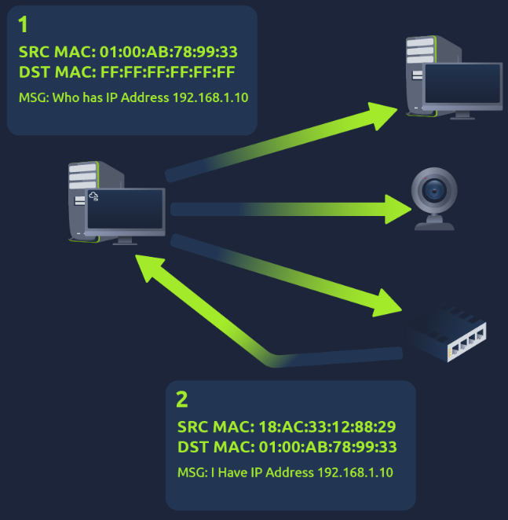

# Room: LAN Topologies, Subnetting, ARP & DHCP

**Path:** Operating Systems Basics
**Date:** September 2026
**Difficulty:** Easy

## Objective

This room introduces important concepts used in **local area networks (LANs)** and explains how devices communicate within and between networks.

The main topics covered are:

* LAN topologies
* Star, Bus, and Ring topologies
* Switches and Routers
* Subnetting
* Network, Host, and Default Gateway addresses
* ARP (Address Resolution Protocol)
* DHCP (Dynamic Host Configuration Protocol)

---

## Key Concepts

| Concept           | Description                                                                     |
| ----------------- | ------------------------------------------------------------------------------- |
| **LAN**           | Local Area Network; a network connecting devices within a limited area          |
| **Topology**      | The design or structure of a network                                            |
| **Star Topology** | Devices connect individually to a central switch or hub                         |
| **Bus Topology**  | Devices share a single backbone cable                                           |
| **Ring Topology** | Devices connect together to form a loop                                         |
| **Switch**        | Centrally connects devices and forwards data to the intended device             |
| **Router**        | Connects different networks and routes data between them                        |
| **Subnetting**    | Dividing a network into smaller networks                                        |
| **Subnet Mask**   | A 32-bit value used to determine the network and host portions of an IP address |
| **ARP**           | Maps an IP address to a MAC address                                             |
| **DHCP**          | Automatically assigns IP addresses to devices                                   |

---

# Task 1: LAN Topologies

A **network topology** describes the design or structure of a network — in other words, how the devices are connected to one another.

Different topologies have different advantages and disadvantages.

---

## Star Topology



In a **Star Topology**, each device is individually connected to a **central networking device**, such as a switch or hub.

This is the most commonly used topology today because it provides good **reliability and scalability**.

### Advantages

* Easy to add more devices.
* Highly scalable.
* A failure of one individual connection generally does not affect the other devices.
* Centralised networking equipment is usually robust.

### Disadvantages

* Requires more cabling.
* Requires dedicated networking equipment.
* More expensive to set up.
* As the network grows, maintenance becomes more difficult.
* If the central switch or hub fails, connected devices can no longer communicate through it.

### Key Idea

**Star = Central device**

All devices communicate through a central networking device.

---

## Bus Topology



A **Bus Topology** uses a single connection called a **backbone cable**.

Devices connect to this shared cable.

Since all data travels along the same cable, the network can become slow when many devices are communicating at the same time.

### Advantages

* Simple to set up.
* Cost-efficient.
* Requires less cabling and dedicated networking equipment.

### Disadvantages

* Can become slow and experience bottlenecks.
* Troubleshooting can be difficult.
* Has very little redundancy.
* The backbone cable is a single point of failure.
* If the backbone fails, devices can no longer communicate across the network.

### Key Idea

**Bus = One shared backbone**

---

## Ring Topology



A **Ring Topology** connects devices directly to one another in a loop.

Data travels around the loop until it reaches its intended destination.

Devices can also forward data received from another device around the ring.

### Advantages

* Requires less cabling than a star topology.
* Has less dependence on dedicated central hardware.
* Relatively easy to troubleshoot.
* Less prone to bottlenecks than a bus topology.

### Disadvantages

* Data may need to pass through several devices before reaching its destination.
* This makes communication less efficient.
* A broken device or cable can cause the entire network to fail.

### Key Idea

**Ring = Devices connected in a loop**

---

# Task 2: Switches and Routers

## What is a Switch?

A **switch** is a networking device used to connect multiple devices on a local network.



Devices such as:

* Computers
* Printers
* Other Ethernet-capable devices

can connect to the ports of a switch.

Switches are commonly used in larger networks such as:

* Businesses
* Schools
* Offices

Switches can have different numbers of ports, such as:

```text
4
8
16
24
32
64
```

### Switch vs Hub

A switch is more efficient than a **hub/repeater**.

A switch keeps track of which device is connected to which port.

When a switch receives a packet, it can forward it to the intended device instead of sending it to every port.

This reduces unnecessary network traffic.

---

## Network Redundancy

Switches and routers can be connected to one another to provide **redundancy**.

Redundancy means having multiple possible paths for data.

```text
Network A ---- Path 1 ---- Network B
       \                    /
        ---- Path 2 -------
```

If one path fails, another path can be used.

This increases the reliability of the network and can prevent complete downtime.

---

## What is a Router?

A **router** is a networking device whose job is to **connect different networks and pass data between them**.

It does this using **routing**.

### Routing

**Routing** is the process of determining and creating a path for data to travel between networks.



For example:

The router determines where data needs to go and forwards it between networks.

### Key Difference

**Switch:**

> Connects devices within a network.

**Router:**

> Connects different networks.

---

## Practical Answers

**Q: What does LAN stand for?**
**A:** `Local Area Network`

**Q: What is the verb given to the job that Routers perform?**
**A:** `Routing`

**Q: What device is used to centrally connect multiple devices on the local network and transmit data to the correct location?**
**A:** `Switch`

**Q: What topology is cost-efficient to set up?**
**A:** `Bus`

**Q: What topology is expensive to set up and maintain?**
**A:** `Star`

**Q: Complete the interactive lab. What is the flag?**
**A:** The flag is obtained from the interactive practical and was not included in the provided room content.

---

# Task 3: Subnetting

Networks can range from very small networks to extremely large networks.

**Subnetting** is the process of dividing a network into smaller networks called **subnets**.

A useful way to think about subnetting is:

> One large network → several smaller networks

For example, a business might have separate departments such as:

* Accounting
* Finance
* Human Resources



Subnetting can be used to separate these groups into different parts of the network.


---

## Subnet Mask

Subnetting is achieved by dividing the number of hosts that can fit within a network.

This is represented using a **subnet mask**.

An IPv4 subnet mask contains **32 bits** and is represented using four octets.

Each octet has a value ranging from:

```text
0 - 255
```

Example:

```text
255.255.255.0
```

---

## Three Important Network Addresses

Subnets use IP addresses in three important ways:

1. **Network Address**
2. **Host Address**
3. **Default Gateway**

| Type                | Purpose                                     | Example         |
| ------------------- | ------------------------------------------- | --------------- |
| **Network Address** | Identifies the network itself               | `192.168.1.0`   |
| **Host Address**    | Identifies a specific device on the network | `192.168.1.100` |
| **Default Gateway** | Device used to send data to another network | `192.168.1.254` |

---

## Network Address

The **Network Address** identifies the network itself.

For example, a device with:

```text
192.168.1.100
```

can belong to the network:

```text
192.168.1.0
```

The network address represents the start/identity of that network.

---

## Host Address

A **Host Address** identifies an individual device within a subnet.

For example:

```text
192.168.1.100
```

could identify a specific computer on the network.

```text
Network: 192.168.1.0
          |
          +-- 192.168.1.100  ← Host
```

---

## Default Gateway

The **Default Gateway** is a device on the network capable of sending information to another network.

If a device wants to communicate with something that is **not on its local network**, it sends the data to the default gateway.

For example:

```text
Computer
   |
   | Local Network
   |
Default Gateway
   |
   | Another Network
   |
Internet
```

The default gateway often uses the first or last usable host address, such as:

```text
192.168.1.1
```

or:

```text
192.168.1.254
```

---

## Why Use Subnetting?

Subnetting provides several benefits:

* **Efficiency** — networks can be divided into manageable sections.
* **Security** — different groups can be separated from each other.
* **Control** — network administrators can control how devices are organised.

### Example: Café Network

A café could use separate networks for:

**Employees:**

* Employee computers
* Cash registers
* Internal devices

**Customers:**

* Public Wi-Fi

Subnetting allows these networks to remain separated while still providing access to larger networks such as the Internet.

---

## Practical Answers

**Q: What is the technical term for dividing a network up into smaller pieces?**
**A:** `Subnetting`

**Q: How many bits are in a subnet mask?**
**A:** `32`

**Q: What is the range of a section (octet) of a subnet mask?**
**A:** `0-255`

**Q: What address is used to identify the start of a network?**
**A:** `Network Address`

**Q: What address is used to identify devices within a network?**
**A:** `Host Address`

**Q: What is the name used to identify the device responsible for sending data to another network?**
**A:** `Default Gateway`

---

# Task 4: ARP

**ARP** stands for **Address Resolution Protocol**.

It is used to associate an **IP address** with a **MAC address** on a network.

Remember:

* **IP address** → Logical identifier
* **MAC address** → Physical identifier

ARP helps a device discover the MAC address associated with a particular IP address.

---

## ARP Cache

Each device maintains an **ARP cache**.

The ARP cache stores mappings between IP addresses and MAC addresses that the device has learned.

For example:

```text
IP Address          MAC Address
192.168.1.10   →    AA:BB:CC:DD:EE:FF
```

This allows the device to reuse the information instead of having to discover it again.

---

## How ARP Works

ARP uses two main types of messages:

1. **ARP Request**
2. **ARP Reply**

### Step 1 — ARP Request

The device broadcasts a request across the network asking:

> Which device owns this IP address?

For example:

```text
Who has 192.168.1.10?
```

The request is broadcast to devices on the network.

### Step 2 — ARP Reply

The device that owns the requested IP address responds with its MAC address.

```text
192.168.1.10
      ↓
AA:BB:CC:DD:EE:FF
```

The requesting device can then store this mapping in its ARP cache.

---

## ARP Process



### Key Idea

**ARP = IP address → MAC address**

---

## Practical Answers

**Q: What does ARP stand for?**
**A:** `Address Resolution Protocol`

**Q: What category of ARP packet asks a device whether or not it has a specific IP address?**
**A:** `ARP Request`

**Q: What address is used as a physical identifier for a device on a network?**
**A:** `MAC Address`

**Q: What address is used as a logical identifier for a device on a network?**
**A:** `IP Address`

---

# Task 5: DHCP

**DHCP** stands for **Dynamic Host Configuration Protocol**.

DHCP allows devices to automatically obtain an IP address when they connect to a network.

Without DHCP, an IP address could be manually configured on a device.

With DHCP, the process can happen automatically.

---

## How DHCP Works

The DHCP process uses four main messages:

1. **DHCP Discover**
2. **DHCP Offer**
3. **DHCP Request**
4. **DHCP ACK**

A simple way to remember them is:

```text
Discover → Offer → Request → ACK
```

---

## Step 1 — DHCP Discover

When a device connects to a network and does not already have an IP address, it sends a **DHCP Discover** message.

The device is essentially asking:

> Is there a DHCP server available?

---

## Step 2 — DHCP Offer

The DHCP server responds with a **DHCP Offer**.

The offer contains an IP address that the device could use.

```text
DHCP Server
     |
     | DHCP Offer
     ↓
Device
```

---

## Step 3 — DHCP Request

The device sends a **DHCP Request** to indicate that it wants to use the offered IP address.

```text
Device
   |
   | DHCP Request
   ↓
DHCP Server
```

---

## Step 4 — DHCP ACK

Finally, the DHCP server sends a **DHCP ACK** (Acknowledgement).

This confirms that the device can use the IP address.

```text
Discover → Offer → Request → ACK
```

After this process, the device can start using the assigned IP address.

---

## DHCP Process Summary

| Step | Packet            | Purpose                                |
| ---- | ----------------- | -------------------------------------- |
| 1    | **DHCP Discover** | Device searches for a DHCP server      |
| 2    | **DHCP Offer**    | Server offers an IP address            |
| 3    | **DHCP Request**  | Device requests the offered IP address |
| 4    | **DHCP ACK**      | Server confirms the assignment         |

### Easy Way to Remember

**DORA**

```text
D → Discover
O → Offer
R → Request
A → ACK
```

---

## Practical Answers

**Q: What type of DHCP packet is used by a device to retrieve an IP address?**
**A:** `DHCP Discover`

**Q: What type of DHCP packet does a device send once it has been offered an IP address by the DHCP server?**
**A:** `DHCP Request`

**Q: What is the last DHCP packet that is sent to a device from a DHCP server?**
**A:** `DHCP ACK`

---

# Key Terminology

| Term                | Meaning                                                   |
| ------------------- | --------------------------------------------------------- |
| **LAN**             | Local Area Network                                        |
| **Topology**        | The structure/design of a network                         |
| **Star Topology**   | Devices connect to a central device                       |
| **Bus Topology**    | Devices share a backbone cable                            |
| **Ring Topology**   | Devices form a loop                                       |
| **Switch**          | Connects devices and forwards data to the intended device |
| **Router**          | Connects networks and routes data between them            |
| **Routing**         | The process of moving data between networks               |
| **Subnetting**      | Dividing a network into smaller networks                  |
| **Subnet Mask**     | A 32-bit value used in subnetting                         |
| **Network Address** | Identifies the network                                    |
| **Host Address**    | Identifies a device within a network                      |
| **Default Gateway** | Sends data to another network                             |
| **ARP**             | Address Resolution Protocol                               |
| **ARP Request**     | Asks which device owns a specific IP address              |
| **ARP Reply**       | Provides the MAC address associated with the IP           |
| **ARP Cache**       | Stores IP-to-MAC mappings                                 |
| **DHCP**            | Dynamic Host Configuration Protocol                       |
| **DHCP Discover**   | Searches for a DHCP server                                |
| **DHCP Offer**      | Offers an IP address                                      |
| **DHCP Request**    | Requests the offered IP address                           |
| **DHCP ACK**        | Confirms the IP address assignment                        |

---

# Key Takeaways

* A **LAN** is a network connecting devices within a limited area.
* A **network topology** describes how devices are connected.
* **Star topology** uses a central device and is scalable but more expensive.
* **Bus topology** uses a shared backbone and is inexpensive but has a single point of failure.
* **Ring topology** connects devices in a loop but can fail if a device or connection breaks.
* A **switch** connects devices within a network and forwards data to the correct destination.
* A **router** connects different networks and performs **routing**.
* **Subnetting** divides a large network into smaller networks.
* A **network address** identifies the network, while a **host address** identifies a device.
* The **default gateway** is used when communicating with another network.
* **ARP** maps an IP address to a MAC address.
* **DHCP** automatically provides devices with IP addresses.
* The four main DHCP messages can be remembered as **DORA: Discover → Offer → Request → ACK**.

## What I Learned

In this room, I learned how devices are organised and communicate within local networks. I learned the differences between **Star, Bus, and Ring topologies**, including their advantages, disadvantages, and failure points.

I also learned the different roles of **switches and routers**. A switch connects devices within a network, while a router connects different networks and performs routing.

Subnetting helped me understand how large networks can be divided into smaller sections for better **efficiency, security, and control**. I also learned the difference between a network address, host address, and default gateway.

Finally, I learned how **ARP** connects the logical identity of a device (IP address) with its physical identity (MAC address), and how **DHCP** automatically assigns IP addresses using the **Discover → Offer → Request → ACK** process.
