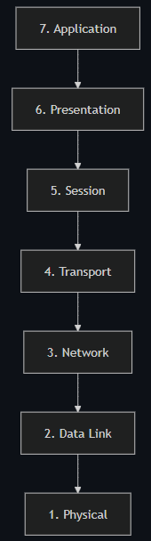
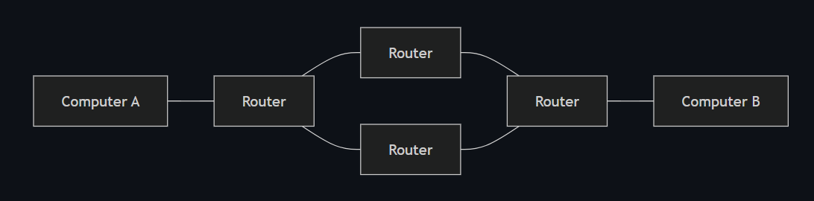
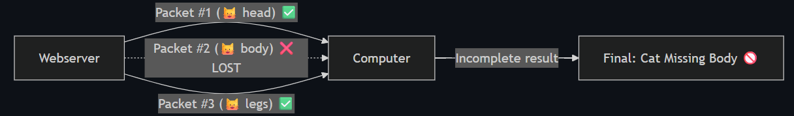

# Room: The OSI Model

**Path:** Networking

**Date:** August 2026

**Difficulty:** Easy

---

## Objective

Understand the 7-layer **OSI Model (Open Systems Interconnection Model)** — how data is packaged, addressed, routed, and interpreted as it travels across a network — including the process of **encapsulation** and the difference between **TCP and UDP** at the Transport layer.

---

## Key Concepts

* **OSI Model:** A 7-layer framework dictating how all networked devices send, receive, and interpret data.
* **Encapsulation:** The process of adding layer-specific information to data as it passes down through each layer.
* **Decapsulation:** The reverse process — removing layer-specific information as data moves back up through the layers on receipt.
* **TCP (Transmission Control Protocol):** A reliable, ordered, connection-based Transport-layer protocol.
* **UDP (User Datagram Protocol):** A fast, connectionless Transport-layer protocol with no delivery guarantees.
* **Layer 3 Device:** A device (e.g. a router) that operates using IP addresses.
* **Layer 2 Device:** A device (e.g. a switch) that operates using MAC addresses.

---

# Task 1: What Is the OSI Model?

The OSI Model is a framework dictating how all networked devices send, receive, and interpret data.

## Why It Matters

Devices can have completely different functions and designs, yet still communicate — because they all follow the same layered structure. Data that follows OSI's uniformity can be understood by any compliant device, regardless of manufacturer or software.

## The 7 Layers

The model has 7 layers, numbered 7 (top) → 1 (bottom). As data travels through each layer, specific processes occur and information gets added — this process is called **encapsulation**.

| # | Layer | One-Line Role |
|---|---|---|
| 7 | Application | Where users/software actually interact with data |
| 6 | Presentation | Translates/formats data between systems |
| 5 | Session | Creates and maintains the connection |
| 4 | Transport | Decides reliability method: TCP or UDP |
| 3 | Network | Routing — determines the path data takes (IP addresses) |
| 2 | Data Link | Physical addressing (MAC addresses) |
| 1 | Physical | The actual hardware/cabling transmitting raw bits |

## Quiz: OSI Model Overview

**Q) What does OSI stand for?**
A) Open Systems Interconnection.

**Q) Why is it useful for the OSI model to be a shared standard across different devices/vendors?**
A) It allows devices with completely different designs/functions to still understand each other's data, since they all follow the same layered structure.

**Q) What's the term for the process of adding information to data as it passes through each layer?**
A) Encapsulation.

**Q) In which direction are OSI layers numbered — top to bottom or bottom to top for Layer 7?**
A) Layer 7 (Application) is at the top; Layer 1 (Physical) is at the bottom.

---

# Task 2: Layer 1 — Physical

The simplest layer to grasp — it references the physical components of hardware used in networking, the lowest layer of the model.

**What happens here:** Devices use electrical signals to transfer data between each other in binary (1s and 0s).

**Example:** Ethernet cables physically connecting devices.

---

# Task 3: Layer 2 — Data Link

Focuses on physical addressing of the transmission.

* Receives a packet from the Network layer (which includes the destination's IP address)
* Adds the physical MAC (Media Access Control) address of the receiving endpoint
* Every network-enabled computer has a NIC (Network Interface Card) with a unique MAC address

## MAC Addresses Are "Burnt In" — But Spoofable

MAC addresses are set by the manufacturer and physically burnt into the card — they can't be changed, but they can be **spoofed** (faked). When data is sent, it's the physical (MAC) address that's actually used to identify exactly where to deliver it.

The Data Link layer also formats the data appropriately for transmission.

## Quiz: Physical & Data Link Layers

**Q) What form does data take at the Physical layer?**
A) Electrical signals representing binary (1s and 0s).

**Q) What does the Data Link layer add to a packet it receives from the Network layer?**
A) The physical MAC address of the receiving endpoint.

**Q) What is a NIC, and what's unique about it?**
A) Network Interface Card — the hardware component inside every network-enabled device, carrying a unique MAC address.

**Q) Can a MAC address be legitimately changed by the user? Can it be spoofed?**
A) It can't be legitimately changed (it's burnt in by the manufacturer), but it can be spoofed/faked.

---

# Task 4: Layer 3 — Network

Where routing and re-assembly of data happens — small chunks are routed individually, then reassembled into the larger whole at the destination.

## Routing = Finding the Optimal Path

Routing determines the most optimal path for data chunks to travel. Some routing protocols — **OSPF** (Open Shortest Path First) and **RIP** (Routing Information Protocol) — decide this; at this stage, it's enough to know they exist.

Factors deciding the optimal path:

* Shortest path — fewest devices the packet needs to cross
* Most reliable path — has this path lost packets before?
* Fastest physical connection — copper (slower) vs. fibre (considerably faster)

## IP Addresses & Layer 3 Devices

Everything at this layer is handled via IP addresses (e.g. `192.168.1.100`). Devices capable of delivering packets using IP addresses — like routers — are called **Layer 3 devices**, since they operate at this layer of the model.

## Quiz: Network Layer

**Q) What two things happen at the Network layer?**
A) Routing (determining the path) and re-assembly (putting the chunked data back together).

**Q) Name the two routing protocols mentioned, and what they stand for.**
A) OSPF (Open Shortest Path First) and RIP (Routing Information Protocol).

**Q) List the three factors that decide the "optimal" path for data.**
A) Shortest path, most reliable path, fastest physical connection type.

**Q) Why are routers called "Layer 3 devices"?**
A) Because they operate using IP addresses to deliver packets — the defining function of Layer 3 (Network) in the OSI model.

---

# Task 5: Layer 4 — Transport (TCP vs. UDP)

When data is sent between devices, it follows one of two protocols, chosen based on several factors.

## TCP (Transmission Control Protocol)

Designed for reliability and guarantee. Reserves a constant connection between two devices for the duration of the transfer, and includes error checking — guaranteeing that small chunks of data sent from the Session layer are received and reassembled in the correct order.

| Advantages of TCP | Disadvantages of TCP |
|---|---|
| Guarantees accuracy of data | Requires a reliable connection — if one chunk isn't received, the whole chunk of data becomes unusable |
| Synchronizes both devices to prevent either from being flooded with data | A slow connection bottlenecks the other device, since the connection stays reserved the whole time |
| Performs extensive processes for reliability | Significantly slower than UDP due to all this extra work |

**Used for:** file sharing, internet browsing, sending email — anywhere data must be accurate and complete.

**The Cat Picture Analogy:** A picture of a cat is broken into small packets by the webserver. With TCP, the computer receives and reassembles all packets in the correct order — resulting in the complete, correct image.

## UDP (User Datagram Protocol)

Much simpler than TCP — no error checking, no reliability guarantees, no synchronization. Data is sent whether or not it actually arrives — "hope for the best."

| Advantages of UDP | Disadvantages of UDP |
|---|---|
| Much faster than TCP | Doesn't care if data is actually received |
| Leaves the application layer in control of packet-sending speed — flexible for developers | Unstable connections lead to a poor user experience |
| Doesn't reserve a continuous connection like TCP does | Missing data is simply... missing |

**Used for:** small data exchanges (e.g. ARP and DHCP) or large data streams where some loss is tolerable, like video streaming (a few lost packets = a few pixelated frames, not a broken stream).

**The Cat Picture Analogy, UDP Version:** Using the same example, only Packets #1 and #3 arrive. With UDP, there's no mechanism to notice or recover the missing Packet #2 — the computer ends up with an incomplete, broken image.

## TCP vs. UDP — Side by Side

| | TCP | UDP |
|---|---|---|
| Reliability | Guaranteed delivery, ordered | No guarantee |
| Speed | Slower | Faster |
| Connection | Persistent, reserved | None reserved |
| Error checking | Yes | No |
| Best for | Files, browsing, email | Streaming, device discovery (ARP/DHCP), real-time data |

## Quiz: Transport Layer (TCP vs. UDP)

**Q) What does TCP guarantee that UDP does not?**
A) That all data arrives, in the correct order, error-checked and complete.

**Q) Why is TCP slower than UDP?**
A) It performs constant error checking, connection synchronization, and reserves a continuous connection — all extra overhead UDP skips.

**Q) Give two real-world use cases for TCP and two for UDP.**
A) TCP: file sharing, internet browsing, email. UDP: video streaming, device discovery protocols like ARP/DHCP.

**Q) In the cat-picture analogy, what happens differently between the TCP and UDP versions when a packet is lost?**
A) TCP would essentially not consider the transfer complete/usable until all chunks arrive correctly; UDP just delivers what arrives, resulting in an incomplete/corrupted result with no recovery mechanism.

**Q) Why is UDP an acceptable choice for video streaming, despite its unreliability?**
A) Because a lost packet just causes minor, tolerable pixelation for a moment — not worth the overhead and delay TCP's guarantees would introduce for real-time playback.

---

# Task 6: Layer 5 — Session

Once data is correctly translated/formatted by the Presentation layer, the Session layer creates and maintains the connection to the destination computer.

* **Session created** = when a connection is established
* **Session active** = as long as the connection is active
* The Session layer also handles closing the connection — if it's unused for a while, or lost

## Checkpoints

A session can contain checkpoints — if data is lost, only the newest pieces need to be resent, saving bandwidth (rather than restarting the whole transfer).

## Sessions Are Unique

Data cannot travel across different sessions — only within the specific session it belongs to.

---

# Task 7: Layer 6 — Presentation

The layer where standardization happens. Different software developers build things differently (e.g. different email clients) — but data still needs to be handled consistently regardless of the specific software.

## Acts as a Translator

This layer translates data to/from the Application layer (Layer 7). The receiving computer understands data sent in one format even if it's destined for a different format on its end.

**Example:** You send an email from one client; the recipient uses a completely different email client — but the email's content still displays correctly.

## Security Lives Here Too

Features like data encryption (e.g. HTTPS when visiting a secure site) occur at this layer.

---

# Task 8: Layer 7 — Application

The layer most users are familiar with — where protocols/rules exist to determine how the user interacts with sent/received data.

**Examples:**

* Everyday apps — email clients, browsers, file transfer software (e.g. FileZilla) — provide a friendly GUI for interacting with data
* **DNS (Domain Name System)** — translates website addresses into IP addresses — also operates at this layer

**Real example:** Browsing an FTP index (e.g. `ftp://tbfc.net`) via a browser — the browser (Application layer software) presents raw file/folder listings in a usable, navigable format for the user.

## Quiz: Session, Presentation & Application Layers

**Q) What triggers the creation of a session, and what can end one?**
A) A session is created when a connection is established; it can end if the connection goes unused for a while or is lost.

**Q) What's the benefit of "checkpoints" within a session?**
A) If data is lost, only the newest pieces need to be resent — saving bandwidth instead of restarting the whole transfer.

**Q) What's the main job of the Presentation layer?**
A) Acting as a translator — standardizing/formatting data between the Application layer and the rest of the model, so different software can still interoperate.

**Q) Give an example of a security feature that operates at the Presentation layer.**
A) Data encryption, e.g. HTTPS.

**Q) What kind of protocols/software live at the Application layer? Give two examples.**
A) User-facing protocols/software providing a GUI or defined rules for interacting with data — e.g. email clients, web browsers, FTP clients (FileZilla), DNS.

**Q) What does DNS do, and at which layer does it operate?**
A) DNS translates website addresses (domain names) into IP addresses; it operates at the Application layer (Layer 7).

---

# Task 9: Conclusion

## Full OSI Stack Summary

| # | Layer | Key Function | Example / Key Term |
|---|---|---|---|
| 7 | Application | User-facing rules/protocols for interacting with data | Browsers, email clients, DNS |
| 6 | Presentation | Translates/standardizes data between systems | Encryption (HTTPS) |
| 5 | Session | Creates/maintains/closes the connection | Checkpoints, unique sessions |
| 4 | Transport | Chooses reliability method | TCP (reliable) vs. UDP (fast) |
| 3 | Network | Routing between networks | IP addresses, routers (Layer 3 devices) |
| 2 | Data Link | Physical addressing | MAC addresses, NIC |
| 1 | Physical | Raw electrical signal transmission | Ethernet cables, binary |

* Data moves **down** the stack when sending (7→1) and **up** the stack when receiving (1→7), gaining/losing layer-specific info at each step — this is **encapsulation** (and its reverse, **decapsulation**).
* **TCP** = reliable but slower (used where correctness matters). **UDP** = fast but unreliable (used where speed matters more than perfection).
* **Routers** = Layer 3. **Switches** = Layer 2.

---

# Key Terminology

* **OSI Model:** A 7-layer framework for how networked devices send, receive, and interpret data.
* **Encapsulation:** Adding layer-specific information to data as it moves down the stack when sending.
* **Decapsulation:** Removing layer-specific information as data moves up the stack when receiving.
* **Physical Layer (1):** Transmits raw binary as electrical signals over hardware (e.g. Ethernet cables).
* **Data Link Layer (2):** Adds MAC addressing; involves NICs; the domain of switches.
* **Network Layer (3):** Handles routing and reassembly via IP addresses; the domain of routers.
* **Transport Layer (4):** Chooses between TCP (reliable) and UDP (fast) delivery.
* **Session Layer (5):** Creates, maintains, and closes connections; supports checkpoints.
* **Presentation Layer (6):** Translates/standardizes data between systems; handles encryption (e.g. HTTPS).
* **Application Layer (7):** Where users interact with data via software (browsers, email clients, DNS, FTP clients).
* **TCP:** Reliable, ordered, connection-based Transport-layer protocol.
* **UDP:** Fast, connectionless Transport-layer protocol with no delivery guarantees.

---

# Key Takeaways

* The **OSI Model** provides a universal, 7-layer standard so that devices from any vendor can communicate, from raw electrical signals (Layer 1) up to user-facing software (Layer 7).
* **Encapsulation** adds information at each layer while sending; **decapsulation** removes it while receiving.
* **MAC addresses** (Layer 2) are permanent hardware identifiers but can be spoofed; **IP addresses** (Layer 3) are used for routing between networks.
* **Routers operate at Layer 3**, using IP addresses; **switches operate at Layer 2**, using MAC addresses.
* **TCP** trades speed for guaranteed, ordered, error-checked delivery — ideal for files, browsing, and email. **UDP** trades reliability for speed — ideal for streaming and real-time data.
* The **Session layer** manages connections (including checkpoints to avoid resending everything after data loss), the **Presentation layer** standardizes/encrypts data, and the **Application layer** is where users and software actually interact with data.

---

## What I Learned

This room gave me a full, structured picture of how data actually travels across a network, layer by layer, instead of just treating "the internet" as a black box. Starting from the Physical layer (raw electrical signals over cables) and working up to the Application layer (the browsers and email clients I use every day) made the whole process feel much more concrete.

The Data Link and Network layers clarified something I'd always been fuzzy on: the difference between MAC addresses and IP addresses, and why routers and switches are described as "Layer 3" and "Layer 2" devices respectively — it comes down to which type of address each one uses to move data around.

The Transport layer comparison between TCP and UDP was probably the most practically useful part. The cat-picture analogy made the trade-off click immediately: TCP guarantees a complete, correctly ordered picture at the cost of speed and overhead, while UDP is fast but will happily deliver a broken, incomplete picture if packets are lost — which is exactly why it's used for things like video streaming, where a little pixelation is preferable to lag.

Learning about the Session, Presentation, and Application layers rounded out the picture — sessions manage the lifetime of a connection (with checkpoints saving bandwidth on data loss), the Presentation layer standardizes and encrypts data (e.g. HTTPS), and the Application layer is where all of this becomes usable software like browsers, email clients, and DNS. Overall, this room tied together a lot of networking concepts I'd encountered separately (IP addresses, MAC addresses, TCP/UDP) into one coherent model, which will be useful for understanding how network-based attacks and defenses map onto specific layers going forward.