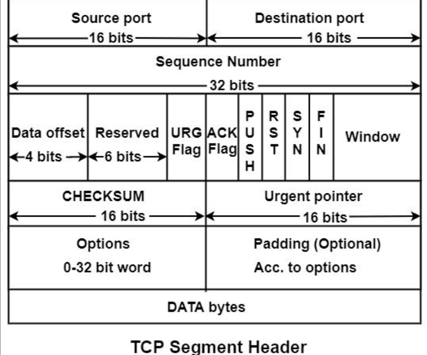
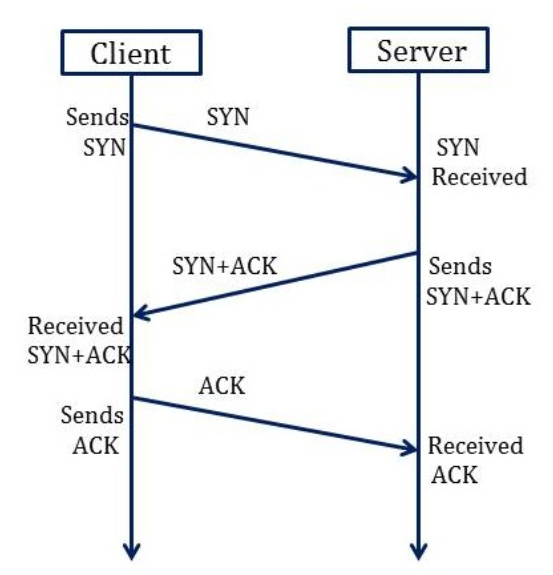
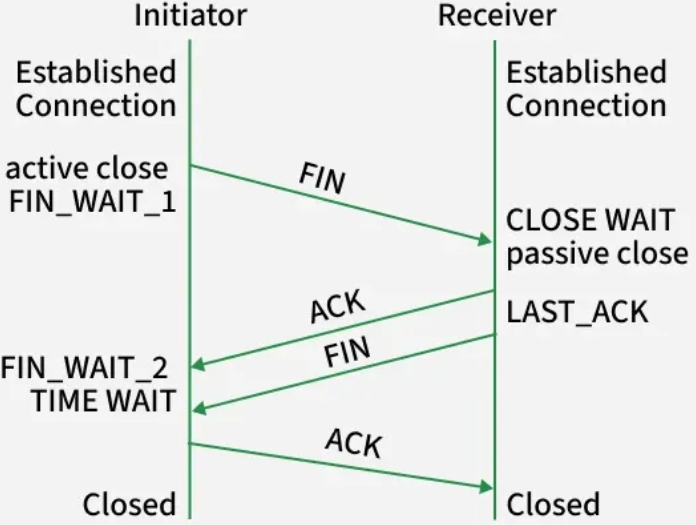
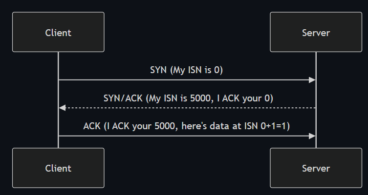
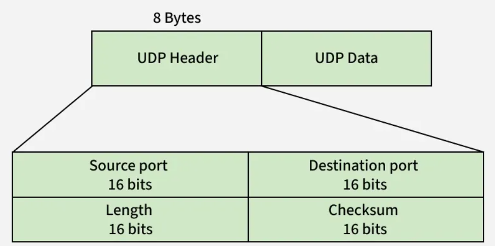

# Room: Packets & Frames — TCP, UDP, Ports

**Path:** Networking

**Date:** August 2026

**Difficulty:** Easy

---

## Objective

Understand how data is structured and transmitted across networks using **packets** and **frames**, how **TCP** establishes and closes reliable connections via the **Three-Way Handshake**, how **UDP** differs as a connectionless protocol, and how **ports** direct data to the correct application on a device.

---

## Key Concepts

* **Packet:** A Layer 3 (Network) unit of data — contains an IP header plus payload.
* **Frame:** A Layer 2 (Data Link) unit of data — encapsulates the packet and adds MAC addressing.
* **Encapsulation / Decapsulation:** Wrapping data with layer-specific info while sending; stripping it back off while receiving.
* **TCP (Transmission Control Protocol):** A connection-oriented protocol that guarantees reliable, ordered delivery via the Three-Way Handshake.
* **UDP (User Datagram Protocol):** A connectionless, stateless protocol with no delivery guarantees, used where speed matters more than reliability.
* **Port:** A numerical value (0–65535) identifying the specific application/service on a device that data should be delivered to.

---

# Task 1: What Are Packets and Frames?

Packets and frames are small chunks of data that combine to form a larger, complete message — but they belong to different OSI layers.

| Term | OSI Layer | Contains |
|---|---|---|
| Packet | Layer 3 (Network) | IP header + payload |
| Frame | Layer 2 (Data Link) | Encapsulates the packet + adds MAC addresses |

## The Envelope Analogy

Mailing a letter: the envelope = the **frame** — it moves the contents (the **packet**, i.e. the letter itself) to another location. Once the recipient opens the envelope (frame), they know how to forward the letter (packet) onward.

**Quick rule of thumb:** Talking about IP addresses → you're talking about packets. Once the encapsulating info is stripped away → you're talking about the frame itself.

## Why Break Data Into Packets?

Packets make data exchange efficient — sending small pieces reduces the chance of network bottlenecking compared to sending one giant message at once, and improves reliability.

**Example:** A website image isn't sent as one solid file — it's divided into packets and reconstructed on your computer once all pieces arrive (the same "cat picture" example used in the OSI Model room).

## Common IP Packet Headers

| Header | Description |
|---|---|
| Time to Live (TTL) | Sets an expiry timer so a lost packet doesn't clog the network forever |
| Checksum | Integrity check — if data changes in transit, the checksum won't match, revealing corruption |
| Source Address | The sending device's IP — so return data knows where to go |
| Destination Address | The receiving device's IP — so the packet knows where to travel |

## Answers

**Q) What is the name for a piece of data when it does have IP addressing information?**
A) Packet

**Q) What is the name for a piece of data when it does not have IP addressing information?**
A) Frame

## Quiz: Packets and Frames

**Q) At which OSI layer does a packet exist? A frame?**
A) Packet = Layer 3 (Network); Frame = Layer 2 (Data Link).

**Q) In the envelope analogy, what represents the frame, and what represents the packet?**
A) The envelope = the frame; the letter inside = the packet.

**Q) Why is breaking data into packets more efficient than sending one large message?**
A) It reduces the chance of network bottlenecking compared to transmitting one large message at once.

**Q) What does the TTL header prevent?**
A) A packet endlessly circulating the network if it never reaches its destination or exits properly.

**Q) What does a checksum mismatch indicate?**
A) That the data was corrupted or altered in transit.

---

# Task 2: TCP/IP and the Three-Way Handshake

**TCP (Transmission Control Protocol)** is closely related to the OSI model — the TCP/IP model is essentially a summarized, 4-layer version of it:

| TCP/IP Layer | Roughly Maps To (OSI) |
|---|---|
| Application | Application, Presentation, Session |
| Transport | Transport |
| Internet | Network |
| Network Interface | Data Link, Physical |

Like the OSI model, data gains information at each layer — **encapsulation** (and the reverse, **decapsulation**).

## TCP Is Connection-Based

TCP must establish a connection between client and server before any data is sent. This is what guarantees delivery — via the **Three-Way Handshake**.

## TCP: Advantages & Disadvantages

| Advantages | Disadvantages |
|---|---|
| Guarantees data integrity | Requires a reliable connection — if one chunk is lost, the whole transfer must be re-sent |
| Synchronizes both devices, preventing data flooding/out-of-order delivery | A slow connection bottlenecks the other device — the connection stays reserved the whole time |
| Extensive reliability processes | Significantly slower than UDP due to all this extra overhead |

## TCP Packet Headers

| Header | Description |
|---|---|
| Source Port | Randomly chosen port (0–65535) the sender uses to send the packet |
| Destination Port | The specific port the target service/application listens on (e.g. a webserver on port 80) — not random |
| Source IP | Sending device's IP address |
| Destination IP | Receiving device's IP address |
| Sequence Number | Random starting number assigned to the first piece of transmitted data |
| Acknowledgement Number | Sequence number of the next expected piece of data (previous + 1) |
| Checksum | Gives TCP its integrity guarantee — mismatched output on the receiving end = corrupted data |
| Data | The actual bytes being transmitted |
| Flag | Controls how the packet should be handled during the handshake process |

## The Three-Way Handshake — Messages

| Step | Message | Description |
|---|---|---|
| 1 | SYN | Client's initial packet — initiates and attempts to synchronize the connection |
| 2 | SYN/ACK | Server acknowledges the client's synchronization attempt (and proposes its own ISN) |
| 3 | ACK | Client confirms — either side can use this to confirm successful receipt of messages |
| 4 | DATA | Actual data (e.g. file bytes) sent once the connection is established |
| 5 | FIN | Cleanly closes the connection once complete |
| — | RST | Abruptly terminates communication — last resort, signals something went wrong (e.g. broken service, low resources) |

## Sequence Numbers, Explained

Each side proposes an **Initial Sequence Number (ISN)** — a random starting point. Both sides must agree on the same numbering so data can be reassembled in the correct order. Each subsequent piece of data increments the number by 1.

| Device | Initial Sequence Number | Final Sequence Number |
|---|---|---|
| Client (Sender) | 0 | 0 + 1 = 1 |
| Client (Sender) | 1 | 1 + 1 = 2 |
| Client (Sender) | 2 | 2 + 1 = 3 |

## Closing a TCP Connection

TCP closes a connection once a device confirms the other has received all the data, typically via **FIN** packets, with both sides acknowledging the closure. Since TCP reserves system resources for the duration of a connection, it's best practice to close connections as soon as possible.

## Answers

**Q) What header ensures data integrity in TCP?**
A) Checksum

**Q) Provide the correct handshake order:**
A) SYN, SYN/ACK, ACK

## Quiz: TCP & the Three-Way Handshake

**Q) Why must TCP establish a connection before sending data?**
A) Because TCP is connection-based — the guarantee of delivery depends on both sides being synchronized before data transfer begins.

**Q) List the 3 steps of the Three-way handshake in order, with their message names.**
A) 1) SYN (client initiates), 2) SYN/ACK (server acknowledges + proposes its own ISN), 3) ACK (client acknowledges server's ISN and begins sending data).

**Q) What's the difference between a Sequence Number and an Acknowledgement Number?**
A) The Sequence Number marks a given piece of data's position; the Acknowledgement Number is the next expected sequence number (previous + 1) — confirming what's already been received.

**Q) What does the Checksum header actually verify?**
A) Data integrity — whether the received data matches exactly what was sent (no corruption).

**Q) What's the difference between a FIN and an RST packet?**
A) FIN cleanly and properly closes a completed connection; RST abruptly terminates it, signaling a problem occurred.

**Q) Why is it best practice to close TCP connections quickly?**
A) TCP reserves system resources for the duration of an open connection — closing promptly frees those resources up.

---

# Task 3: UDP/IP

**UDP (User Datagram Protocol)** is stateless — no persistent connection is required. No Three-way handshake, no synchronization between devices.

## When UDP Makes Sense

Used where applications can tolerate lost data (video streaming, voice chat) or where a fully stable connection isn't critical.

## UDP: Advantages & Disadvantages

| Advantages | Disadvantages |
|---|---|
| Much faster than TCP | Doesn't care whether data is actually received |
| Leaves the application layer in control of packet-sending speed — flexible for developers | Unstable connections lead to a poor user experience |
| No continuous connection reserved on the device | No safeguards like TCP's data integrity checks |

## UDP Packet Headers (Simpler Than TCP)

| Header | Description |
|---|---|
| Time to Live (TTL) | Expiry timer, same purpose as in IP packets |
| Source Address | Sending device's IP |
| Destination Address | Receiving device's IP |
| Source Port | Randomly chosen sending port |
| Destination Port | Fixed port the target service listens on |
| Data | The actual transmitted bytes |

## No Acknowledgement, No Handshake

UDP is stateless — no acknowledgement messages, no setup process. Data is simply sent, with no regard for whether it's received.

## Answers

**Q) What does UDP stand for?**
A) User Datagram Protocol

**Q) What type of connection is UDP?**
A) Stateless

**Q) Which protocol is used for file transfer?**
A) TCP

**Q) Which protocol is used for video calls?**
A) UDP

## Quiz: UDP/IP

**Q) What makes UDP "stateless"?**
A) It doesn't establish or maintain a persistent connection — no handshake, no synchronization, no acknowledgements.

**Q) Name two scenarios where UDP's unreliability is an acceptable trade-off.**
A) Video streaming, voice chat (any case where occasional data loss is tolerable and speed matters more than perfection).

**Q) Compare TCP and UDP headers — what's missing from UDP that TCP has?**
A) UDP lacks Sequence Numbers, Acknowledgement Numbers, Checksums, and Flags — the fields that give TCP its reliability guarantees.

**Q) Does UDP perform a handshake before sending data?**
A) No — it sends data directly with no setup process.

---

# Task 4: Ports

Ports are the specific points through which data is exchanged on a device — numerical values from 0 to 65535, acting like docking points that let data reach the correct application.

## The Harbour Analogy

Ships (data) must dock at a compatible port at a harbour (device) — a cruise liner can't dock at a fishing-boat port and vice versa. Ports enforce what can connect and where, preventing chaos as data flows in and out of a device.

## Why Standardize Ports?

With 0–65535 possible ports, it'd be chaos to track what's using what — so standard rules exist. Example: all web browsers send data over port 80 by convention, so any browser can interpret web data the same way, regardless of who built it.

Any port between 0 and 1024 is considered a **"common" (well-known) port**, reserved by convention for specific protocols.

## Well-Known Protocol Ports

| Protocol | Port | Description |
|---|---|---|
| FTP (File Transfer Protocol) | 21 | Client-server file sharing — download from a central location |
| SSH (Secure Shell) | 22 | Secure text-based remote login for system management |
| HTTP (HyperText Transfer Protocol) | 80 | Powers the World Wide Web — browsers use this to fetch text/images/video |
| HTTPS (HTTP Secure) | 443 | Same as HTTP, but encrypted |
| SMB (Server Message Block) | 445 | Like FTP, but also shares devices (e.g. printers) |
| RDP (Remote Desktop Protocol) | 3389 | Secure remote login via a full visual desktop interface (vs. SSH's text-only) |

## Standards Aren't Enforced by Law

These are conventions, not hard rules — you can run a webserver on a non-standard port (e.g. 8080 instead of 80). But since applications assume the standard port unless told otherwise, you'll need to explicitly specify it with a colon, e.g. `example.com:8080`.

## Quiz: Ports

**Q) What's the numerical range for a port number?**
A) 0 to 65535.

**Q) In the harbour analogy, what do ports enforce?**
A) What type of data/connection can "dock" (connect) at that specific point — compatibility rules for communication.

**Q) Why is it useful that all web browsers agree to use port 80 by convention?**
A) It means any browser, regardless of manufacturer, can consistently locate and interpret web traffic — a shared, predictable rule across all implementations.

**Q) What range is considered "common" or well-known ports?**
A) 0–1024.

**Q) Match each to its default port: FTP, SSH, HTTP, HTTPS, SMB, RDP.**
A) FTP = 21, SSH = 22, HTTP = 80, HTTPS = 443, SMB = 445, RDP = 3389.

**Q) If a webserver runs on port 8080 instead of 80, how would you specify that in a URL?**
A) With a colon followed by the port number, e.g. `example.com:8080`.

## Practical Challenge — Ports 101

Connected to IP `8.8.8.8` on port `1234`.

**Flag:** `THM{YOU_CONNECTED_TO_A_PORT}`

---

# Task 5: Conclusion

This room covered how data moves across networks using packets and frames, how TCP ensures reliable communication via the Three-Way Handshake, how UDP prioritizes speed over reliability, and how ports guide traffic to the correct services. These concepts form the backbone of networking and cybersecurity analysis.

---

# Key Terminology

* **Packet:** Layer 3 unit of data — IP header + payload.
* **Frame:** Layer 2 unit of data — the packet plus MAC addressing (the "envelope" around the packet's "letter").
* **Encapsulation:** Adding layer-specific information as data moves down the stack.
* **Decapsulation:** Removing layer-specific information as data moves up the stack on receipt.
* **TTL (Time to Live):** An expiry timer preventing packets/frames from looping the network forever.
* **Checksum:** An integrity check used to detect data corruption in transit.
* **TCP (Transmission Control Protocol):** A connection-oriented, reliable protocol using the Three-Way Handshake.
* **Three-Way Handshake:** SYN → SYN/ACK → ACK — the process TCP uses to establish a connection.
* **Sequence Number / Acknowledgement Number:** TCP fields that track data order and confirm receipt.
* **FIN / RST:** TCP flags for gracefully closing (FIN) or abruptly terminating (RST) a connection.
* **UDP (User Datagram Protocol):** A connectionless, stateless protocol with no delivery guarantees.
* **Port:** A numerical value (0–65535) identifying an application/service on a device.
* **Well-Known Ports:** Ports 0–1024, reserved by convention (e.g. HTTP = 80, HTTPS = 443, SSH = 22, FTP = 21, SMB = 445, RDP = 3389).

---

# Key Takeaways

* A **packet** (Layer 3, IP header + payload) is wrapped inside a **frame** (Layer 2, adds MAC addressing) — think of a letter (packet) inside an envelope (frame).
* **TCP** is reliable and connection-based: it guarantees delivery via the **Three-Way Handshake** (SYN → SYN/ACK → ACK), closes cleanly via **FIN**, and aborts abruptly via **RST**.
* **UDP** is stateless and connectionless: no handshake, no guarantees, but faster — well suited to streaming and real-time data.
* **Sequence** and **Acknowledgement Numbers** are what let TCP reassemble data in the correct order and confirm what's been received.
* **Ports** (0–65535) direct data to the correct application on a device; **0–1024** are standardized "common" ports (HTTP=80, HTTPS=443, SSH=22, FTP=21, SMB=445, RDP=3389).
* Non-standard ports work fine technically, but require explicit specification (`:port`) since standard-port assumptions are baked into most software.
* From a security perspective, knowing which ports are open and which protocol/port pairs are standard is essential for identifying what services are running on a target system.

---

## What I Learned

This room connected the theoretical OSI Model to the practical mechanics of how data actually moves across a network. I learned the precise distinction between a **packet** and a **frame** — a packet is the Layer 3 unit carrying IP addressing and payload, while a frame is the Layer 2 wrapper around it that adds MAC addressing for local delivery. The envelope analogy made this stick immediately: the frame is the envelope, the packet is the letter inside it.

The TCP section was the most detailed and, I think, the most valuable. Walking through the **Three-Way Handshake** (SYN → SYN/ACK → ACK) step by step, and seeing how **Sequence** and **Acknowledgement Numbers** increment to keep data in order, made it clear exactly *how* TCP delivers its reliability guarantee — and why that reliability comes at the cost of speed and resource overhead (which is also why closing connections promptly with FIN matters). Completing the practical handshake lab and getting the flag `THM{TCP_CHATTER}` helped cement this by reconstructing the handshake between two simulated devices myself rather than just reading about it.

Contrasting this with **UDP** — stateless, no handshake, no acknowledgements — reinforced why it's the right choice for things like video calls and streaming, where speed and low overhead matter more than guaranteeing every single packet arrives.

Finally, the **Ports** task tied everything together: ports are what let a device route incoming data to the correct application, and memorizing the well-known ports (21, 22, 80, 443, 445, 3389) gives me an immediate mental shortcut for recognizing common services when scanning or analyzing traffic later on. The practical challenge of connecting to `8.8.8.8` on port `1234` and getting the flag `THM{YOU_CONNECTED_TO_A_PORT}` made the abstract concept of "connecting to a port" concrete. Overall, this room gave me a solid, practical foundation in TCP/UDP and ports that I expect to come back to constantly once I start working with tools like Wireshark or doing basic port scanning.