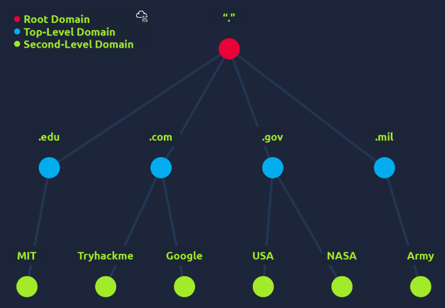
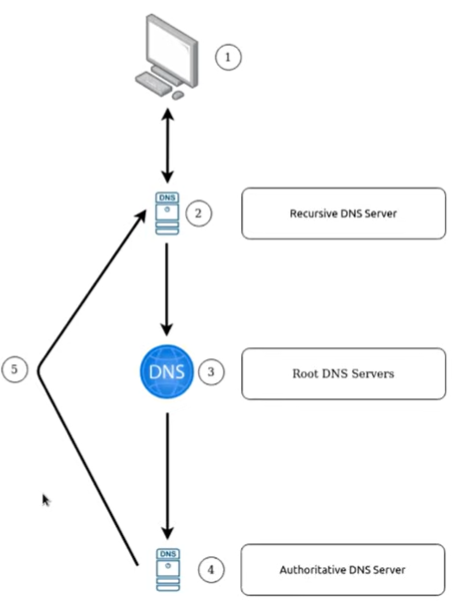
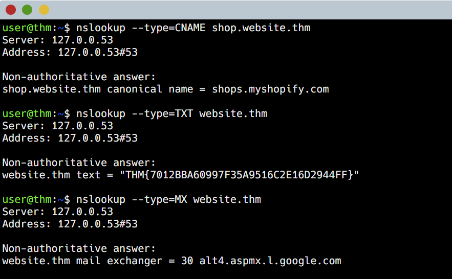

# Room: DNS in Detail

**Path:** Networking

**Date:** August 2026

**Difficulty:** Easy

---

## Objective

Learn how DNS (Domain Name System) works and how it helps translate human-readable domain names into IP addresses. The room covers the domain hierarchy (TLD, second-level domain, subdomain), common DNS record types, the step-by-step journey of a DNS request, and a hands-on practical building real DNS queries.

---

## Key Concepts

* **DNS (Domain Name System):** Translates human-readable domain names into IP addresses so users don't have to memorize numerical addresses.
* **IP Address:** A unique numerical address (e.g. `104.26.10.229`) identifying a device on the Internet.
* **Domain Hierarchy:** The structure of a domain name — TLD, second-level domain, and subdomain(s).
* **DNS Record:** A stored entry that answers a specific type of DNS query (A, AAAA, CNAME, MX, TXT, etc.).
* **Recursive DNS Server, Root Server, TLD Server, Authoritative Server:** The chain of servers involved in resolving a DNS request.
* **TTL (Time to Live):** How long (in seconds) a DNS response should be cached before it must be looked up again.

---

# Task 1: What Is DNS?

DNS provides a simple way to communicate with devices on the Internet without remembering complex numbers. Much like every house has a unique address for mail, every computer on the Internet has its own unique address — an **IP address** — to communicate with it.

An IP address looks like `104.26.10.229`: four sets of digits ranging from 0–255, separated by periods. Since remembering a string of numbers isn't convenient, DNS lets you remember `tryhackme.com` instead.

---

# Task 2: Domain Hierarchy


## TLD (Top-Level Domain)

A TLD is the right-most part of a domain name — for `tryhackme.com`, the TLD is `.com`.

There are two types of TLD:

* **gTLD (Generic Top-Level Domain):** Historically indicated the domain's purpose — e.g. `.com` for commercial, `.org` for an organisation, `.edu` for education, `.gov` for government. Due to demand, many new gTLDs now exist (`.online`, `.club`, `.website`, `.biz`, and more).
* **ccTLD (Country Code Top-Level Domain):** Used for geographical purposes — e.g. `.ca` (Canada), `.co.uk` (United Kingdom).

There are over 2000 TLDs in total.

## Second-Level Domain

For `tryhackme.com`, `.com` is the TLD and `tryhackme` is the **Second-Level Domain**. When registering a domain name, the second-level domain is limited to 63 characters (plus the TLD) and can only use `a-z`, `0-9`, and hyphens (cannot start or end with a hyphen, or use consecutive hyphens).

## Subdomain

A subdomain sits to the left of the second-level domain, separated by a period — e.g. in `admin.tryhackme.com`, `admin` is the subdomain.

* Subdomain naming follows the same restrictions as second-level domains (63 characters, `a-z 0-9` and hyphens, no leading/trailing/consecutive hyphens).
* Multiple subdomains can be chained with periods to create longer names — e.g. `jupiter.servers.tryhackme.com`.
* The full domain name must be 253 characters or fewer.
* There is no limit to the number of subdomains a domain name can have.

---

# Task 3: Record Types

DNS isn't just for websites — multiple types of DNS records exist.

## A Record

Resolves to an **IPv4 address** — e.g. `104.26.10.229`.

## AAAA Record

Resolves to an **IPv6 address** — e.g. `2606:4700:20::681a:be5`.

## CNAME Record

Resolves to **another domain name**. For example, TryHackMe's online shop subdomain `store.tryhackme.com` returns a CNAME record of `shops.shopify.com`. Another DNS request is then made to `shops.shopify.com` to work out the actual IP address.

## MX Record

Resolves to the address of the **server(s) that handle email** for the queried domain — e.g. an MX record for `tryhackme.com` might return `alt1.aspmx.l.google.com`. MX records also carry a **priority flag**, telling the client the order in which to try the servers — useful if the main mail server goes down and email needs to be routed to a backup.

## TXT Record

A free-text field that can store any text-based data. Common uses include:

* Listing servers authorized to send email on behalf of a domain (helps combat spam/spoofed email)
* Verifying domain ownership when signing up for third-party services

**Examples:**

```text
_acme-challenge.example.com TXT "token_value_here"
@ TXT "v=spf1 ip4:192.0.2.0/24 include:_spf.google.com include:amazonses.com ~all"
_dmarc.example.com TXT "v=DMARC1; p=reject; rua=mailto:dmarc-reports@example.com; adkim=s; aspf=s; pct=100"
@ TXT "MS=ms12345678"
```

As the name implies, TXT records are simply strings of text.

---

# Task 4: Making a Request

## What Happens When You Make a DNS Request

1. **Local cache check:** Your computer first checks its local cache to see if you've recently looked up the address. If not, a request is sent to your **Recursive DNS Server**.
2. **Recursive DNS Server:** Usually provided by your ISP (though you can choose your own). It also has a local cache — if the answer is found there, it's returned immediately and the request ends (common for heavily requested sites like Google, Facebook, Twitter). If not found locally, the journey continues to the Internet's **root DNS servers**.
3. **Root servers:** Act as the DNS backbone of the Internet. Their job is to redirect the request to the correct **Top-Level Domain (TLD) server** — e.g. recognizing the `.com` TLD in `www.tryhackme.com` and referring the request to the TLD server that handles `.com` addresses.
4. **TLD server:** Holds records pointing to the correct **authoritative server** (also known as the **nameserver**) for the domain. For example, the nameservers for `tryhackme.com` are `kip.ns.cloudflare.com` and `uma.ns.cloudflare.com` — multiple nameservers commonly exist as backups in case one goes down.
5. **Authoritative DNS server:** Responsible for storing the DNS records for the domain, and where any updates to those records would be made. The relevant record is sent back to the Recursive DNS Server (which caches a local copy for future requests) and then relayed back to the original client.

## TTL (Time to Live)

DNS records come with a **TTL** value — a number of seconds representing how long the response should be cached locally before it needs to be looked up again. Caching saves on making a fresh DNS request every time you communicate with a server.

---

# Task 5: Practical

Using the room's website, DNS queries were built and their results (and the equivalent command-line commands) were observed directly.


---

# Task 6: Conclusion

DNS translates human-friendly domain names into the numerical IP addresses computers actually use to communicate, using a hierarchical structure of TLDs, second-level domains, and subdomains, and a distributed chain of servers (recursive → root → TLD → authoritative) to resolve each request.

---

# Key Terminology

* **DNS (Domain Name System):** Translates domain names into IP addresses.
* **IP Address:** A unique numerical address identifying a device on the Internet.
* **TLD (Top-Level Domain):** The right-most part of a domain name (e.g. `.com`); can be a gTLD (generic) or ccTLD (country code).
* **Second-Level Domain:** The name directly to the left of the TLD (e.g. `tryhackme` in `tryhackme.com`).
* **Subdomain:** A name to the left of the second-level domain, separated by a period (e.g. `admin` in `admin.tryhackme.com`).
* **A Record:** Resolves a domain to an IPv4 address.
* **AAAA Record:** Resolves a domain to an IPv6 address.
* **CNAME Record:** Resolves a domain to another domain name.
* **MX Record:** Resolves to a domain's mail server(s), with a priority order.
* **TXT Record:** Stores arbitrary text data (e.g. SPF, DMARC, domain verification).
* **Recursive DNS Server:** The first server queried (often via ISP); caches recent lookups.
* **Root DNS Server:** Redirects requests to the correct TLD server.
* **TLD Server:** Points to the authoritative server/nameserver for a domain.
* **Authoritative DNS Server (Nameserver):** Stores and serves the actual DNS records for a domain.
* **TTL (Time to Live):** How long, in seconds, a DNS response is cached before requiring a fresh lookup.

---

# Key Takeaways

* DNS exists so humans can use memorable names (`tryhackme.com`) instead of numerical **IP addresses** (`104.26.10.229`).
* A domain name is structured hierarchically: **TLD** → **second-level domain** → optional **subdomain(s)**, each with specific naming rules and length limits.
* Different **record types** answer different kinds of questions: `A`/`AAAA` for IP addresses, `CNAME` for aliasing to another domain, `MX` for mail servers (with priority), and `TXT` for arbitrary text data like SPF/DMARC/verification tokens.
* Resolving a domain name involves a chain of servers: local cache → **Recursive DNS Server** → **root servers** → **TLD server** → **authoritative server (nameserver)**.
* **TTL** values let responses be cached locally for a set time, reducing the need to repeat the full resolution chain for every request.
* Multiple **nameservers** typically exist per domain as redundancy/backup.

---

## What I Learned

This room turned DNS from something I used passively every day into a process I actually understand step by step. I hadn't previously thought about domain names as having a strict hierarchy — learning the distinction between the **TLD**, **second-level domain**, and **subdomain**, along with their character limits and naming rules, made it clear why domain names look the way they do and how much structure sits behind something as simple as typing a URL.

The record types section was especially useful for connecting DNS to real infrastructure decisions: an `A` record for a plain IPv4 address, a `CNAME` for pointing one domain at another (like TryHackMe's shop redirecting to Shopify), an `MX` record (with priority) for routing email to the right mail server or its backup, and `TXT` records for things like SPF/DMARC anti-spoofing rules or proving domain ownership to a third-party service. Seeing real-looking TXT record examples made abstract security concepts like SPF and DMARC feel much more concrete.

The most valuable part was walking through what actually happens when a DNS request is made — from checking the local cache, to the Recursive DNS Server (usually the ISP's), to the root servers, to the TLD server, and finally to the authoritative nameserver that holds the real records. Understanding that **TTL** values control how long each of these results gets cached helped explain why DNS changes sometimes take time to "propagate" — it's simply waiting for cached TTLs to expire across different resolvers.

The practical task made this concrete by actually building DNS queries and seeing real record values (CNAME, TXT, MX priority, and A record) come back, rather than just reading about the theory. This is a solid foundation for later rooms that build on DNS, such as subdomain enumeration or DNS-based attacks.