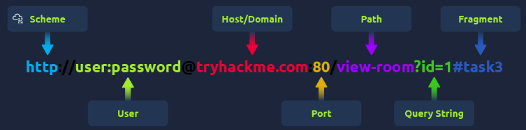
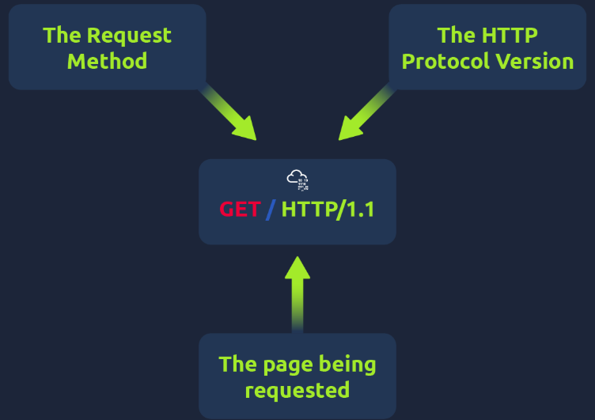

# Room: HTTP in Detail

**Path:** Web Fundamentals

**Date:** August 2026

**Difficulty:** Easy

---

## Objective

Learn how HTTP(S) works: what a URL is and how it's structured, how HTTP requests and responses are formed, the common HTTP methods, HTTP status code ranges and the most common individual codes, common request/response headers, and how cookies work — with a final hands-on request-building practical.

---

## Key Concepts

* **HTTP (HyperText Transfer Protocol):** The set of rules used for communicating with web servers to transmit webpage data (HTML, images, videos, etc.).
* **HTTPS (HTTP Secure):** The encrypted version of HTTP — protects data in transit and verifies you're talking to the genuine server.
* **URL (Uniform Resource Locator):** An instruction on how to access a resource on the Internet.
* **HTTP Method:** Indicates the client's intended action (GET, POST, PUT, DELETE, etc.).
* **HTTP Status Code:** A number in a response's first line indicating the outcome of a request, grouped into 5 ranges.
* **Header:** Additional data sent alongside an HTTP request or response.
* **Cookie:** A small piece of data stored by the browser and sent back to the server on future requests, used to work around HTTP being stateless.

---

# Task 1: What Is HTTP(S)?

## What Is HTTP? (HyperText Transfer Protocol)

HTTP is what's used whenever you view a website, developed by Tim Berners-Lee and his team between 1989–1991. HTTP is the set of rules used for communicating with web servers for the transmitting of webpage data — HTML, images, videos, etc.

## What Is HTTPS? (HyperText Transfer Protocol Secure)

HTTPS is the secure version of HTTP. HTTPS data is encrypted, which stops people from seeing the data being sent/received and also assures you that you're talking to the correct web server, not something impersonating it.

---

# Task 2: Requests and Responses

## URLs

When accessing a website, the browser makes requests to a web server for assets (HTML, images, etc.) and downloads the responses. To tell the browser specifically how and where to access these resources, **URLs** are used.

### What Is a URL? (Uniform Resource Locator)


A URL is predominantly an instruction on how to access a resource on the Internet.

| Part | Example | Description |
|---|---|---|
| Scheme | `http` | The protocol to use for accessing the resource — HTTP, HTTPS, FTP, etc. |
| User | `user:password` | Optional login credentials, for services that require authentication |
| Host | `tryhackme.com` | The domain name or IP address of the server |
| Port | `80` | The port to connect to — usually 80 for HTTP, 443 for HTTPS, but any port 1–65535 is possible |
| Path | `/view-room` | The file name or location of the resource being accessed |
| Query String | `?id=1` | Extra information sent to the requested path — e.g. `/blog?id=1` requests the blog article with ID 1 |
| Fragment | `#task3` | A reference to a specific location on the requested page (e.g. jumping directly to a section) |

## Making a Request

A minimal request can be just one line: `GET / HTTP/1.1`. For a richer web experience, additional data is sent in **headers** (covered in the Headers task).

### Example Request

```text
GET / HTTP/1.1

Host: tryhackme.com
User-Agent: Mozilla/5.0 Firefox/87.0
Referer: https://tryhackme.com/
```

**Breakdown:**

* **Line 1:** Sends the `GET` method, requests the home page (`/`), and specifies HTTP protocol version 1.1.
* **Line 2:** Tells the web server which website is being requested — `tryhackme.com`.
* **Line 3:** Tells the web server the browser being used — Firefox version 87.
* **Line 4:** Tells the web server which page referred the client here — `https://tryhackme.com`.
* **Line 5:** HTTP requests always end with a blank line to signal the request is finished.

### Example Response

```text
HTTP/1.1 200 OK

Server: nginx/1.15.8
Date: Fri, 09 Apr 2021 13:34:03 GMT
Content-Type: text/html
Content-Length: 98

<html>
<head>
    <title>TryHackMe</title>
</head>
<body>
    Welcome To TryHackMe.com
</body>
</html>
```

**Breakdown:**

* **Line 1:** The HTTP version (`1.1`) followed by the HTTP status code — here, `200 OK`, meaning the request completed successfully.
* **Line 2:** The web server software and version number.
* **Line 3:** The current date, time, and timezone of the web server.
* **Line 4:** `Content-Type` tells the client what kind of data is being sent (HTML, image, video, PDF, XML, etc.).
* **Line 5:** `Content-Length` tells the client how long the response is, so it can confirm no data is missing.
* **Line 6:** A blank line confirms the end of the HTTP response.
* **Lines 7–14:** The actual requested content — in this case, the homepage.

---

# Task 3: HTTP Methods

HTTP methods show the client's intended action when making a request. There are many methods, but most work involves **GET** and **POST**.

* **GET Request:** Used for getting information from a web server.
* **POST Request:** Used for submitting data to the web server, potentially creating new records.
* **PUT Request:** Used for submitting data to a web server to update existing information.
* **DELETE Request:** Used for deleting information/records from a web server.

---

# Task 4: HTTP Status Codes

When an HTTP server responds, the first line always contains a **status code** informing the client of the outcome of their request (and potentially how to handle it). These codes fall into 5 ranges:

| Range | Category | Description |
|---|---|---|
| 100–199 | Information Response | Tells the client the first part of their request has been accepted and to continue sending the rest. No longer very common. |
| 200–299 | Success | The client's request was successful. |
| 300–399 | Redirection | Redirects the client's request to another resource — a different page or a different website. |
| 400–499 | Client Errors | Informs the client there was an error with their request. |
| 500–599 | Server Errors | Reserved for server-side errors — usually a major problem handling the request. |

## Common HTTP Status Codes

| Code | Name | Description |
|---|---|---|
| 200 | OK | The request was completed successfully. |
| 201 | Created | A resource has been created (e.g. a new user or blog post). |
| 301 | Moved Permanently | Redirects the browser to a new page, or tells search engines the page has moved. |
| 302 | Found | A temporary redirect — unlike 301, it may change again in the near future. |
| 400 | Bad Request | Something was wrong or missing in the request — e.g. a missing expected parameter. |
| 401 | Not Authorised | The client isn't currently allowed to view the resource until authorising (e.g. username/password). |
| 403 | Forbidden | The client doesn't have permission to view the resource, whether logged in or not. |
| 405 | Method Not Allowed | The resource doesn't allow this method — e.g. sending GET to `/create-account` when POST was expected. |
| 404 | Page Not Found | The requested page/resource doesn't exist. |
| 500 | Internal Service Error | The server encountered an error it doesn't know how to handle properly. |
| 503 | Service Unavailable | The server can't handle the request — overloaded or down for maintenance. |

> A great visual resource for studying status codes is `http.cat`.

---

# Task 5: Headers

Headers are additional bits of data sent to the web server (or back to the client) alongside a request/response. No headers are strictly required to make an HTTP request, but without them a website will be difficult to view properly.

## Common Request Headers

Sent from the client (usually the browser) to the server.

* **Host:** Some servers host multiple websites — the Host header tells the server which one is being requested; otherwise the default site is returned.
* **User-Agent:** The browser software and version number, helping the server format the site correctly (some HTML/JS/CSS features are browser-specific).
* **Content-Length:** When sending data (e.g. a form), tells the server how much data to expect, so it can confirm nothing is missing.
* **Accept-Encoding:** Tells the server what compression methods the browser supports, so data can be sent more efficiently.
* **Cookie:** Data sent to the server to help remember information about the client (see Cookies below).

## Common Response Headers

Returned to the client from the server after a request.

* **Set-Cookie:** Information to store, which gets sent back to the server on each subsequent request (see Cookies below).
* **Cache-Control:** How long to store the response's content in the browser's cache before requesting it again.
* **Content-Type:** Tells the client what type of data is being returned (HTML, CSS, JavaScript, images, PDF, video, etc.), so the browser knows how to process it.
* **Content-Encoding:** The method used to compress the data to make it smaller when sending it over the Internet.

## Cookies

Cookies are small pieces of data stored on your computer, saved when a `Set-Cookie` header is received from a web server. On every further request, that cookie data is sent back to the server.

Because HTTP is **stateless** (it doesn't keep track of previous requests), cookies let the web server "remember" who you are, personal settings, or whether you've visited before.

Cookies are most commonly used for **website authentication** — the cookie value is usually not a clear-text password, but a **token** (a unique, not-easily-guessable secret code).

### Viewing Your Cookies

Cookies can be viewed using the browser's developer tools:

1. Open developer tools.
2. Click the **Network** tab — this lists every resource the browser has requested.
3. Click on a request for a detailed breakdown of the request/response.
4. If the browser sent a cookie, it will appear on the **Cookies** tab of that request.

---

# Task 6: Making Requests (Practical)

Using the room's HTTP request emulator, requests were built and tested, applying the concepts from the earlier tasks (methods, headers, status codes) to complete the practical questions.

---

# Task 7: Conclusion

This room covered how HTTP(S) works end to end — from the structure of a URL, through building and reading raw HTTP requests/responses, the common HTTP methods, the meaning behind status code ranges and specific codes, common request/response headers, and how cookies solve HTTP's stateless nature.

---

# Key Terminology

* **HTTP:** The protocol used to transmit webpage data between clients and servers.
* **HTTPS:** The encrypted, authenticated version of HTTP.
* **URL:** An instruction for accessing a resource on the Internet, made up of scheme, user, host, port, path, query string, and fragment.
* **Scheme:** The protocol used in a URL (e.g. `http`, `https`, `ftp`).
* **Query String:** Extra parameters passed to a path (e.g. `?id=1`).
* **Fragment:** A reference to a specific location within a requested page (e.g. `#task3`).
* **HTTP Method:** The client's intended action — `GET`, `POST`, `PUT`, `DELETE`, etc.
* **HTTP Status Code:** A 3-digit code in a response indicating the outcome of a request, grouped into 1xx–5xx ranges.
* **Header:** Extra metadata sent with an HTTP request or response.
* **Content-Type:** A header indicating the type of data being returned (HTML, image, PDF, etc.).
* **Content-Length:** A header indicating how much data to expect in a request/response.
* **Cookie:** Data stored by the browser and resent to the server on subsequent requests.
* **Stateless:** HTTP's nature of not tracking previous requests on its own — the reason cookies exist.
* **Token:** A unique, non-guessable value (often used in cookies) to represent authentication state.

---

# Key Takeaways

* A **URL** encodes everything needed to locate and access a resource: scheme, optional credentials, host, port, path, query string, and fragment.
* An HTTP **request** always has a method, a path, and a protocol version on its first line, followed by headers and a blank line marking the end of the request.
* An HTTP **response** always starts with the protocol version and a **status code**, followed by headers, a blank line, and then the actual content (the response body).
* **GET** retrieves data; **POST** submits/creates data; **PUT** updates data; **DELETE** removes data.
* HTTP **status codes** fall into five ranges — 1xx (info), 2xx (success), 3xx (redirection), 4xx (client error), 5xx (server error) — each with commonly seen specific codes (200, 404, 403, 500, etc.).
* **Headers** carry metadata in both directions — e.g. `Host` and `User-Agent` from the client, `Content-Type` and `Set-Cookie` from the server.
* **Cookies** exist because HTTP is **stateless** — they let a server "remember" a client across separate requests, most commonly for authentication via a token rather than a plaintext password.

---

## What I Learned

This room gave me a genuinely detailed, practical understanding of what happens every time a browser loads a webpage — something I'd used constantly without really seeing "under the hood." Breaking down a URL into its scheme, user, host, port, path, query string, and fragment made something I'd always seen as one long string suddenly make structural sense.

Reading through an actual raw HTTP request and response line-by-line was the most useful part. Seeing that a request is really just a method + path + protocol version, followed by headers and a blank line, demystified what the browser is actually sending. Same with the response: a status line, headers like `Content-Type` and `Content-Length`, a blank line, and then the actual HTML content. This makes tools like Burp Suite or browser dev tools much less intimidating going forward, since I now know exactly what I'm looking at.

Learning the **HTTP methods** (GET, POST, PUT, DELETE) reinforced how a single URL can behave completely differently depending on the method used — which is directly relevant to web security, since misconfigured methods (like allowing DELETE where it shouldn't be) are a real vulnerability class.

The **status code** ranges gave me a mental shortcut for quickly interpreting server responses without memorizing every individual code — 2xx means success, 4xx means I did something wrong, 5xx means the server did. Knowing specific codes like 401 vs 403 (not authenticated vs. no permission) is something I'll use a lot when testing web apps.

Finally, understanding **cookies** and why they exist — because HTTP itself is stateless — connected directly to authentication and session security. Knowing that a cookie's value is usually a token rather than a readable password, and being able to inspect cookies via the Network tab in dev tools, is a skill I'll use constantly when analyzing how a website handles login sessions.