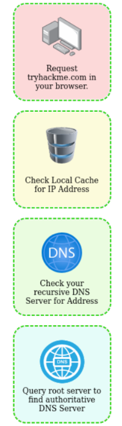

# Room: Putting It All Together

**Path:** Web Fundamentals

**Date:** August 2026

**Difficulty:** Easy

---

## Objective

Tie together everything learned so far and understand how all web technologies interact when a user visits a website — the end-to-end flow across DNS, HTTP, servers, and supporting infrastructure (load balancers, CDNs, databases, WAFs). Real attacks never target just one layer; they exploit gaps between these components.

---

## Key Concepts

* **End-to-End Web Request Flow:** DNS resolution → HTTP(S) communication → server response → browser rendering.
* **Load Balancer:** Distributes client requests across multiple backend servers for availability and performance.
* **CDN (Content Delivery Network):** Hosts static content across geographically distributed servers to reduce latency.
* **Database:** Stores persistent application data such as credentials, posts, preferences, and logs.
* **WAF (Web Application Firewall):** Sits between client and server, detecting and blocking malicious requests.
* **Virtual Host:** Lets one web server host multiple websites, distinguished by the `Host` header.
* **Static vs Dynamic Content:** Static content never changes and is served directly from disk; dynamic content is generated per-request by backend logic.

---

# Task 1: Putting It All Together

When you request a website in your browser, many things happen behind the scenes before the page appears on your screen.

## High-Level Flow of a Web Request

1. **Your computer needs to know where the server is** — done using **DNS (Domain Name System)**.
2. **Your computer communicates with the server** — using the **HTTP/HTTPS** protocol.
3. **The web server responds** with HTML, CSS, JavaScript, images, videos, etc.
4. **Your browser** interprets the response and renders the webpage visually.

## Security Insight

Every step in this chain can be attacked, misconfigured, or abused.

---

# Task 2: Other Components

Modern websites rely on additional components to improve performance, availability, and security.

## Load Balancers

Load balancers are used when traffic is too high for one server, or high availability is required.

### What Load Balancers Do

* Receive client requests first
* Forward requests to backend servers
* Prevent server overload
* Provide failover if a server goes down

### Common Load Balancing Algorithms

* **Round-robin** – Sends requests evenly
* **Weighted** – Sends traffic to the least busy server

### Health Checks

Load balancers periodically check if servers are alive. If a server fails a health check, traffic is stopped until it recovers.

**Security Insight:** Misconfigured load balancers can expose internal servers or bypass security controls.

## CDN (Content Delivery Network)

A CDN hosts static content across servers worldwide.

### Why CDNs Exist

* Reduce latency
* Improve performance
* Reduce server load

Static content includes images, CSS, JavaScript, and videos. When requested, content is served from the nearest geographic server.

**Attacker Mindset:** CDN misconfigurations can leak origin servers or cached sensitive data.

## Databases

Websites often need to store user data such as credentials, posts, preferences, and logs.

Common databases include **MySQL**, **MSSQL**, **MongoDB**, and **PostgreSQL**. Databases can range from single files to distributed clusters for scalability and resilience.

**Security Insight:** Databases are prime targets — misconfigured access leads to data breaches.

## WAF (Web Application Firewall)

A WAF sits between the client and the web server.

### What a WAF Does

* Detects malicious requests
* Blocks common attack patterns
* Enforces rate limiting
* Identifies bots vs real users

If a request looks malicious, it's dropped before reaching the server.

**Important:** A WAF is not a replacement for secure code.

## Questions

**Q) What can be used to host static files and speed up a client's visit?**
A) CDN

**Q) What does a load balancer perform to ensure a host is alive?**
A) Health check

**Q) What helps protect a website from hacking attempts?**
A) WAF

---

# Task 3: How Web Servers Work

## What Is a Web Server?

A web server is software that listens for incoming connections and uses HTTP/HTTPS to serve content.

Common web servers: **Apache**, **Nginx**, **IIS**, **NodeJS**.

## Web Server Root Directories

Web servers serve files from a root directory:

| Server | Default Root |
|---|---|
| Apache / Nginx | `/var/www/html` |
| IIS (Windows) | `C:\inetpub\wwwroot` |

**Example:** `http://www.example.com/picture.jpg` → `/var/www/html/picture.jpg`

## Virtual Hosts

Web servers can host multiple websites on a single server using **Virtual Hosts**.

**How it works:**

1. The server checks the `Host` header.
2. Matches it against configuration files.
3. Serves the correct website.

**Example:**

* `one.com` → `/var/www/website_one`
* `two.com` → `/var/www/website_two`

**Security Insight:** Misconfigured virtual hosts can expose internal or admin sites.

## Static vs Dynamic Content

### Static Content

* Never changes
* Served directly from disk
* Examples: images, CSS, JavaScript, static HTML

### Dynamic Content

* Changes based on requests
* Generated by backend logic
* Examples: blogs, search results, user dashboards

Dynamic content is processed on the backend, then returned as HTML.

## Backend & Scripting Languages

Backend languages enable logic and interactivity: **PHP**, **Python**, **Ruby**, **NodeJS**, **Perl**.

**Example PHP code:**

```php
<html>
  <body>Hello <?php echo $_GET["name"]; ?>
  </body>
</html>
```

**Request:** `http://example.com/index.php?name=adam`

**Response:**

```html
<html>
  <body>Hello adam
  </body>
</html>
```

**Security Insight:** Backend logic is hidden — but vulnerabilities in it are extremely dangerous.

## Questions

**Q) What does web server software use to host multiple sites?**
A) Virtual Hosts

**Q) What is the name for content that can change?**
A) Dynamic

**Q) Does the client see backend code?**
A) No

---

# Task 4: Quiz

This task tests understanding of the full web request lifecycle, tying together DNS, HTTP, servers, and the supporting infrastructure covered in this room.

        

## Flag

`THM{YOU_GOT_THE_ORDER}`

---

# Task 5: Conclusion

## Key Takeaways

* Web requests involve many interconnected systems.
* DNS, HTTP, servers, and browsers all play roles.
* Load balancers and CDNs improve performance and availability.
* Databases store critical data.
* WAFs add defensive layers.
* Backend logic introduces powerful functionality — and risk.

Understanding the full web stack is essential for web exploitation, SOC analysis, architecture reviews, secure application development, and advanced offensive security.

---

# Key Terminology

* **DNS:** Resolves a domain name to a server's IP address, the first step of a web request.
* **HTTP/HTTPS:** The protocol used for client-server communication once the server's location is known.
* **Load Balancer:** Distributes incoming requests across multiple backend servers, with health checks for failover.
* **Round-Robin / Weighted:** Load balancing algorithms — even distribution vs. sending traffic to the least busy server.
* **CDN:** A network of geographically distributed servers caching and serving static content closer to the user.
* **Database:** Persistent storage for application data (credentials, posts, preferences, logs) — e.g. MySQL, MSSQL, MongoDB, PostgreSQL.
* **WAF (Web Application Firewall):** Sits between client and server, filtering malicious requests before they reach the backend.
* **Web Server:** Software that listens for connections and serves content over HTTP/HTTPS — e.g. Apache, Nginx, IIS, NodeJS.
* **Root Directory:** The base folder a web server serves files from (e.g. `/var/www/html`).
* **Virtual Host:** A configuration letting one server host multiple websites, distinguished by the `Host` header.
* **Static Content:** Fixed content served directly from disk (images, CSS, JS, static HTML).
* **Dynamic Content:** Content generated per-request by backend logic (blogs, search results, dashboards).
* **Backend/Scripting Language:** Languages powering server-side logic — PHP, Python, Ruby, NodeJS, Perl.

---

# Key Takeaways

* A web request follows a consistent chain: **DNS** resolves the domain, **HTTP/HTTPS** carries the communication, the server responds with content, and the browser renders it — and every link in that chain is a potential attack surface.
* **Load balancers** and **CDNs** exist to handle scale and performance, but misconfigurations in either can expose internal servers, bypass security controls, or leak cached sensitive data.
* **Databases** store the data attackers actually want, making them a prime target when access controls are misconfigured.
* A **WAF** adds a defensive layer by filtering malicious requests before they reach the server — but it's a supplement to secure code, not a substitute for it.
* **Virtual hosts** let one physical server host many websites via the `Host` header, and misconfiguration here can expose sites that were never meant to be public.
* **Static content** is served as-is from disk, while **dynamic content** is generated by backend logic (PHP, Python, etc.) on each request — and since the client never sees that backend code directly, vulnerabilities hidden in it can go unnoticed until exploited.

---

## What I Learned

This room was the most valuable one so far because it stopped treating DNS, HTTP, and servers as separate topics and showed how they actually fit together into one continuous request lifecycle. Seeing the flow laid out step by step — DNS resolves the address, HTTP carries the conversation, the server responds, the browser renders — turned everything from earlier rooms into one coherent mental model instead of isolated facts.

Learning about **load balancers** and **CDNs** filled in a gap I hadn't really thought about before: how large websites handle massive traffic and stay available. Understanding round-robin vs. weighted balancing, and that health checks are what let a load balancer detect and route around a dead server, made it clear why these components exist beyond just "making things faster." The security insight that misconfigured load balancers or CDNs can expose internal servers or leak cached data was a good reminder that infrastructure meant to improve reliability can just as easily become an attack surface if set up carelessly.

The **web server internals** section was especially useful — understanding that a URL path maps directly to a file inside a root directory (like `/var/www/html`), and that **virtual hosts** let one server pretend to be many websites based on the `Host` header, explained a class of misconfiguration I'd heard of (virtual host / vhost enumeration) but hadn't understood mechanically until now.

The distinction between **static and dynamic content**, paired with the PHP example (`$_GET["name"]` being echoed straight into the page), made it obvious how quickly backend logic can introduce risk — since the client never sees that PHP code directly, a vulnerability there can sit invisible until someone probes it. Completing the final quiz and earning the flag `THM{YOU_GOT_THE_ORDER}` felt like a good capstone, confirming I could trace a request through the entire stack — DNS, HTTP, load balancer/CDN, web server, backend, and database — rather than understanding each piece in isolation. This room gives me a solid mental map to build on for actual web exploitation work.