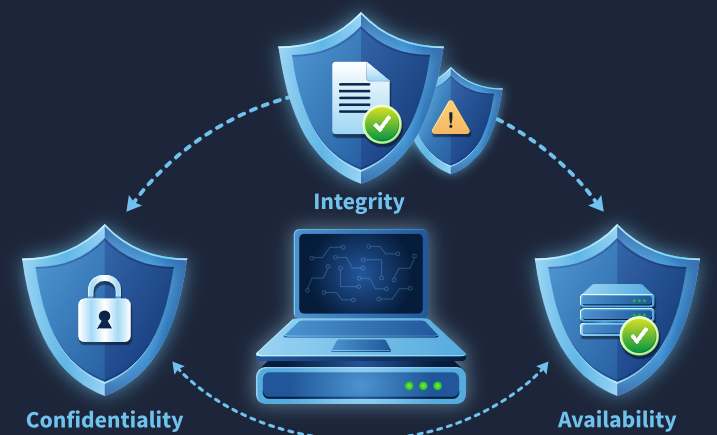
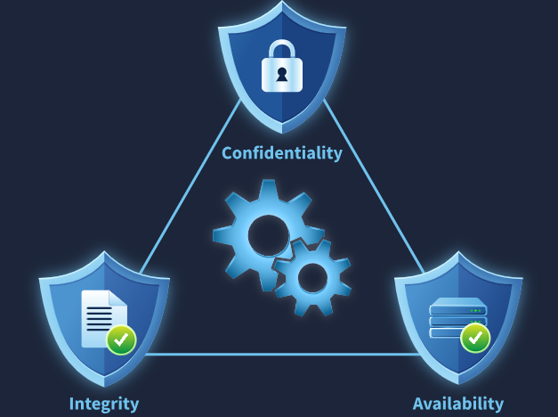
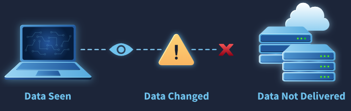

# Room: The CIA Triad

**Path:** Cyber Security Fundamentals

**Date:** August 2026

**Difficulty:** Easy

---

## Objective

Understand the **CIA Triad** — Confidentiality, Integrity, and Availability — and how it shapes the core mindset of cyber security. The room covers what each pillar means, real-world and digital-world examples of each being upheld or broken, and how security professionals use the CIA Triad to assess the impact of an incident.

---

## Key Concepts

* **CIA Triad:** The three core principles cyber security exists to protect — Confidentiality, Integrity, and Availability.
* **Confidentiality:** Ensuring sensitive data can only be accessed by authorized individuals.
* **Integrity:** Ensuring data is not modified by unauthorized individuals.
* **Availability:** Ensuring data and services are available to authorized users when needed.
* **Security Mindset:** Assessing an incident by asking which of the three CIA pillars was affected.

---

# Task 1: Introduction

Having covered the fundamentals of computers, operating systems, software, networks, and the web in previous rooms, this room begins the journey into cyber security by asking: what does cyber security actually protect inside the digital world?

Cyber security focuses on protecting three key aspects, covered in this room, with a hands-on exercise at the end to validate understanding.

## Learning Objectives

* Understand the pillars of cyber security
* Understand the purpose of Confidentiality, Integrity, and Availability
* Recognize Confidentiality, Integrity, and Availability in simple scenarios
* Make decisions to preserve these core aspects of cyber security

## Prerequisites

Completion of all previous modules in this path is recommended before starting.

---

# Task 2: Understanding the CIA Triad

## Why This Matters

In the past, most information was stored on physical paper. Today, that same information is stored as digital data on systems and communicated over networks. Without proper security, digital data can be exposed to the wrong people, modified without permission, or unavailable when needed most — so protecting it has become a core requirement for governments, organizations, and individuals.

Security in cyber security doesn't simply mean stopping attacks or having tools in place — it means ensuring specific conditions for digital data. These conditions are:

* **Confidentiality**
* **Integrity**
* **Availability**

Together, these three principles — the **CIA Triad** — explain what cyber security actually protects. Nearly everything encountered in a cyber security journey revolves around defending or attacking digital data to keep these three pillars intact.

## Confidentiality

Confidentiality ensures that sensitive data can only be accessed by authorized individuals. If confidentiality isn't maintained, unauthorized individuals can access data, resulting in financial loss, privacy violations, or legal consequences.

**Real-world example:** Having a private conversation with a friend about a personal matter, only for an unknown person to deliberately listen in and later use that information to manipulate you — the information was accessed by someone with no right to hear it, directly harming confidentiality. To prevent this in future, you might have such conversations in a secure area while staying aware of your surroundings.

**Digital-world example:** Logging into a social media account over a coffee shop's public network, then being suddenly logged out because someone intercepted your credentials over that network. Confidentiality in the digital world is protected through processes like **encryption** and **access controls**.

### Confidentiality — Achieved or Not?

| Situation | Confidentiality Achieved? |
|---|---|
| Gmail credentials written on sticky notes on your office table | No |
| Internal company documents available only to employees who need them for their work | Yes |
| A personal document available publicly on the internet | No |

## Integrity

Integrity ensures that unauthorized individuals do not modify data. Without integrity, data can be altered and no longer trusted — and unauthorized changes can sometimes lead to dangerous consequences.

**Real-world example:** A teacher gives you a good exam grade, but someone modifies that grade before it's submitted to the examination authority — a breach of integrity. To prevent this, the teacher might start noting grades on a separate sheet and verifying them before final submission.

**Digital-world example:** Initiating a bank transfer from your mobile device, only for someone to intercept and modify the receiving account information before the transaction completes — resulting in money going where it wasn't supposed to. Several techniques exist to ensure integrity in the digital world.

### Integrity — Achieved or Not?

| Situation | Integrity Achieved? |
|---|---|
| Data changed through authorised approval | Yes |
| Attendance records changed after being locked by the teacher | No |
| Order price modified before checkout | No |

## Availability

Availability ensures that data and services are available to authorized users when needed. Though it's the third pillar, it's no less important than the other two — most businesses rely heavily on digital services, and even short downtime can cause serious losses.

**Real-world example:** Depositing money in a very secure bank, but the bank is closed the day you need your money because of a power failure — even though the money is secure, if you can't access it, it's effectively useless. To ensure availability here, a bank might deploy an alternative power generator to keep services running during a main power failure.

**Digital-world example:** Attackers sending a huge volume of requests to a website that can't handle them, causing it to go down — no data is leaked or modified, but the compromise of availability still causes major loss. Websites defend against this by managing traffic load and blocking requests past a certain threshold.

### Availability — Achieved or Not?

| Situation | Availability Achieved? |
|---|---|
| Critical services disrupted by a software installation | No |
| Company's website went offline during business hours | No |
| All systems accessible to employees during working hours | Yes |

## Answers

**Q) Which pillar of the CIA focuses on preventing unauthorized modification of data?**
A) Integrity

**Q) Which pillar of the CIA focuses on preventing unauthorized access to data?**
A) Confidentiality

**Q) Which CIA pillar ensures data is available to users when needed?**
A) Availability

**Q) Which CIA pillar gets impacted if the data becomes untrustworthy?**
A) Integrity

**Q) What is the term used collectively for all these pillars?**
A) The CIA Triad

---

# Task 3: The Security Mindset

CIA is not just a set of definitions — it's a **security mindset** of cyber security professionals. When a security incident occurs, it's often explained in terms of what was affected, by asking questions like:

* Was sensitive data exposed to unauthorized individuals?
* Was data being modified without permission?
* Were systems or services unavailable to users when they needed them?

Having a clear understanding of each component of the CIA Triad enables a professional to assess the impact of any incident and decide on an appropriate response.

## Hands-On Scenario

At a cyber security workshop, part of an engagement exercise involves nine different security incidents. Each incident is read carefully, then classified according to which part of the CIA Triad it affects most — dragging and dropping each incident into the pillar it impacts.

## Answers

**Q) What is the flag received after solving the exercise?**
A) *(specific to the deployed exercise instance — not included in the source notes)*

**Q) CIA Triad is not just a set of definitions; it's a mindset. What type of mindset is it?**
A) A security mindset

---

# Task 4: Conclusion

This room marks the first step into cyber security, answering a foundational question: what exactly do we protect in cyber security? Understanding the CIA Triad provides the core cyber security mindset that underlies many concepts encountered throughout the field.

---

# Key Terminology

* **Confidentiality:** Ensuring digital information is not available to unauthorized individuals.
* **Integrity:** Ensuring digital information is not modified without permission.
* **Availability:** Ensuring digital information is not unavailable when needed.
* **CIA Triad:** The collective term for these three pillars — Confidentiality, Integrity, and Availability.
* **Security Mindset:** Assessing incidents by identifying which of the three CIA pillars was compromised.

---

# Key Takeaways

* Cyber security exists to protect three core properties of digital data: **Confidentiality**, **Integrity**, and **Availability** — together, the **CIA Triad**.
* **Confidentiality** is broken when unauthorized parties access data (e.g. intercepted credentials, leaked personal documents).
* **Integrity** is broken when data is modified without authorization (e.g. an altered grade, a tampered bank transfer).
* **Availability** is broken when authorized users can't access data or services when needed (e.g. power outages, DoS attacks) — even without any data being leaked or altered.
* The CIA Triad isn't just theory — it's a practical **mindset**: when assessing any security incident, ask which of the three pillars was affected, since that determines both the impact and the appropriate response.
* Nearly every concept encountered later in a cyber security journey — attacks, defenses, controls — ultimately maps back to defending one (or more) of these three pillars.

---

## What I Learned

This room gave me the foundational lens I'll be using for the rest of my cyber security learning: that everything in this field ultimately comes down to protecting **Confidentiality**, **Integrity**, and **Availability**. Before this room, I understood cyber security vaguely as "stopping hackers," but this reframed it much more precisely — security means ensuring specific properties of data and systems hold true, and an "attack" is really just something that breaks one of these three properties.

The real-world analogies made each pillar click immediately: an eavesdropped private conversation for confidentiality, an altered exam grade for integrity, and an inaccessible bank during a power outage for availability. Pairing each with a digital-world equivalent — intercepted Wi-Fi credentials, a tampered bank transfer, a DoS attack — showed how the same underlying principle applies whether the "asset" is a paper record or digital data.

The "Achieved or Not?" tables were a good gut-check exercise. A few were intuitive (leaked personal documents = no confidentiality), but some were more subtle — like realizing that a website going offline during business hours breaks availability even though nothing was stolen or changed, which reinforced that availability is just as serious a security concern as the other two, even though it doesn't always feel as "exciting" as a data breach.

The most valuable takeaway was Task 3's framing of CIA as a **mindset**, not just three definitions. Learning that security professionals triage incidents by asking "was data exposed? modified? unavailable?" gives me a simple, repeatable framework I can apply going forward — whenever I encounter a new vulnerability or attack type in future rooms, my first instinct now will be to ask which pillar of the CIA Triad it actually threatens, which should make it much easier to understand *why* a given issue matters, not just *that* it does.