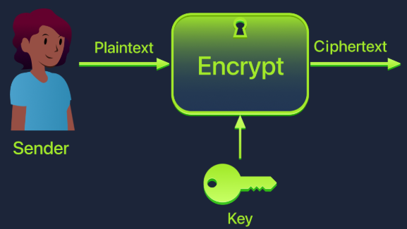
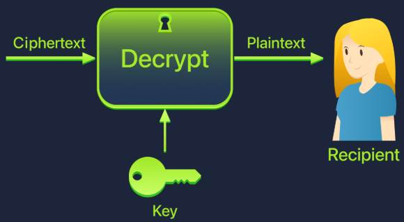
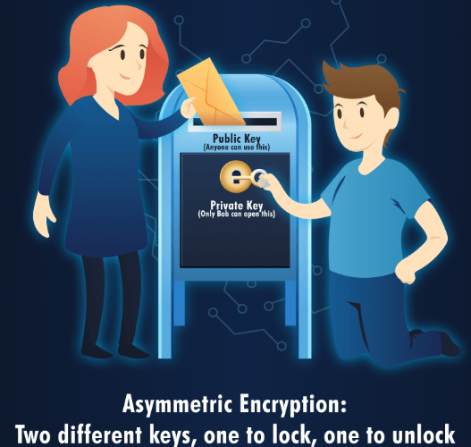
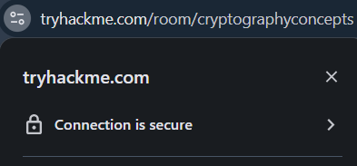
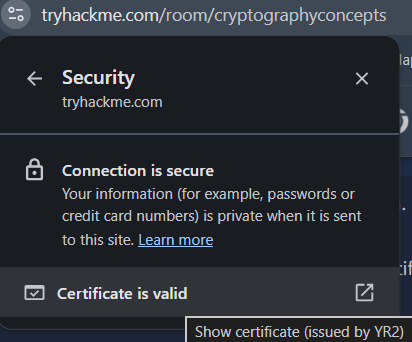
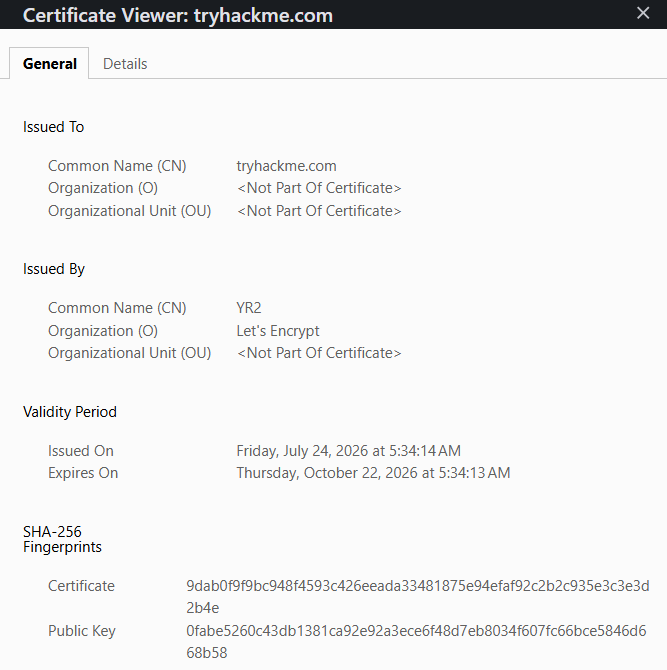

# Room: Cryptography Concepts

**Path:** Cyber Security Fundamentals (follows The CIA Triad, Data Encoding)

**Date:** August 2026

**Difficulty:** Easy

---

## Objective

Understand cryptography's role in everyday digital security — what actually stops someone from reading or modifying data as it travels across the Internet (e.g. behind the browser padlock icon). The room covers plaintext vs ciphertext, keys and algorithms, symmetric encryption (via the Caesar cipher), asymmetric encryption and the key distribution problem, certificates, and how HTTPS combines both approaches in practice.

---

## Key Concepts

* **Plaintext:** A message that can be read normally.
* **Ciphertext:** A scrambled version of a message that shouldn't make sense to anyone without the key.
* **Key:** The secret ingredient controlling how scrambling/unscrambling works.
* **Algorithm:** The public "recipe" describing how to use a key on a message — security comes from the key, not from hiding the algorithm.
* **Symmetric Encryption:** One key both encrypts and decrypts.
* **Asymmetric Encryption:** Two mathematically linked keys — a public key and a private key.
* **Certificate:** A digitally signed document binding a public key to an identity, issued by a trusted Certificate Authority (CA).

---

# Task 1: Introduction

**Opening question:** When you see the little padlock icon in your browser's address bar, what's actually stopping someone from reading or modifying your data as it travels across the internet?

## Why Cryptography Matters

Recalling the **CIA Triad**: confidentiality, integrity, and availability are the three pillars of cyber security, and attackers try to break them through disclosure, alteration, and destruction. Cryptography is the practical tool for actually protecting secrets and detecting tampering in the real world.

## A Real-World Scenario

Running a small medical clinic, you need to send patient records (names, medical conditions, treatment history) to specialists and insurance companies over the Internet. Data doesn't travel directly from sender to recipient — it bounces through dozens of computers and routers along the way. Without protection, anyone with access to those systems could read, change, or block the data.

Cryptography solves this by using mathematical rules and secret keys to scramble information into gibberish that only authorised people can unscramble.

## Learning Objectives

* Explain what cryptography is and why it matters for protecting confidentiality and integrity.
* Describe the difference between plaintext and ciphertext with actual examples.
* Explain what keys and algorithms are, and why keeping keys secret is critical.
* Explain the difference between symmetric and asymmetric encryption using everyday objects, such as lockboxes and mailboxes.
* Describe how symmetric and asymmetric encryption work together to protect web browsing.

## Prerequisites

Completion of all previous modules, including **CIA Triad** and **Data Encoding**.

---

# Task 2: Hiding Information — Symmetric Encryption

**Opening question:** If someone's listening to every single piece of data travelling between two people, how can those two people still share secrets?

## Understanding the Basics

* **Plaintext** — A message you can read normally, like `HELLO` or `Patient name: Alice Smith`.
* **Ciphertext** — A scrambled version that's not supposed to make sense, like `KHOOR` or `Sdwlhqw qdph: Dolfh Vplwk`.
* **Key** — The secret ingredient that controls how scrambling and unscrambling work — like a password the algorithm uses.
* **Algorithm** — The public recipe: the set of steps for using the key on the message. Everyone can know the algorithm; security comes from keeping the key secret.

**Encryption process:** plaintext + encryption algorithm + key → ciphertext

**Decryption process:** ciphertext + decryption algorithm + key → plaintext

## The Lockbox Analogy

* The **algorithm** is how the lock works — anyone can see you insert a key and turn it, so it's not secret.
* The **key** is your specific metal key — only people with that exact key can open your box.
* The **plaintext** is the letter inside the box.
* The **ciphertext** is the locked box travelling through the postal system.

Security doesn't come from hiding how locks work — it comes from keeping your key private. The same principle applies to cryptography: algorithms are usually public and tested by experts worldwide, while security comes from keeping keys secret.

**Alice sending Bob a secret letter through the public postal system:**

1. She writes her message (the plaintext) on paper.
2. She puts the letter in a sturdy lockbox.
3. She locks it with a padlock using her key.
4. She sends the locked box (the ciphertext) through the mail.

Bob uses his copy of the same key to unlock it and read the message. Anyone intercepting the box just sees a locked metal box — without the key, it's useless.

**That's symmetric encryption in a nutshell: one key locks the box, the same key unlocks it.**

## Plaintext vs Ciphertext

Alice wants to send `HELLO` (plaintext). Using an algorithm and a secret key, it becomes `KHOOR` (ciphertext) — meaningless to anyone without the key. Bob receives `KHOOR`, uses the same key and algorithm, and unscrambles it back to `HELLO`.

## The Caesar Cipher: Algorithm Plus Key

The **Caesar cipher** is named after Julius Caesar, who reportedly used it over 2000 years ago to send military messages. It's simple, making it great for learning — but terrible for real security.

### How It Works

The Caesar cipher shifts each letter in a message by a fixed number of positions in the alphabet — that fixed number is the key.

With a key of 3: `A`→`D`, `B`→`E`, `C`→`F`, ... `X`→`A` (wraps around), `Y`→`B`, `Z`→`C`.

**Encrypting `HELLO` with key 3:**

`H`→`K`, `E`→`H`, `L`→`O`, `L`→`O`, `O`→`R` → **`KHOOR`**

**Decrypting `KHOOR`** (shift back 3): `K`→`H`, `H`→`E`, `O`→`L`, `O`→`L`, `R`→`O` → **`HELLO`**

* The **algorithm** (shift each letter by some number) is completely public.
* The **key** (the number 3) is what's secret — only Alice and Bob know it.

If someone intercepts `KHOOR` without knowing the key, they'd have to try all 25 possible shifts — tedious for a human, about a millisecond for a computer.

> The Caesar cipher is **not secure** and is never used in real systems — it's far too easy to compromise. It's used here purely because it's simple to understand and shows how keys and algorithms work together. Real algorithms like **AES (Advanced Encryption Standard)** are vastly more complex and secure, but follow the same basic idea: algorithm + key + plaintext → ciphertext.

## Symmetric Encryption Explained

The Caesar cipher is an example of **symmetric encryption**:

* The same key encrypts (locks) and decrypts (unlocks) the message.
* Both sender and receiver need a copy of that key.
* The key must stay secret from everyone else.

**Benefits:**

* **Fast** — symmetric algorithms churn through huge amounts of data quickly.
* **Efficient** — ideal for encrypting files, hard drives, and network traffic.

**The catch:** how do Alice and Bob share that key safely in the first place? Sending it in plain view lets an eavesdropper grab it and decrypt every future message. Encrypting the key just creates the same problem one level up — infinite regress.

This is the **key distribution problem** — the Achilles' heel of symmetric encryption used alone. It's solved in the next task with asymmetric encryption.

## Practical — "Secret Message Rescue" Game

A security team being monitored on their office Wi-Fi communicates using a simple Caesar cipher. The task involves decrypting intercepted secret warnings and encrypting new messages before sending them, adjusting the shift key and watching the message change.

> This is purely educational — real systems don't use the Caesar cipher because it's laughably weak.

---

# Task 3: Sharing Keys Safely — Asymmetric Encryption

**Opening question:** If Alice and Bob have never met and can't safely send a key over the internet, how can they start encrypting messages to each other?

## The Key Distribution Problem

Symmetric encryption is fast and efficient, but sharing the key safely in the first place is unsolved: sending it in plaintext lets an attacker grab it; encrypting it just needs another key, bringing the same problem back. Enter **asymmetric encryption**.

## Two Keys Instead of One

Asymmetric encryption uses two mathematically linked keys:

* A **public key** that anyone can know and use.
* A **private key** that only one person keeps secret.

* If you encrypt something with someone's **public key**, only their **private key** can decrypt it.
* If you encrypt something with your **private key**, anyone with your public key can decrypt it (used mainly for digital signatures).

The two keys are connected by serious math, but it would take an ordinary computer hundreds or thousands of years to recover the private key from the public key — that computational difficulty is what makes asymmetric encryption secure.

## The Mailbox Analogy

* The **mail slot** at the top of a street-corner mailbox is the **public key** — anyone walking by can drop off a letter; it's completely open and accessible.
* The **locked door** at the front is the **private key** — only the mailbox owner has the key to open it and grab the letters.

**Alice sending Bob a secret:**

1. Alice finds Bob's public key (the mail slot) — not a secret; Bob can post it publicly.
2. Alice writes her message, encrypts it with Bob's public key, and sends it.
3. Only Bob can decrypt it, since he's the only one with the private key.

Even if an attacker intercepts the encrypted message, they can't decrypt it without Bob's private key.

## Solving the Key Distribution Problem

1. Bob creates a public key and a private key. He keeps the private key to himself and shares the public key with the world.
2. Alice grabs Bob's public key (from his website or a key server).
3. Alice encrypts her message using Bob's public key and sends it off.
4. Bob receives it and decrypts it using his private key.

At no point did they need to secretly exchange a key over the network — the only key that travelled publicly was Bob's public key, which isn't secret by design. That's the solution to the key distribution problem.

## Real-World Use: HTTPS

The most common everyday use of asymmetric encryption is **HTTPS** — the protocol behind the browser padlock.

**Visiting `https://google.com`:**

1. Your browser requests the website's public key.
2. The website sends back its public key wrapped in a **certificate**.
3. Your browser and the website use asymmetric encryption to agree on a shared secret (a symmetric key) without anyone else seeing it.
4. From there, they switch to fast symmetric encryption using that shared secret for the rest of the session.

This is called a **hybrid approach**:

* Asymmetric encryption solves the key distribution problem.
* Symmetric encryption handles the heavy lifting, since it's faster.

## Certificates

How does Alice know a public key really belongs to Bob, not an attacker pretending to be Bob? That's what **certificates** solve.

A certificate is a digital document that:

* Contains someone's public key.
* States who that key belongs to (e.g. `example.com`).
* Is digitally signed by a trusted authority, called a **Certificate Authority (CA)**.

Browsers and operating systems come preloaded with a list of trusted CAs. When a website presents a certificate, the browser checks that a trusted CA signed it and that it's still valid (not expired or revoked). If everything checks out, the browser shows the padlock and trusts the public key. If something's off (expired, untrusted signer), the browser shows a warning and may refuse to connect.

## Viewing a Certificate in Your Browser
  

1. Visit any HTTPS site (e.g. `https://www.tryhackme.com`).
2. Click the padlock icon in the address bar.
3. Look for "Certificate", "Connection is secure", or "View certificate".
4. A window opens showing: **Issued to** (the domain), **Issued by** (the signing CA), and **Valid from / Valid until** (expiration dates).

This is how a browser knows it's talking to the real website, not an attacker's fake version.

## Symmetric vs Asymmetric — Side by Side

| Feature | Symmetric Encryption | Asymmetric Encryption |
|---|---|---|
| Number of keys | One key for both encrypting and decrypting | Two keys: public and private |
| Key sharing | Both people need the same secret key | Public key can be shared openly |
| Speed | Very fast | Slower (used for small amounts of data) |
| Main use | Encrypting bulk data (files, network traffic) | Sharing keys securely, digital certificates |
| Analogy | One key locks and unlocks a box | A mailbox: anyone posts, only the owner retrieves |

In practice, real systems use both: asymmetric encryption initiates a connection and securely shares a symmetric key, then symmetric encryption takes over for the rest of the session. This is how HTTPS, VPNs, and encrypted messaging apps all operate.

---

# Task 4: Conclusion

## What We've Covered

* **Plaintext** is what you can read; **ciphertext** is scrambled gibberish.
* A **key** is the secret that controls scrambling and unscrambling.
* An **algorithm** is the public method for using the key.
* **Symmetric encryption** uses a single key for both encryption and decryption — fast and efficient, but needs a secure way to share that key (demonstrated with the Caesar cipher).
* **Asymmetric encryption** uses two linked keys — a public key anyone can use, and a private key only one person keeps — solving the key distribution problem and powering the initial handshake for HTTPS connections.
* Real systems combine both: asymmetric encryption sets up a shared key at the start, and symmetric encryption handles the actual data because it's faster. That combo is what protects passwords, banking details, and messages behind the browser padlock.

Cryptography is one of the most critical tools in a defender's arsenal — it protects confidentiality and integrity and is the backbone of almost every secure system used online. But it's not magic; it's one layer in a much bigger security picture that also includes strong password practices, secure key storage, user awareness and training, regular software updates, and monitoring/incident response.

---

# Key Terminology

* **Plaintext:** A readable message before encryption.
* **Ciphertext:** A scrambled, unreadable version of a message.
* **Key:** The secret value controlling encryption/decryption.
* **Algorithm:** The public method describing how a key is applied to a message.
* **Symmetric Encryption:** Uses one key for both encryption and decryption.
* **Caesar Cipher:** A simple (insecure) symmetric cipher that shifts letters by a fixed key value.
* **AES (Advanced Encryption Standard):** A real, secure symmetric encryption algorithm.
* **Key Distribution Problem:** The challenge of securely sharing a symmetric key before communication begins.
* **Asymmetric Encryption:** Uses a linked public/private key pair.
* **Public Key / Private Key:** The shareable key used to encrypt; the secret key used to decrypt (or sign).
* **Certificate:** A signed document binding a public key to an identity.
* **Certificate Authority (CA):** A trusted entity that digitally signs certificates.
* **HTTPS:** The secure web protocol combining asymmetric and symmetric encryption (a hybrid approach).

---

# Key Takeaways

* Cryptography turns **plaintext** into **ciphertext** using an **algorithm** (public) and a **key** (secret) — security lives in the key, not in hiding the algorithm.
* **Symmetric encryption** (e.g. the Caesar cipher, or AES in real systems) uses one shared key for both directions — fast, but creates the **key distribution problem**: how do two parties share that key safely in the first place?
* **Asymmetric encryption** solves this with a **public/private key pair** — anything encrypted with a public key can only be decrypted with the matching private key, so the public key can be shared openly with no risk.
* **Certificates**, signed by trusted **Certificate Authorities**, let a browser verify that a public key genuinely belongs to the website it claims to — this is what produces the padlock icon (or a warning, if something's wrong).
* Real-world systems like **HTTPS** use a **hybrid approach**: asymmetric encryption to securely establish a shared symmetric key, then fast symmetric encryption for the actual data — combining the security of asymmetric with the speed of symmetric.
* Cryptography protects **confidentiality and integrity**, but it's only one layer of a broader security picture that also includes practices like key storage, user awareness, and patching.

---

## What I Learned

This room finally made the browser padlock icon make sense as an actual mechanism rather than just a trust symbol. Starting with the core vocabulary — plaintext, ciphertext, key, algorithm — gave me a shared language for everything that followed, and the lockbox analogy made the idea that "algorithms are public, keys are secret" click immediately: nobody hides how a padlock works, they just guard the key.

Working through the **Caesar cipher** by hand (`HELLO` → `KHOOR` with a shift of 3) was genuinely useful for understanding symmetric encryption at a mechanical level, even knowing it's completely insecure by modern standards. It made the definition of symmetric encryption — one key locks and unlocks — concrete rather than abstract, and the "Secret Message Rescue" game reinforced that by having me actually encrypt and decrypt messages by adjusting the shift key myself.

The real turning point was hitting the **key distribution problem**: realizing that symmetric encryption's biggest weakness isn't the math, it's the logistics of getting a shared secret to both parties without anyone else intercepting it. That made **asymmetric encryption** land as an elegant solution rather than just "another type of encryption" — the mailbox analogy (anyone can drop mail in the slot, only the owner has the door key) explained why a public key can be handed out freely with zero risk.

Learning how **HTTPS** actually uses both — asymmetric encryption just to securely establish a shared symmetric key, then switching to symmetric for speed — tied the whole room together and directly answered the opening question about what's really happening behind that padlock icon. Understanding **certificates** and the role of a **Certificate Authority** added the missing piece: encryption alone doesn't prove you're talking to the real website, which is exactly the kind of trust gap a certificate is designed to close. Actually viewing a real certificate in the browser (issued to, issued by, validity dates) made this tangible rather than theoretical. Overall, this room gave me a solid working model of how confidentiality and integrity are actually enforced in practice, which I expect to come back to constantly once I start looking at things like TLS misconfigurations or certificate-based attacks.