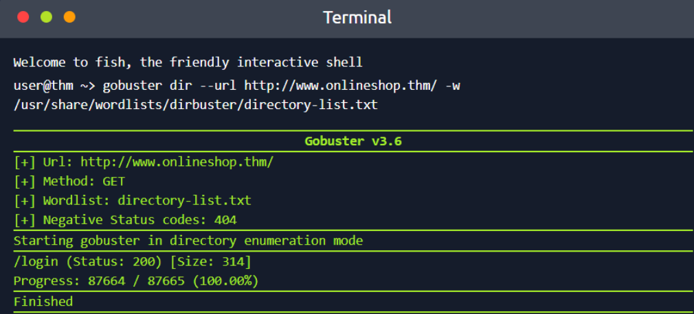
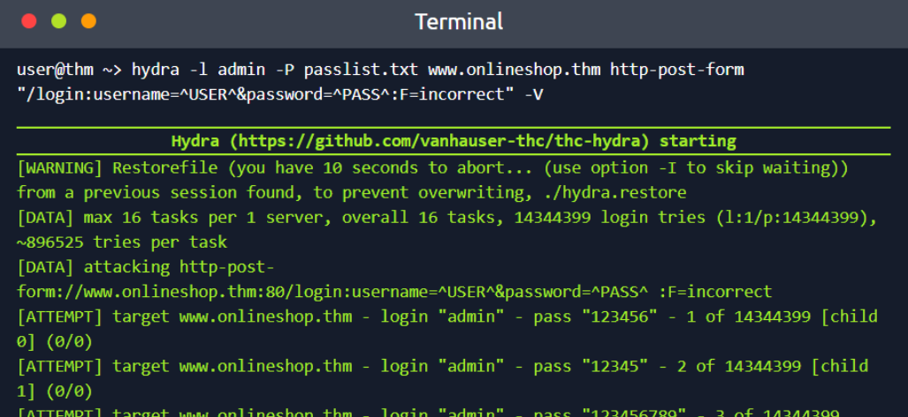
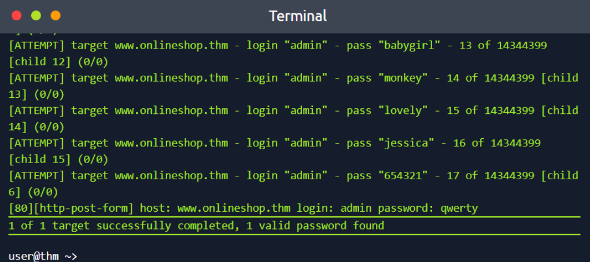

# Room: Become a Hacker

**Path:** Cyber Security Fundamentals

**Date:** August 2026

**Difficulty:** Easy

---

## Objective

Understand what **offensive security** is and why organizations use it, learn common offensive security terminology, and get hands-on practice with basic enumeration and password attacks — using tools like **Gobuster** and **Hydra** — against a web application, all within a safe, authorized, and legal scope.

---

## Key Concepts

* **Offensive Security:** Proactively testing systems by attempting to break into them, to find weaknesses before real attackers do.
* **Scope:** The boundaries of an engagement — what can and cannot be tested, and which actions are allowed/restricted.
* **Vulnerability:** A weakness in software, hardware, configuration, or processes that could be abused.
* **Exploit:** A technique used to take advantage of a vulnerability.
* **Enumeration:** Systematically collecting information about a target (users, services, directories, applications, credentials).
* **Dictionary Attack:** Trying passwords/usernames from a predefined list rather than every possible combination.

---

# Task 1: What Is Offensive Security?

Cyber security is often divided into two broad areas: **Defensive Security** (protecting systems) and **Offensive Security** (testing systems).

Offensive security professionals proactively attempt to identify weaknesses before malicious attackers can exploit them. Rather than asking *"How do we defend this system?"*, they ask *"How could someone break into this system?"*

## Thinking Like an Attacker

Hackers constantly ask questions such as:

* What is exposed?
* What can be accessed?
* What assumptions does the system make?
* What happens if I use unexpected input?

This process helps uncover weaknesses that developers or administrators may have overlooked.

## Ethical Hacking

In this context, hacking refers to **authorized**, **legal**, **controlled** testing aimed at security improvement — commonly called **Penetration Testing** or **Ethical Hacking**. The purpose is to discover weaknesses so they can be fixed before real attackers find them.

---

# Task 2: Finding Weaknesses

Before performing an assessment, it's important to understand common offensive security terminology.

## Core Offensive Security Terms

**Red Teaming** — A structured and authorized attack simulation that mimics real-world adversaries, used to test defenses, measure detection capabilities, and identify weaknesses.

**Penetration Testing** — A controlled security assessment where testers attempt to exploit vulnerabilities within an approved scope, used to understand risk, validate vulnerabilities, and improve security.

**Vulnerability** — A weakness in software, hardware, configuration, or processes that could be abused by attackers.

**Exploit** — A technique used to take advantage of a vulnerability, e.g. accessing restricted pages, gaining unauthorized access, or executing unintended actions.

**Scope** — The boundaries of an engagement, defining what can/cannot be tested and which actions are allowed/restricted.

## The Most Important Rule

All ethical hacking requires **permission**. Without permission, testing systems is illegal and unethical.

## Real-World Scenario

Mike has created an online shop and wants a security assessment before launch.

**Goal:** Identify hidden pages, discover weaknesses, and help secure the application.
**Target:** `http://www.onlineshop.thm/`

## Manual Enumeration

One method of discovering hidden pages is testing common paths manually — e.g. `/sitemap`, `/mail`, `/register`, `/login`, `/admin`. When a page doesn't exist, a `404` error appears.

**Hidden page discovered:** `/login`

## Automated Enumeration

Testing a few pages manually is manageable; testing thousands is not — this is where automated tools help.

### Gobuster

**Gobuster** is a directory enumeration tool.

```text
gobuster dir --url http://www.onlineshop.thm/ -w /usr/share/wordlists/dirbuster/directory-list.txt
```

**Command breakdown:**

* `gobuster` — the enumeration tool
* `dir` — directory discovery mode
* `--url http://www.onlineshop.thm/` — specifies the target
* `-w /usr/share/wordlists/dirbuster/directory-list.txt` — specifies the wordlist



**Results:** Hidden page `/login` returned status code `200`, meaning the page exists and is accessible.

## Answer Check

**Q) Hidden web page discovered?**
A) `/login`

**Q) Status code returned?**
A) `200`

---

# Task 3: Exploiting Weaknesses

Finding a weakness is only the beginning — attackers often chain multiple weaknesses together.

## The Domino Effect

A single weakness may not be dangerous on its own, but combining weaknesses can create serious security risks. **Example:** a hidden login page + a weak password → administrative access. Together, these create a much bigger issue.

## Think Like a Hacker

Hackers don't ask "Does this work?" — they ask **"How can this be abused?"**

**Key principles:**

* **Ask questions:** What if it doesn't work correctly?
* **Test the unexpected:** Try inputs developers may not have anticipated.
* **Chain weaknesses:** Combine small flaws to create greater impact.
* **Think like an adversary:** Ask how an attacker would approach this.

## Why Credentials Matter

Attackers often target usernames, passwords, and authentication systems because access unlocks valuable resources.

### What Can Authenticated Access Reveal?

* **Sensitive functionality** — actions that should only be available to authorized users
* **User data** — names, emails, account information
* **Administrative features** — managing users, changing settings, controlling the application
* **Additional attack opportunities** — access often exposes new vulnerabilities

## Testing the Login Page

**Discovered page:** `/login`
**Username to test:** `admin`
**Password list:** `abc123`, `123456`, `password`, `qwerty`, `654321`

**Valid credentials:** Username `admin`, Password `qwerty`

## Hacking Automation

Testing five passwords manually is easy; testing thousands is not — automation makes the process faster.

### Hydra

**Hydra** is a password-testing tool that performs **dictionary attacks** using predefined wordlists.

```text
hydra -l admin -P passlist.txt www.onlineshop.thm http-post-form "/login:username=^USER^&password=^PASS^:F=incorrect" -V
```

**Command breakdown:**

* `hydra` — password attack tool
* `-l admin` — username: `admin`
* `-P passlist.txt` — password wordlist
* `www.onlineshop.thm` — target website
* `http-post-form` — specifies login form testing
* `/login:username=^USER^&password=^PASS^:F=incorrect` — defines the login endpoint, parameters, and failure message
* `-V` — verbose mode, showing every login attempt





## What Is a Dictionary Attack?

A dictionary attack tries passwords from a predefined list (e.g. `password`, `123456`, `qwerty`, `admin123`) rather than attempting every possible combination.

## Results

* **Password found:** `qwerty`
* **Secret message:** `THM{born_to_hack!}`
* **Failed attempts before success:** 17

---

# Task 4: Where to Go From Here

## Key Terminology

* **Scope:** The systems and actions allowed during testing.
* **Vulnerability:** A weakness that attackers could exploit.
* **Exploit:** A technique used to abuse a vulnerability.
* **Enumeration:** Collecting information about a target — users, services, directories, applications.
* **Credentials:** Authentication details such as usernames and passwords.
* **Authentication:** The process of verifying identity.
* **Dictionary Attack:** Using a predefined list of passwords or usernames to gain access.

## What Comes Next?

Cyber security is a broad field. The best approach is to choose an area of interest, practice regularly, build hands-on experience, and learn consistently — small daily progress compounds into expertise.

## Potential Career Opportunities

**Penetration Tester / Ethical Hacker** — Tests systems safely within a defined scope; responsible for vulnerability discovery, risk validation, and security reporting.

**Vulnerability Researcher** — Finds and validates previously unknown weaknesses in software, hardware, and protocols.

**Red Team Operator** — Simulates real-world attackers to test defenses, measure detection, and evaluate response capabilities.

## Further Learning

Suggested next paths: Cyber Security 101, Jr Penetration Tester, SOC Level 1, Become a Defender.

---

# Key Terminology (Full List)

* **Offensive Security:** Proactively testing systems to find weaknesses before real attackers do.
* **Defensive Security:** Protecting and monitoring systems (contrasted with offensive security).
* **Red Teaming:** Authorized, adversary-simulating attack testing to measure defenses and detection.
* **Penetration Testing:** Controlled, scoped exploitation testing to validate vulnerabilities and risk.
* **Vulnerability:** A weakness in software, hardware, configuration, or process.
* **Exploit:** A technique used to abuse a vulnerability.
* **Scope:** The defined boundaries — allowed/restricted systems and actions — of an engagement.
* **Enumeration:** Systematically gathering information about a target (e.g. directories, users, services).
* **Gobuster:** A directory/file enumeration tool for discovering hidden web paths.
* **Hydra:** A password-attack tool used for dictionary attacks against login systems.
* **Dictionary Attack:** Attempting login using a predefined list of likely passwords/usernames.
* **Credentials:** A username/password pair used for authentication.
* **Authentication:** The process of verifying identity.

---

# Key Takeaways

* **Offensive security** flips the defender's question ("how do we protect this?") into an attacker's question ("how could someone break in?") — and that mindset shift is the core skill being taught.
* All ethical hacking requires **explicit permission** and a defined **scope** — without it, identical actions are illegal.
* **Manual enumeration** (guessing common paths) doesn't scale; tools like **Gobuster** automate directory/file discovery against large wordlists.
* A single weakness (a hidden login page) isn't dangerous alone — **chaining** it with another weakness (a weak password) can escalate to full administrative access. This "domino effect" is how real attacks typically unfold.
* **Hydra** automates credential testing via **dictionary attacks**, trying many username/password combinations far faster than doing so manually.
* Authenticated access can expose sensitive functionality, user data, admin features, and further attack surface — which is exactly why credentials are such a high-value target for attackers.

---

## What I Learned

This room gave me my first real hands-on taste of offensive security, and it reframed how I think about testing a system. Instead of asking "does this feature work correctly," the room trained me to ask "how could this be abused" — which is a genuinely different lens, and one I can already see applying to everything from web apps to the Linux privilege escalation exercise from the OS Security room.

The enumeration task made the difference between manual and automated testing very concrete. Manually guessing paths like `/admin` or `/login` is fine for a handful of guesses, but running **Gobuster** against a full wordlist showed me how quickly automation surfaces hidden pages that would be impractical to find by hand — and confirming the `/login` page returned a `200` status code (versus a `404`) was a clean, unambiguous signal that it existed and was reachable.

The password attack task tied everything together. Seeing how a single hidden page plus a weak password (`qwerty`, found after just 17 failed attempts using **Hydra**) escalated all the way to admin access made the "domino effect" concept click — no individual weakness here was especially dramatic, but combined they led to full compromise. Breaking down the Hydra command (`-l` for username, `-P` for the password list, the login string with `^USER^`/`^PASS^` placeholders and a failure condition) also demystified a tool I'd only heard referenced before, and getting the flag `THM{born_to_hack!}` made the exercise feel like a real, complete mini-assessment rather than a theoretical walkthrough.

More broadly, this room clarified the vocabulary I'll need going forward — the distinction between **red teaming** (simulating a real adversary) and **penetration testing** (scoped vulnerability validation), and terms like **scope**, **vulnerability**, and **exploit** that I'll keep seeing throughout more advanced rooms. It's also useful career context, since it laid out concrete roles (penetration tester, vulnerability researcher, red team operator) alongside the defensive-side path I'm ultimately aiming for as a future SOC analyst — offensive security knowledge like this should make it easier to recognize what attackers are actually doing once I'm on the defensive/monitoring side.